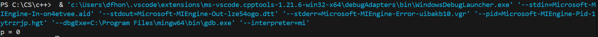

# 1 C++初识

## 1.1 第一个c++程序

~~~c++
#include <iostream>
using namespace std;

int main(){
    cout << "Hello World!" << endl;
    return 0;
}
~~~

结果：


## 1.2 注释

作用：在代码中加一些说明和解释，增加代码易读性

两种格式：

- 单行注释：`// 描述信息`，通常放在一行代码的上方，或者一条语句的末尾，对该代码进行说明；
- 多行注释：`/* 描述信息 */`，通常放在一段代码的上方，对该段代码做整体说明；

> 编译器在编译代码时，会忽略注释的内容

## 1.3 变量

作用：给一段指定的内存空间起名，方便操作这段内存


上图中，这块内存地址为 0x0000，我们可以直接使用地址来操作，将10放在这块地址，但记整台电脑的地址显然不切实际，所以我们取名 `a` 来代替。

语法：`数据类型 变量名 = 初始量;`

示例：

```c++
#include <iostrem>
using namespace std;

int main(){
    int a = 10;
    cout << "a = " << a << endl;
    return 0;
}
```


## 1.4 常量

作用：用于记录程序中不可更改的数据

有两种定义常量的方式：

- `#define` 宏常量：`#define 常量名 常量值`，通常在一个文件的上方定义，表示一个常量；
- `const` 修饰的变量：`const 数据类型 常量名 = 初始值`，通常在变量定义前加关键字 `const`，修饰该变量为常量，不可修改；

示例：

```c++
#include <iostream>
using namespace std;

#define Day 7

int main(){
    const int Month = 12;
    cout << "一周总共有：" << Day << "天" << endl;
    cout << "一年共有：" << Month << "个月份" << endl;
    return 0;
}
```


## 1.5 关键字

作用：关键字是C++中预先保留的单词，比如 `int`。在定义变量或者常量时，不要用关键字。

## 1.6 标识符命名规则

作用：C++规定给标识符（变量、常量）命名时，有一套自己的规则

- 标识符不能是关键字
- 标识符只能由字母、数字、下划线组成
- 第一个字符必须为字母获下划线
- 标识符中字母区分大小写

# 2 数据类型

C++规定：创建一个变量或者常量时，必须要指定出相应的数据类型，否则无法给变量分配内存

数据类型存在的意义：给变量分配合适的内存空间。不同的数据类型占用内存空间不同，如果没有数据类型，那么所有变量占用相同的内存空间。

## 2.1 整型

作用：整型变量表示的时整数类型的数据

C++中能够表示整型的类型有以下几种，区别在于所在内存空间的不同：

| 类型      | 占用空间                                                    | 取值范围       |
| --------- | ----------------------------------------------------------- | -------------- |
| short     | 2字节                                                       | -2^15 ~ 2^15-1 |
| int       | 4字节                                                       | -2^31 ~ 2^31-1 |
| long      | Windows为4字节，Linux为4字节（32位系统）、8字节（64位系统） | -2^31 ~ 2^31-1 |
| long long | 8字节                                                       | -2^63 ~ 2^63-1 |

以 short 为例，范围为 -32768 ~ 32767，如果给变量赋值 32768，显示的就是 -32768，这是因为 1000 0000 0000 0000（32768），但第一位是符号位，1表示负数，0表示正数，所以显示的就是 -32768。

## 2.2 sizeof关键字

作用：统计数据类型所在内存的大小

语法：`sizeof(数据类型/变量)`

示例：

```c++
#include<iostream>
using namespace std;

int main(){
    short a = 1;
    int b = 2;
    long c = 3;
    long long d = 4;
    cout << "short类型占用内存空间：" << sizeof(short) << endl;
    cout << "short类型变量 a 占用内存空间：" << sizeof(a) << endl;
    cout << "int类型占用内存空间：" << sizeof(int) << endl;
    cout << "int类型变量 b 占用内存空间：" << sizeof(b) << endl;
        cout << "long类型占用内存空间：" << sizeof(long) << endl;
    cout << "long类型变量 c 占用内存空间：" << sizeof(c) << endl;
        cout << "long long类型占用内存空间：" << sizeof(long long) << endl;
    cout << "long long类型变量 d 占用内存空间：" << sizeof(d) << endl;
    return 0;
}
```


## 2.3 实型（浮点型）

作用：用于表示小数

分为两种：

- 单精度 `float`
- 双精度 `double`

两者的区别在于表示的有效数字的范围：

| 类型     | 占用内存 | 有效数字范围    |
| -------- | -------- | --------------- |
| `float`  | 4字节    | 7位有效数字     |
| `double` | 8字节    | 15~16位有效数字 |

> 有效数字：小数点前后的都算

示例：

```c++
#include<iostream>
using namespace std;

int main(){
    float f1 = 3.141592;
    double d1 = 3.1415926535;
    cout << "float类型 f1 = " << f1 << endl;
    cout << "double类型 d1 = " << d1 << endl;
    cout << "float类型占用内存空间：" << sizeof(float) << endl;
    cout << "double类型占用内存空间：" << sizeof(double) << endl;
    return 0;
}
```


可以看到，虽然有效数字范围不同，但是实际显示的都是6位有效数字，如果需要显示更多的有效数字需要额外的设置。但两种类型的浮点数的有效数字范围确实不同。

## 2.4 字符型

作用：字符型变量用于显示单个字符。

语法：`char 变量名 = '单个字符'`

> 注意：
>
> 1、字符型变量用单引号，不用双引号；
>
> 2、单引号内只能有一个字符

c和c++中，字符型变量只占1字节。字符型变量并不是把字符本身放入内存空间，而是将字符的ASCII码放入内存中。

示例：

```c++
#include<iostream>
using namespace std;

int main(){
    // 1. 创建字符型变量
    char ch = 'a';
    cout << ch << endl;

    // 2. 字符型变量所在内存空间大小
    cout << "char变量占内存：" << sizeof(char) << endl;

    // 3. 字符型变量对应的ASCII码
    cout << (int)ch << endl;
    
    return 0;
}
```


> `(int)ch`是将变量`ch`强制转为整型

## 2.5 转义字符

作用：用于显示一些不能显示出来的ASCII字符。

常用的有：`\n`、`\t`、`\\`，其他的用到的时候去找。

## 2.6 字符串类型

作用：用于表示一串字符。

两种风格：

- C风格：`char 变量名[] = "字符串";`
- C++风格：`string 变量 = "字符串"`

```c++
#include <iostream>
using namespace std;

int main(){
    // 1. C风格字符串
    char str1[] = "hello world_1";
    // 2. C++风格字符串
    string str2 = "hello world_2";

    cout << str1 << endl;
    cout << str2 << endl;
    return 0;
}
```


注意事项：

1. C风格需要在变量名后面加 `[]`；
2. 两种风格都使用双引号；

## 2.7 布尔类型

作用：代表真或假的值

bool类型只有两个值：

1. `true`，本质是 1；
2. `false`，本质是 0；

bool类型占1字节大小。

示例：

```c++
#include <iostream>
using namespace std;

int main(){
    bool flag = true;
    cout << flag << endl;
    flag = false;
    cout << flag << endl;
    cout << "bool 类型占内存：" << sizeof(bool) << endl;
    return 0;
}
```


## 2.8 数据的输入

作用：用于从键盘获取数据

关键字：`cin`

语法：`cin >> 变量`

示例：

```c++
#include <iostream>
using namespace std;

int main(){
    // 1. 输入整型
    int a = 123;
    cout << "整型a原来的值：" << a << "\n请输入新的整型值：";
    cin >> a;
    cout << "整型a现在的值：" << a << endl;

    // 2. 输入浮点型
    float b = 3.15;
    cout << "浮点型b原来的值：" << b << "\n请输入新的浮点型值：";
    cin >> b;
    cout << "浮点型b现在的值：" << b << endl;

    // 3. 输入字符型
    char ch = 'a';
    cout << "字符型ch原来的值：" << ch << "\n请输入新的字符型值：";
    cin >> ch;
    cout << "字符型ch现在的值：" << ch << endl;

    // 4. 输入字符串型
    string str = "hello";
    cout << "字符串str原来的值：" << str << "\n请输入新的字符串值：";
    cin >> str;
    cout << "字符串str现在的值：" << str << endl;

    // 5. 输入布尔型
    bool flag = false;
    cout << "布尔型flag原来的值是：" << flag << "\n请输入新的布尔型值：";
    cin >> flag;
    cout << "布尔型flag现在的值：" << flag << endl;

    return 0;
}
```


> 注意：输入布尔类型的时候输入的是1或0。

# 3 运算符

作用：用于执行代码的运算

主要有：

| 运算符类型 | 作用                                   |
| ---------- | -------------------------------------- |
| 算数运算符 | 用于处理四则运算                       |
| 赋值运算符 | 用于将表达式的值赋给变量               |
| 比较运算符 | 用于表达式的比较，并返回一个真值或假值 |
| 逻辑运算符 | 用于根据表达式的值返回真值或假值       |

## 3.1 算数运算符

作用：用于处理四则运算

包括：

| 运算符 |      | 作用           |
| ------ | ---- | -------------- |
| +      |      | 加号，或正数   |
| -      |      | 减号，或负数   |
| *      |      | 乘号           |
| /      |      | 除号           |
| %      |      | 取模（求余数） |
| ++     |      | 递增           |
| --     |      | 递减           |

> 除法需要注意：
>
> 1、整数之间相除结果也是整数，会舍弃小数部分，只要有一个是浮点数，则结果是浮点数；
>
> 2、除数不能为0，否则会报错；

> 取模需要注意：
>
> 1、除数不能为0，否则会报错；
>
> 2、存在小数不能取模，不论小数是除数还是被除数；

其中，递增和递减有两种情况：

- 前置：`++a`、`--a`
- 后置：`a++`、`a--`

```c++
#include <iostream>
using namespace std;

int main(){
    int a = 10;
    int b = 10;
    int num1 = ++a;
    int num2 = b++;
    cout << "num1：" << num1 << endl;
    cout << "num2：" << num2 << endl;

    return 0; 
}
```


可以观察到，`num1`和`num2`不同，这是因为前置是先运算 `a = a + 1`，然后再运算 `num1 = a`；后置则是先运算 `num2 = b`，然后运算 `b = b + 1`，递减同理。

更难一点，假设 `a`和 `b`的值都是10，那么下面两个表达式的值是多少：

- `c = a++ * 10`
- `d = ++b * 10`

```c++
#include <iostream>
using namespace std;

int main(){
    int a = 10;
    int b = 10;
    int c = a++ * 10;
    int d = ++b * 10;
    cout << "a的值：" << a << endl;
    cout << "b的值：" << b << endl;
    cout << "c的值：" << c << endl;
    cout << "d的值：" << d << endl;
    return 0;
}
```


可以看到，c和d的值不同，这就说明，前置递增（递减）是先进行自增（自减）运算，然后进行表达式运算；后置递增（递减）则先进行表达式运算，然后再自增（自减）运算。

## 3.2 赋值运算符

作用：用于将表达式的值赋给变量

包括：

| 运算符 | 术语   | 作用                    |
| ------ | ------ | ----------------------- |
| =      | 赋值   | 将右边的值赋给左边变量  |
| +=     | 加等于 | `a+=b`等价于`a = a + b` |
| -=     | 减等于 | 与上述类似              |
| *=     | 乘等于 | 与上述类似              |
| /=     | 除等于 | 与上述类似              |
| %=     | 模等于 | 与上述类似              |

## 3.3 比较运算符

作用：用于表达式比较，并返回一个真值或假值

包括：

| 运算符 | 术语     | 作用                                                         |
| ------ | -------- | ------------------------------------------------------------ |
| ==     | 相等于   | 如果左右两边表达式的值符合运算符，则返回true（1）否则返回false（0） |
| !=     | 不等于   | 同上                                                         |
| <      | 小于     | 同上（从左往右，左小于大则true，否则flase）                  |
| >      | 大于     | 同上                                                         |
| <=     | 小于等于 | 同上                                                         |
| >=     | 大于等于 | 同上                                                         |

## 3.4 逻辑运算符

作用：用于根据表达式的值返回真值或假值

包括：

| 运算符 | 术语 | 作用                                                   |
| :----- | :--- | :----------------------------------------------------- |
| !      | 非   | 取反，如果 a 为假，则 !a 为真；如果 a 为真，则 !a 为假 |
| &&     | 与   | a && b，如果a和b都为真，则结果为真，否则为假           |
| \|\|   | 或   | a \|\| b，如果a和b有至少一个为真，则结果为真，否则为假 |

> 注意：c++中除了0是false，其他都为true（包括负数和小数）。即 !0 结果为1，!10 结果为0。

# 4 程序流程结构

C/C++支持最基本的三种程序运行结构；顺序结构、选择结构、循环结构。

- 顺序结构：程序按顺序执行，不发生跳转；
- 选择结构：依据条件是否满足，有选择的执行相应功能；
- 循环结构：一句条件是否满足，循环多次执行某段代码；

## 4.1 选择结构

### 4.1.1 if语句

作用：执行满足条件的语句

三种形式：

- 单行格式if语句
- 多行格式if语句
- 多条件的if语句

```c++
// 1. 单行格式
if(条件){
    条件满足时执行的代码
}

// 2. 多行格式（else及后面的代码可以不写，就变成单行格式）
if(条件){
    条件满足时执行的代码
}else{
    条件不满足时执行的代码
}

// 3. 多条件（else及后面的代码可以不写）
if(条件1){
    条件1满足时执行的代码
}else if(条件2){
    条件1不满足，条件2满足时执行的代码
}else if(条件3){
    条件1、2不满足，条件3满足时执行的代码
}
...else if(条件n){
    条件1、2、...、n-1都不满足，条件n满足时执行的代码
}else{
    条件都不满足时执行的代码
}
```

还有一种叫做：嵌套if语句，即在if语句中嵌套if语句，比如：

```c++
if(条件1){
    if(条件2){
        两个条件都满足时执行的代码
    }
    else{
        在条件1满足的前提下，条件2不满足时执行的代码
    }
}else{
    条件1不满足时执行的代码
}
```

其中，嵌套也可以使用多条件。

----

练习案例：三只小猪称体重

有三只小猪ABC，请分别输入三只小猪的体重，并且判断哪只小猪最重。

```c++
#include <iostream>
using namespace std;

// 有三只小猪ABC，请分别输入三只小猪的体重，并且判断哪只小猪最重。
int main(){
    int a = 0;
    int b = 0;
    int c = 0;
    cout << "输入A的体重：";
    cin >> a;
    cout << "输入B的体重：";
    cin >> b;
    cout << "输入C的体重：";
    cin >> c;

    if(a >= b){
        if(a >= c){
            cout << "A最重";
        }
        else{
            cout << "C最重";
        }
    }else{
        if(b >= c){
            cout << "B最重";
        }else{
            cout << "C最重";
        }
    }
    return 0;
}
```

---

### 4.1.2 三目运算符

作用：通过三目运算符实现简单的判断

语法：`表达式1? 表达式2: 表达式3`

解释：

- 如果表达式1为真，则执行表达式2；
- 如果表达式1为假，则执行表达式3；

`c > a? a: b = 100` 假设 `a` 比 `c` 小，那么返回的结果是 `a` 这个变量，最后再执行 `a = 100` 的赋值操作。因此，三目运算符的返回结果是变量。

### 4.1.3 switch语句

作用：执行多条件分支语句

语法：

```c++
switch(表达式){
    case 结果1:
        执行语句;
        break;
    case 结果2:
        执行语句;
        break;
    ....;
    case 结果n: 
        执行语句;
        break;
    default:
        执行语句;
        break;
}
```

注意：

1. switch语句中表达式只能是整型或者字符型；
2. case中如果没有 break 则会一直向下执行；

## 4.2 循环结构

### 4.2.1 while循环语句

作用：满足循环条件，执行循环语句

语法：`while(循环条件){循环语句}`

解释：只要循环条件为真，则会一直执行循环语句。

---

练习案例：猜数字

系统随机生成一个1到100之间的数字，玩家进行猜测，如果猜错，提示玩家数字过大或过小，如果猜对则退出游戏。

```c++
#include <iostream>
using namespace std;

int main(){
    srand(time(0));
    int num = rand() % 100 + 1;  // 生成 1 ~ 100 的随机数
    int numOfPlayer = -1;
    while (1){
        cout << "请玩家输入猜测的数字：";
        cin >> numOfPlayer;
        if(numOfPlayer > num){
            cout << "数字过大" << endl;
        }else if(numOfPlayer < num){
            cout << "数字过小" << endl;
        }else{
            cout << "恭喜！猜对了！游戏结束！" << endl;
            break;
        }
    }
    
    return 0;
}
```


其中，`srand(time(0))` 重置随机数种子，以当前时间为参数，如果没有这个语句，`rand()` 函数生成的随机数是不会变化的。

---

### 4.2.2 do-while循环语句

作用：满足循环条件，执行循环语句。

语法：`do{循环语句}while(循环条件);`

注意：与 while 语句对比，do-while 会先执行一次循环语句，然后在判断循环条件。

---

练习案例：水仙花数

水仙花数是指一个3位数，每位上的数字的3次幂之和等于它本身。使用do-while语句求出所有水仙花数。

```c++
#include <iostream>
using namespace std;

int main(){
    int num = 100;
    int bit_1 = 0;
    int bit_2 = 0;
    int bit_3 = 0;
    do{
        bit_1 = num % 10;  // 个位
        bit_2 = num / 10 % 10;  // 十位
        bit_3 = num / 100;  // 百位
        if(bit_1 * bit_1 * bit_1 + bit_2 * bit_2 * bit_2 + bit_3 * bit_3 * bit_3 == num){
            cout << num << endl;
        }
        num += 1;
    }while(num < 1000);
    return 0;
}
```


---

### 4.2.3 for循环语句

作用：满足循环条件，执行循环语句。

语法：`for(起始表达式; 条件表达式; 更新循环控制变量){循环语句}`

注意：中间是分号！

---

练习案例：敲桌子

从1开始到数字100，如果数字出现7或者是7的倍数，打印”敲桌子“，其他数字直接输出。

```c++
#include <iostream>
using namespace std;

int main(){
    for(int i = 1; i <= 100; i++){
        if(i % 7 == 0 || i % 10 == 7 || i / 10 == 7){
            cout << "敲桌子" << endl;
        }else{
            cout << i << endl;
        }
    }
    return 0;
}
```

---

### 4.2.4 嵌套循环

作用：在循环体中嵌套循环，解决实际问题。

示例：

```c++
#include <iostream>
using namespace std;

int main(){
    for(int i = 0; i < 10; i++){
        for(int j = 0; j < 10; j++){
            cout << "* ";
        }
        cout << endl;
    }
    return 0;
}
```


---

练习案例：乘法口诀表

```c++
#include <iostream>
using namespace std;

int main(){
    for(int row = 1; row <= 9; row++){
        for(int col = 1; col <= row; col++){
            cout << col << '*' << row << '=' << col * row << '\t';
        }
        cout << endl;
    }
    return 0;
}
```


---

## 4.3 跳转语句

### 4.3.1 break语句

作用：用于跳出选择结构或者循环结构

使用时机：

- switch语句中，用来终止case并跳出switch；
- 循环语句中，跳出循环；
- 嵌套循环中，跳出当前的循环；

### 4.3.2 continue语句

作用：在循环语句中，立即跳过本次循环，执行下一次循环。

### 4.3.3 goto语句

作用：可以无条件跳转语句

语法：`goto 标记;`

解释：如果标记的名称存在，执行到 goto 语句就会跳转到标记的位置。

示例：

```c++
#include <iostream>
using namespace std;

int main(){
    cout << 1 << endl;
    goto FLAG;
    cout << 2 << endl;
    cout << 3 << endl;
    FLAG:
    cout << 4 << endl;
    cout << 5 << endl;
    return 0;
}
```


从结果可以看出，跳过了 2、3 直接输出了 4、5。

> 注意：由于 goto 语句会导致代码可读性变差，实际不使用。

# 5 数组

所谓数组，就是一个集合，里面存放了相同类型的数据元素。

特点：

1. 数字中的每个数据元素都是相同的数据类型；
2. 数组是由连续的内存空间组成的；
3. 数组元素的下标从0开始；


## 5.1 一维数组

### 5.1.1 一维数组的定义

定义方式：

```c++
// 1. 第一种
int arr[5];
arr[0] = 10;
arr[1] = 20;
arr[2] = 30;
arr[3] = 40;
arr[4] = 50;

// 2. 第二种
int arr[5] = {10, 20, 30, 40, 50};

// 3. 第三种
int arr[] = {10, 20, 30, 40, 50};
```

- 第一种：定义数组之后，一定要初始化，否则内存里面存放的是没用的数据；
- 第二种：定义数组之后，如果数组长度大于初始化的数量（即花括号中的个数），则从下标0开始初始化，其余部分用0补齐；
- 第三种：不指定数组长度，那么花括号中的初始化数量就是数组长度；

可以用循环遍历数组：

```c++
for(int i = 0; i < 5; i++){
    cout << arr[i] << endl;
}
```

> 总结：创建一个全0数组：`int arr[len] = {};`

### 5.1.2 一维数组的名称

一维数组名称的作用：

- 可以统计整个数组在内存中的长度；
- 可以获取数组在内存中的首地址；
- 数组名是一个常量，指向某一块内存地址，不可以进行赋值操作；

```c++
int arr[10] = {1, 2, 3, 4, 5, 6, 7, 8, 9};
// 1. 统计数组在内存中的长度
cout << "数组 arr 在内存中的长度：" << sizeof(arr) << endl;
cout << "数组 arr 中每个元素所在的内存长度：" << sizeof(arr[0]) << endl;
cout << "数组 arr 的长度：" << sizeof(arr) / sizeof(arr[0]) << endl;

// 2. 获取数组在内存中的首地址
cout << "数组 arr 在内存中的首地址：" << arr << endl;
cout << "数组 arr 中第一个元素的地址：" << &arr[0] << endl;
cout << "数组 arr 中第二个元素的地址：" << &arr[1] << endl;
```

结果：


可以看出：

- 数组 `arr` 的首地址就是 `arr[0]`的地址；
- `arr`中相邻的元素内存空间也相邻；
- `sizeof(arr) / sizeof(arr[0])` 的结果就是数组长度；
- `&`是取地址，后面指针中会学习；

---

练习案例1：五只小猪称体重

在一个数组中记录了五只小猪的体重，找出并打印最重的小猪体重。

```c++
#include <iostream>
using namespace std;

int main(){
    int arr[5] = {300, 304, 123, 340, 209};
    int tmp = 0;
    for(int i = 0; i < 5; i++){
        if(arr[i] > tmp){
            tmp = arr[i];
        }
    }
    cout << "最重的小猪体重为："  << tmp << endl;

    return 0;
}
```

练习案例2：数组元素逆置

声明一个长度为10的元素，将数组元素逆置。

```c++
#include <iostream>
using namespace std;

int main(){
    int arr[10] = {1, 2, 3, 4, 5, 6, 7, 8, 9, 0};
    int length = sizeof(arr) / sizeof(arr[0]);
    cout << "逆置前的数组：" << endl;
    for (int i = 0; i < length; i++){
        cout << arr[i] << '\t';
    }
    int start = 0;
    int end = length - 1;
    while (start < end){
        int tmp = arr[start];
        arr[start] = arr[end];
        arr[end] = tmp;
        start++;
        end--;
    }
    cout << "\n逆置后的数组：" << endl;
    for (int i = 0; i < length; i++){
        cout << arr[i] << '\t';
    }
    return 0;
}
```


---

### 5.1.3 冒泡排序

作用：最常用的排序算法，对数组内元素进行排序

流程：

1. 比较相邻的元素，如果第一个比第二个大，则交换；
2. 从头到尾依次比较，执行完毕后，找到当前最大值，并确定它的位置；
3. 重复上述步骤，每次比较次数减1，因为每一次都会得到当前最大值；

> 上述流程中以最大值为例，也可以是最小值

示例：将数组 `{4, 2, 8, 0, 5, 7, 1, 3, 9}` 进行升序排序。

```c++
#include <iostream>
using namespace std;

int main(){
    int arr[] = {4, 2, 8, 0, 5, 7, 1, 3, 9};
    int length = sizeof(arr) / sizeof(arr[0]);
    cout << "排序前数组：" << endl;
    for (int i = 0; i < length; i++){
        cout << arr[i] << '\t';
    }
	
    // 冒泡排序
    for (int i = 0; i < length; i++){
        for (int j = 0; j < length - i - 1; j++){
            if (arr[j] > arr[j + 1]){
                // 交换
                int tmp = arr[j];
                arr[j] = arr[j + 1];
                arr[j + 1] = tmp;
            }
        }
        cout << endl << "第" << i + 1 << "次排序结果：" << endl;
        for (int i = 0; i < length; i++){
            cout << arr[i] << '\t';
        }
    }

    cout << "\n排序结束，最终结果：" << endl;
    for (int i = 0; i < length; i++){
        cout << arr[i] << '\t';
    }

    return 0;
}
```


可以看出，其实第5次排序结束后，程序就可以停止，后面不会再有交换操作，因此可以判断，如果这一轮排序没有交换，则判断排序完成，退出程序。

```c++
#include <iostream>
using namespace std;

int main(){
    int arr[] = {4, 2, 8, 0, 5, 7, 1, 3, 9};
    int length = sizeof(arr) / sizeof(arr[0]);
    cout << "排序前数组：" << endl;
    for (int i = 0; i < length; i++){
        cout << arr[i] << '\t';
    }

    for (int i = 0; i < length; i++){
        bool flag = false;
        for (int j = 0; j < length - i - 1; j++){
            if (arr[j] > arr[j + 1]){
                // 交换
                int tmp = arr[j];
                arr[j] = arr[j + 1];
                arr[j + 1] = tmp;
                flag = true;
            }
        }
        cout << endl << "第" << i + 1 << "次排序结果：" << endl;
        for (int i = 0; i < length; i++){
            cout << arr[i] << '\t';
        }
        if (!flag){
            break;
        }
    }

    cout << "\n排序结束，最终结果：" << endl;
    for (int i = 0; i < length; i++){
        cout << arr[i] << '\t';
    }

    return 0;
}
```


## 5.2 二维数组

### 5.2.1 二维数组的定义

二维数组四种定义方式：

1. `数据类型 数组名[行数][列数];`
2. `数据类型 数组名[行数][列数] = {{数据1, 数据2, ..., 数据n}, {数据1, 数据2, ..., 数据m}};`⭐
3. `数据类型 数组名[行数][列数] = {数据1, 数据2, ..., 数据n};`
4. `数据类型 数组名[][列数] = {数据1, 数据2, ..., 数据n};`

```c++
// 1. 第一种方式
int arr[2][3];
arr[0][0] = 1;
arr[0][1] = 2;
arr[0][2] = 3;
arr[1][0] = 4;
arr[1][1] = 5;
arr[1][2] = 6;

// 2. 第二种方式
int arr[2][3] = {{1, 2, 3}, {4, 5, 6}};

// 3. 第三种方式
int arr[2][3] = {1, 2, 3, 4, 5, 6};

// 4. 第四种方式
int arr[][3] = {1, 2, 3, 4, 5, 6};
```

注意：

- 第一种方式，如果数组未初始化，则里面的内容是垃圾数据；
- 第三种方式，花括号中数的个数要小于等于二维数组元素的总个数，大于会报错。且，如果花括号中数的个数要小于二维数组元素总个数，那么会按照“先行后列”的方式进行赋值，即先把第一行赋值结束再赋值下一行，依次直到花括号中的数全部赋值，二维数组中剩下的部分会全部赋值为0；
- 第四种方式，必须给出列数，花括号中的数的赋值方式也是一样，先把第一行赋值结束再赋值下一行，因此这种方式得到的数组行数等于花括号中的数的个数除以列数向上取整。如果不是整除，那么最后一行剩下的位置则是垃圾数据；
- ⭐即使2行3列的二维数组，也可以对`arr[3][3]` 赋值和查询，因为这只是代表一个内存空间！！！所以一定要记住数组的范围！！！一维数组中也是一样！！！

### 5.3.2 二维数组的名称

用途：

- 可以查看二维数组占用内存大小；
- 可以查看二位数组的首地址；

```c++
int arr[2][3] = {
    {1, 2, 3},
    {3, 4, 5}
};
// 1. 可以查看二维数组占用内存大小
cout << "二维数组 arr 占用内存大小：" << sizeof(arr) << endl;
cout << "二维数组 arr 第一行占用内存大小："  << sizeof(arr[0]) << endl;
cout << "二维数组 arr 第一个元素占用内存大小：" << sizeof(arr[0][0]) << endl;
cout << "二维数组 arr 的行数：" << sizeof(arr) / sizeof(arr[0]) << endl;
cout << "二维数组 arr 的列数：" << sizeof(arr[0]) / sizeof(arr[0][0]) << endl;

// 2. 可以查看二位数组的首地址
cout << "二维数组 arr 的首地址：" << arr << endl;
cout << "二维数组 arr 第一行的首地址：" << &arr[0] << endl;
cout << "二维数组 arr 第一个元素的首地址：" << &arr[0][0] << endl;
cout << "二维数组 arr 第二行的首地址：" << &arr[1] << endl;
```


可以看出：

- 二维数组中，首地址等于第一行首地址等于第一个元素首地址；
- 二维数组行数=二维数组占用内存大小除以二维数组第一行占用内存大小；
- 二维数组列数=二维数组第一行占用内存大小除以二维数组第一个元素占用内存大小；

---

练习案例：考试成绩统计

分别输出以下三位同学的总成绩：

| 姓名 | 语文 | 数学 | 英语 |
| ---- | ---- | ---- | ---- |
| 张三 | 100  | 100  | 100  |
| 李四 | 90   | 50   | 100  |
| 王五 | 60   | 70   | 80   |

```c++
#include <iostream>
using namespace std;

int main(){
    int scores[3][3] = {
        {100, 100, 100},
        {90, 50, 100},
        {60, 70, 80}
    };
    string names[3] = {"张三", "李四", "王五"};

    int row = sizeof(scores) / sizeof(scores[0]);
    int col = sizeof(scores[0]) / sizeof(scores[0][0]);

    for (int i = 0; i < row; i++){
        int sum = 0;
        for (int j = 0; j < col; j++){
            sum += scores[i][j];
        }
        cout << names[i] << "的总分：" << sum << endl;
    }

    return 0;
}
```

---

# 6 函数

作用：将一段经常使用的代码封装，减少代码。

一个较大的程序，一般分为若干个程序块，每个模块实现特定的功能。

## 6.1 函数的定义

函数的定义有5个步骤：

1. 返回值类型，函数执行结束后需要返回的结果的类型；
2. 函数名；
3. 参数列表；
4. 函数体语句；
5. return 表达式，表达式就是函数返回的结果，其类型要与返回值类型相同；

```c++
返回值类型 函数名(参数列表):{
    函数体语句;
    return 表达式;
}
```

示例：定义 `add` 函数

```c++
int add(int num1, int num2){
	return num1 + num2;
}
```


## 6.2 函数的调用

作用：使用定义好的函数

语法：`函数名(参数列表)`

示例：调用 `add` 函数

```c++
int main(){
    int a = 10;
    int b = 20;
    int res = add(a, b);
    cout << "a + b = " << res << endl;

    return 0;
}
```

> 注意：
>
> 1、函数定义时的参数称为形参，函数调用时的参数称为实参。形参只是起到为实参“占位”的作用；
>
> 2、函数的定义要在调用前；
>
> 3、如果函数返回值类型是 `void` 则不需要返回值；

## 6.3 值传递

值传递就是函数调用时实参将数值传入给形参，因此形参的值发生变化并不会影响到实参。

示例：

```c++
#include <iostream>
using namespace std;

void swap(int num1, int num2){
    cout << "进入函数" << endl;
    cout << "交换前，num1和num2的值分别是：" << num1 << ", " << num2 << endl;
    int tmp = num1;
    num1 = num2;
    num2 = tmp;
    cout << "交换后，num1和num2的值分别是：" << num1 << ", " << num2 << endl;
    cout << "退出函数" << endl;
}

int main(){
    int a = 10;
    int b = 20;
    cout << "交换前，a和b的值分别是：" << a << ", " << b << endl;
    swap(a, b);
    cout << "交换后，a和b的值分别是：" << a << ", " << b << endl;
    return 0;
}
```


解释：这是因为形参和实参指向的内存空间不是同一块，实参只是将数值传给形参，函数中的交换在形参的内存空间中进行，并没有影响到实参内存，所以交换前后 `a`、`b`值不变。

> 注意：调用函数时会单独使用一段内存空间，函数结束后空间将被释放，所以函数外无法使用形参和函数内部定义的变量。

## 6.5 函数的常见样式

常见的有以下4种：

- 无参无返；
- 有参无返；
- 无参有返；
- 有参有返；

## 6.6 函数的声明

作用：告诉编译器函数名称以及如何调用函数，函数的实际主体单独定义。

- 函数的声明可以多次，函数的定义只有一次。

示例：将函数的定义写在 `main` 函数后面，函数的声明写在 `main` 函数前面。

```c++
#include <iostream>
using namespace std;

int add(int num1, int num2);  // 函数的声明

int main(){
    int a = 10;
    int b = 20;
    cout << "a + b = " << add(a, b) << endl;  // 函数的调用

    return 0;
}

// 函数的定义
int add(int num1, int num2){
    return num1 + num2;
}
```

## 6.7 函数的分文件编写

作用：将函数的声明与定义写在单独的文件中，让代码结构更加清晰。

函数分文件编写一般有4个步骤：

1. 创建后缀名为 `.h` 的头文件；
2. 创建后缀名为 `.cpp` 的源文件；
3. 在头文件中写函数的声明；
4. 在源文件中写函数的定义；

假设需要创建 `void swap(int num1, int num2)`函数。都在

步骤1：创建 `swap.h` 头文件，并写入下面内容：

```c++
#include <iostream>
using namespace std;

void swap(int num1, int num2);
```

步骤2：创建 `swap.cpp` 源文件，并写入下面内容：

```c++
#include "swap.h"
using namespace std;

void swap(int num1, int num2){
    cout << "交换前，num1 = " << num1 << ", num2 = " << num2 << endl; 
    int tmp = num1;
    num1 = num2;
    num2 = tmp;
    cout << "交换后，num1 = " << num1 << ", num2 = " << num2 << endl; 
}
```

步骤3：在 `test.cpp` 源文件中调用 `swap`：

```c++
#include <iostream>
#include "swap.h"
using namespace std;

int main(){
    int a = 10;
    int b = 20;
    swap(a, b);

    return 0;
}
```


`swap.h`、`swap.cpp`和 `test.cpp` 都在同一个目录下：


如果使用 vscode 需要配置 `task.json` 文件（参考：https://zhuanlan.zhihu.com/p/137760796）：

```json
{
    "tasks": [
        {
            "type": "cppbuild",
            "label": "C/C++: g++.exe build active file",
            "command": "C:\\Program Files\\mingw64\\bin\\g++.exe",
            "args": [
                "-fdiagnostics-color=always",
                "-g",
                // "${file}",
                "${workspaceFolder}/*.cpp",
                "-I",
                "${workspaceFolder}/include",
                "-o",
                "${fileDirname}\\${fileBasenameNoExtension}.exe"
            ],
            "options": {
                "cwd": "${fileDirname}"
            },
            "problemMatcher": [
                "$gcc"
            ],
            "group": {
                "kind": "build",
                "isDefault": true
            },
            "detail": "Task generated by Debugger."
        }
    ],
    "version": "2.0.0"
}
```

解释：

- 去掉 `${file}` 参数，如果加了这个参数只会编译当前 `.cpp` 文件；
- `${workspaceFolder}/*.cpp`指定所有要编译的`cpp`文件；
- 使用 `-I`参数引入头文件目录 `${workspaceFolder}/include`；

> 注意：
>
> 1、`.h`文件和 `.cpp` 文件除了后缀名之外，文件名可以不同，不过为了易读性，尽量相同；
>
> 2、最好单独使用头文件目录放置头文件，源文件目录放置源文件，大型项目的情况下比较直观，不过 vscode 需要单独配置；

# 7 指针

作用：可以通过指针间接访问内存。

- 内存编号从0开始记录，一般用16进制表示；
- 可以利用指针变量保存地址；

## 7.1 指针变量的定义和使用

语法：`数据类型 * 变量名;`

```c++
#include <iostream>
using namespace std;

int main(){
    int a = 10;
    // 1. 定义指针，可以将两句合并为 int *p = &a;
    int *p;
    p = &a;
    cout << "a的地址为：" << &a << endl;
    cout << "p的值为：" << p << endl;

    // 2. 使用指针
    *p = 20;
    cout << "a的值为：" << a << endl;
    cout << "*p的值为：" << *p << endl;

    return 0;
}
```


解释：

- `p = &a`：表示将a的地址赋值给变量p；
- `*p`：解引用，表示取出**指针变量**p的值（即a的地址）存储的数据（即a的值）。因此 `*p = 20`就是修改a变量地址中的数据，即修改a的值；
- `&p`：表示p的地址；

> 注意：需要记住指针变量就是一个地址，`*p`是取指针变量p存储的地址中的值，`&p`是取p的地址；

## 7.2 指针所占内存空间

```c++
#include <iostream>
using namespace std;

int main(){
    cout << "指针1所占用的内存：" << sizeof(int *) << endl;
    cout << "指针2所占用的内存：" << sizeof(char *) << endl;
    cout << "指针3所占用的内存：" << sizeof(string *) << endl;
    cout << "指针4所占用的内存：" << sizeof(bool *) << endl;

    return 0;
}
```


指针也是一种数据类型，所以也会占用内存空间，指针数据变量占用内存空间与操作系统有关：

- 32位操作系统：占4个字节；
- 64位操作系统：占8个字节；

## 7.3 空指针和野指针

**空指针**：指针变量指向内存地址为0的空间

作用：初始化指针变量；

> 注意：空指针指向的内存不可以访问

示例：写了三种定义空指针的方式

```c++
#include <iostream>
using namespace std;

int main(){
    int *p = NULL;
    // int *p = 0;
    // int *p = nullptr;
    cout << "p = " << p << endl;

    return 0;
}
```




**野指针**：指针变量指向非法的内存空间

```c++
#include <iostream>
using namespace std;

int main(){
    int *p = (int *)0x1100;
    cout << *p << endl;

    return 0;
}
```

上例中的 `*p` 就是野指针，访问野指针会报错！

解释：

- 非法的内存空间：没有经过申请的内存空间。

## 7.4 const修饰指针

在存在指针的情形下，const修饰有三种：

- 常量指针：const修饰指针；
- 指针常量：const修饰常量；
- const既修饰指针，又修饰常量；

第一种情况：

```c++
#include <iostream>
using namespace std;

int main(){
    int a = 10;
    int b = 20;
    const int *p = &a;  // 重点
    cout << "*p = " << *p << endl;
    p = &b;
    cout << "*p = " << *p << endl;
    // *p = 20;    // 报错
    // cout << "*p = " << *p;
    return 0;
}
```

常量指针解释：

- 指针的指向可以改变：上述例子中，`p`刚开始指向 `a`，后来指向 `b`；
- 指针指向的地址内的数据不可以改变：上述例子中，`p`指向 `a`，然后 `*p = 20`妄图修改 `a` 的值，但报错了；

第二种情况：

```c++
#include <iostream>
using namespace std;

int main(){
    int a = 10;
    int b = 20;
    int * const p = &a;  // 重点
    cout << "*p = " << *p << endl;
    // p = &b;  // 报错
    // cout << "*p = " << *p << endl;
    *p = 20;
    cout << "*p = " << *p;
    return 0;
}
```

指针常量解释：

- 指针的指向不可以改变：`p`的指向从`a`改为`b`则报错；
- 指针指向的地址内的数据可以改变：`p`指向 `a`，那么 `*p = 20` 就可以运行；

第三种情况：

```c++
#include <iostream>
using namespace std;

int main(){
    int a = 10;
    int b = 20;
    const int * const p = &a;  // 重点
    cout << "*p = " << *p << endl;
    // p = &b;  // 报错
    // cout << "*p = " << *p << endl;
    // *p = 20;  // 报错
    // cout << "*p = " << *p;
    return 0;
}
```

解释：

- 指针的指向和指针指向的地址内的数据都不可以改变；

总结记忆：

- `const`在最前面，那么 `*p`就不能改变，但是 `p` 可以改变；
- `const`在 `p` 和 `*` 之间，那么 `p` 就不能改变，但是 `*p` 可以改变；

- `const` 在最前面、 ` p` 和 `*` 之间都有，那么 `*p` 和 `p` 都不可以改变；

## 7.5 指针和数组

作用：可以利用指针访问数组中的元素

示例：

```c++
#include <iostream>
using namespace std;

int main(){
    int arr[] = {1, 2, 3, 4, 5, 6, 7, 8};
    int * p = arr;
    for (int i = 0; i < 8; i++){
        cout << "*p = " << *p << endl;
        p++;
    }
    return 0;
}
```


解释：

- 前面学习数组时候说过，数组名称代表数组的首地址，所以 `int * p = arr`，就是让 `p` 指向数组首地址；
- 指针的增加减少不是加1，而是加指针类型的字节数，简单来讲就是下一个地址，比如 `int` 就加4个字节，`double`就加8个字节，这样 `p++` 就可以直接到达数组的下一个元素的地址；

## 7.6 指针和函数

作用：利用指针作函数参数，可以修改实参的值。在 6.3 学到值传递，本节可以通过指针实现地址传递从而在函数内部修改实参的值。

示例：

```c++
#include <iostream>
using namespace std;

void swap(int * p1, int * p2){
    cout << "--------------------进入函数--------------------" << endl;
    cout << "交换前，*p1和*p2的值分别是：" << *p1 << ", " << *p2 << endl;
    int tmp = *p1;
    *p1 = *p2;
    *p2 = tmp;
    cout << "交换后，*p1和*p2的的值分别是：" << *p1 << ", " << *p2 << endl;
    cout << "--------------------退出函数--------------------" << endl;
}

int main(){
    int a = 10;
    int b = 20;
    cout << "交换前，a和b的值分别是：" << a << ", " << b << endl;
    swap(&a, &b);
    cout << "交换后，a和b的值分别是：" << a << ", " << b << endl;
    return 0;
}
```


## 7.7 指针、数组、函数案例

描述：封装一个函数，利用冒泡排序，实现对整型数组的升序排序，数组：`int arr[10] = {4, 3, 6, 9, 1, 2, 10, 8, 7, 5};`。

```c++
#include <iostream>
using namespace std;

void bubbleSort(int * p, int len){
    for (int i = 0; i < len - 1; i++){
        bool flag = false;
        for (int j = 0; j < len - 1 - i; j++){
            if (p[j] > p[j+1]){
                flag = true;
                int tmp = p[j];
                p[j] = p[j+1];
                p[j+1] = tmp;
            }
        }
        if (!flag){
            break;
        }
    }
}

void traversal(int *p, int len){
    for (int i = 0; i < len; i++){
        cout << *p << '\t';
        p++;
    }
}

int main(){
    int arr[] = {4, 3, 6, 9, 1, 2, 10, 8, 7, 5};
    int length = sizeof(arr) / sizeof(arr[0]);
    cout << "升序排序前的数组：" << endl;
    traversal(arr, length);

    bubbleSort(arr, length);

    cout << "\n升序排序后的数组：" << endl;
    traversal(arr, length);

    return 0;
}
```

解释：

- 需要在函数 `bubbleSort` 内修改数组 `arr` 的元素，所以需要传入地址，而 `arr` 名称就代表数组首地址；
- 函数内可以写 `int *p` 也可以写 `int p[]`，一个意思；
- 一般会在外面算好数组长度，然后传入函数；

# 8 结构体

概念：结构体属于用户自定义的数据类型，允许用户存储不同的数据类型

## 8.1 结构体的定义和使用

结构体定义语法：

```c++
struct 结构体名{
    结构体成员列表;
};  // 这里还有一个分号！！！
```

比如定义一个学生数据类型，包含有姓名、年龄和成绩三个成员：

```c++
struct Student{
    string name;
    int age;
    float score;
};
```

使用结构体有三种方式，第一种创建结构体变量，然后为成员赋值：

```c++
int main(){
    struct Student stu1;
    stu1.name = "张三";
    stu1.age = 18;
    stu1.score = 98.5;
    cout << "学生：" << stu1.name << "，年龄 " << stu1.age << "，成绩 " << stu1.score << endl;

    return 0;
}
```

第二种创建结构体变量的同时为成员赋值：

```c++
int main(){
    struct Student stu1 = {"张三", 18, 98.5};
    cout << "学生：" << stu1.name << "，年龄 " << stu1.age << "，成绩 " << stu1.score << endl;

    return 0;
}
```

> 注意：
>
> 1、赋值的顺序要和结构体定义的顺序相同！！！
>
> 2、第一种和第二种创建变量的时候，可以把 `struct` 关键字省略，直接写 `Student stu1`；

第三种在定义结构体的同时创建结构体变量：

```c++
#include <iostream>
using namespace std;

struct Student{
    string name;
    int age;
    float score;
}stu1;  // 注意这里

int main(){
    stu1.name = "张三";
    stu1.age = 18;
    stu1.score = 98.5;
    cout << "学生：" << stu1.name << "，年龄 " << stu1.age << "，成绩 " << stu1.score << endl;

    return 0;
}
```

> 不推荐这种写法。

## 8.2 结构体数组

作用：将自定义的结构体创建数组，方便维护

语法：`struct 结构体名 数组名[元素个数] = {{}, {},..., {}};`

```c++
Student stuArray[] = {  // struct可以不写，元素个数也可以不写
    {"张三", 18, 98.5},
    {"李四", 19, 100},
    {"王五", 20, 70.2},  // 这个逗号可以不加，个人习惯
};
```


## 8.3 结构体指针

作用：通过指针访问结构体中的成员

- 利用操作符 `->`可以通过结构体指针访问结构体属性（成员）

```c++
Student stu = {"张三", 18, 90.5};
Student * p = &stu;
cout << "姓名：" << p->name << "，年龄：" << p->age << "，成绩：" << p->score << endl;
```

## 8.4 结构体嵌套结构体

作用：结构体中的成员可以是另一个结构体，用来解决实际问题

示例：每个老师辅导一个学员，则老师的结构体中包含学生的结构体。

```c++
#include <iostream>
using namespace std;

struct Student{
    string name;
    int age;
    float score;
};

struct Teacher{
    int id;
    string name;
    int age;
    Student stu;  // 嵌套学生结构体
};

int main(){
    Teacher t;
    t.id = 10000;
    t.name = "李理";
    t.age = 50;
    t.stu.name = "张三";
    t.stu.age = 18;
    t.stu.score = 98.5;
    cout << "老师姓名：" << t.name << "，老师编号："  << t.id << "，老师年龄：" << t.age << "：" << endl;
    cout << "辅导的学生姓名：" << t.stu.name << "，年龄：" << t.stu.age << "，成绩：" << t.stu.score << endl;

    return 0;
}
```


解释：

- 被嵌套的结构体的定义应该在前面，这里表现为学生在老师前面；

## 8.5 结构体做函数参数

作用：将结构体作为参数传入函数

传递方式有两种：

- 值传递；
- 地址传递；

示例：

```c++
// 1. 值传递
void printStudent1(Student stu){
    cout << "学生姓名：" << stu.name << "，年龄：" << stu.age << "，成绩：" << stu.score << endl;
}

// 2. 地址传递
void printStudent2(Student * sp){
    sp->score = 100;
    cout << "学生姓名：" << sp->name << "，年龄：" << sp->age << "，成绩：" << sp->score << endl;
}
```

两者的区别和前面说的一样：

- 地址传递可以在函数内修改实参的值，而值传递不可以。
- 除此之外，由于整个结构体可能很大，使用值传递占用空间很大，而地址传递只传入地址，占用空间小；


## 8.6 结构体中const使用场景

作用：用 `const` 防止误操作

场景：当使用地址传递的时候，函数内部可以修改实参的值，而用户又不想被修改的时候使用。

```c++
#include <iostream>
using namespace std;

struct Student{
    string name;
    int age;
    const float score;  // 将成绩设置为常量
};


void printStudent(Student * sp){
    // sp->score = 100;  // 修改成绩则报错
    cout << "学生姓名：" << sp->name << "，年龄：" << sp->age << "，成绩：" << sp->score << endl;
}

int main(){
    Student stu = {"张三", 18, 98.4};
    printStudent(&stu);
    cout << "学生姓名：" << stu.name << "，年龄：" << stu.age << "，成绩：" << stu.score << endl;

    return 0;
}
```

解释：

- 因为`Student`结构体中，`score`是常量，不可以修改，所以报错；

## 8.7 结构体案例

### 8.7.1 案例1

**案例描述：**

每名老师带5个学生，共3名老师，需求如下：

1. 设计学生和老师的结构体，学生的结构体中有姓名、考试分数，老师的结构体中有老师姓名和一个存放5名学生的数组作为成员；
2. 创建数组存放3名老师，通过函数给每个老师及所带的学生赋值；
3. 最终打印出老师数据以及老师所带的学生数据；

**代码实现：**

```c++
#include <iostream>
using namespace std;

// 学生结构体
struct Student{
    string name;
    float score;
};

// 老师结构体
struct Teacher{
    string name;
    Student stus[5];
};

// 通过函数为老师以及学生赋值
void initAll(Teacher ts[], int len){
    string nameSeed = "ABCDEFG";
    for (int i = 0; i < len; i++){
        ts[i].name = "Teacher_";
        ts[i].name += nameSeed[i];
        
        for (int j = 0; j < 5; j++){
            ts[i].stus[j].name = "Student_";
            ts[i].stus[j].name += nameSeed[j];
            ts[i].stus[j].score = rand() % 101;
        }

    }
}

// 打印老师数据以及所带学生数据
void printInfo(Teacher ts[], int len){
    for (int i = 0; i < len; i++){
        cout << "第" << i+1 << "个老师姓名：" <<ts[i].name << "，五个学生分别是：" << endl; 
        for (int j = 0; j < 5; j++){
            cout << j+1 << ". " << ts[i].stus[j].name << "，成绩：" << ts[i].stus[j].score << '\t';
        }
        cout << endl;
    }
}

int main(){
    srand(time(0));
    Teacher ts[3];
    int len = sizeof(ts) / sizeof(ts[0]);
    initAll(ts, len);
    printInfo(ts, len);

    return 0;
}
```

解释：

- `ts[i].stus[j].name += nameSeed[j];`，C语言中字符串就是字符数组，因此可以通过下标读取元素，`+=`是字符串连接；


### 8.7.2  案例2

**案例描述：**

1. 设计一个英雄的结构体，包括成员姓名、年龄、性别；
1. 创建结构体数组，数组中存放5名英雄；
1. 通过冒泡排序的算法，将数组中的英雄按照年龄进行升序排序，最终打印排序后的结果；

5名英雄信息如下：

```c++
{"刘备", 23, "男"},
{"关羽", 22, "男"},
{"张飞", 20, "男"},
{"赵云", 26, "男"},
{"貂蝉", 18, "女"},
```

**代码实现：**

```c++
#include <iostream>
using namespace std;

struct Hero{
    string name;
    int age;
    string gender;
};

void bubbleSort(Hero heroArr[], int len){
    for (int i = 0; i < len - 1; i++){
        int flag = true;
        for (int j = 0; j < len - 1 - i; j++){
            if (heroArr[j].age > heroArr[j+1].age){
                flag = false;
                Hero tmp = heroArr[j];
                heroArr[j] = heroArr[j+1];
                heroArr[j+1] = tmp;
            }

        }
        if (flag){
            break;
        }
    }
}

void printInfo(Hero heroArr[], int len){
    for (int i = 0; i < len; i++){
        cout << "英雄名字：" << heroArr[i].name << "，年龄：" << heroArr[i].age << "，性别：" << heroArr[i].gender << endl;
    }
}

int main(){
    Hero heroArray[5] = {
        {"刘备", 23, "男"},
        {"关羽", 22, "男"},
        {"张飞", 20, "男"},
        {"赵云", 26, "男"},
        {"貂蝉", 18, "女"},
    };
    int len = sizeof(heroArray) / sizeof(heroArray[0]);
    cout << "排序前：" << endl;
    printInfo(heroArray, len);
    bubbleSort(heroArray, len);
    cout << "排序后：" << endl;
    printInfo(heroArray, len);
    return 0;
}
```

解释：

- 冒泡排序就是将数据类型改成结构体，其他没变；


# 9 通讯录管理系统

## 9.1 系统需求

通讯录是一个可以记录亲人、好友信息的工具。利用C++实现一个通讯录管理系统，系统中需要实现的功能有：

1. 添加联系人：向通讯录中添加新人，信息包括：姓名、性别、年龄、联系电话、家庭地址，最多纪录1000人；
2. 显示联系人：显示通讯录中所有联系人信息；
3. 删除联系人：按照姓名删除指定联系人；
4. 查找联系人：按照姓名查看指定联系人信息；
5. 修改联系人：按照姓名重新修改指定联系人信息；
6. 清空联系人：清空通讯录中所有信息；
7. 退出通讯录：退出当前使用的通讯录；

## 9.2 菜单功能

```c++
void showMenu(){
    cout << "*****************************" << endl;
    cout << "******  1、添加联系人  ******" << endl;
    cout << "******  2、显示联系人  ******" << endl;
    cout << "******  3、删除联系人  ******" << endl;
    cout << "******  4、查找联系人  ******" << endl;
    cout << "******  5、修改联系人  ******" << endl;
    cout << "******  6、清空联系人  ******" << endl;
    cout << "******  0、退出系统    ******" << endl;
    cout << "*****************************" << endl;
}
```


## 9.3 框架实现

我们希望用户输入选项来选择功能，那么可以使用 switch 分支结构搭建框架。

用户使用除退出功能之外的功能后，应该继续显示菜单供用户后续选择，只有退出功能才是真正退出程序，因此可以使用 `while(true)` 的方式一直运行，直到退出。

```c++
#include <iostream>
using namespace std;

void showMenu(){
    cout << "*****************************" << endl;
    cout << "******  1、添加联系人  ******" << endl;
    cout << "******  2、显示联系人  ******" << endl;
    cout << "******  3、删除联系人  ******" << endl;
    cout << "******  4、查找联系人  ******" << endl;
    cout << "******  5、修改联系人  ******" << endl;
    cout << "******  6、清空联系人  ******" << endl;
    cout << "******  0、退出系统    ******" << endl;
    cout << "*****************************" << endl;
}

int main(){
    int select;
    while(true){
        system("cls");
        showMenu();
        cout << "请选择功能：";
        cin >> select;
        switch (select){
            case 1: // 添加联系人
                break;  
            case 2: // 显示联系人
                break;
            case 3: // 删除联系人
                break;
            case 4: // 查找联系人
                break;
            case 5: // 修改联系人
                break;
            case 6: // 清空联系人
                break;
            case 0: // 退出系统
                cout << "欢迎下次使用！" << endl;
                return 0; // 退出 main 函数
        }

    }
}
```


## 9.4 添加联系人

功能描述：实现添加联系人功能，上限1000人，信息包括：姓名、性别、年龄、联系电话、家庭地址。

实现步骤：

1. 设计联系人结构体；
2. 设计通讯录结构体；
3. main 函数中创建通讯录；
4. 封装添加联系人函数；

```c++
// 联系人结构体
struct Person{
    string name;
    string gender;
    int age;
    string phone;
    string addr;
};

// 通讯录结构
struct addressBook{
    Person personArr[MAX];
    int size;
};


// 添加联系人函数
void addPerson(addressBook * abs){
    if (abs->size == MAX){
        cout << "通讯录已满，无法添加！" << endl;
    }else{
        string tmpName;
        string tmpGender;
        int tmpAge;
        string tmpPhone;
        string tmpAddr;
        cout << "请输入姓名：";
        cin >> tmpName;
        cout << "性别：";
        cin >> tmpGender;
        cout << "年龄：";
        cin >> tmpAge;
        cout << "电话号码：";
        cin >> tmpPhone;
        cout << "地址：";
        cin >> tmpAddr;

        abs->personArr[abs->size].name = tmpName;
        abs->personArr[abs->size].gender = tmpGender;
        abs->personArr[abs->size].age = tmpAge;
        abs->personArr[abs->size].phone = tmpPhone;
        abs->personArr[abs->size].addr = tmpAddr;
        abs->size++;  // 更新通讯录人数
        cout << "添加成功！" << endl;
        system("pause");  //  等待用户按键
        system("cls");  // 清屏
    }
}
```


## 9.5 显示联系人

功能描述：显示通讯录中已有的联系人信息

实现步骤：

1. 封装显示联系人函数，判断通讯录中是否存在人员，如果有则显示，否则提示为空。

```c++
void showPerson(AddressBook * abs){
    if (abs->size == 0){
        cout << "通讯录为空！" << endl;
    }else{
        cout << "通讯录联系人如下：" << endl;
        for (int i = 0; i < abs->size; i++){
            cout << "姓名：" << abs->personArr[i].name << "\t性别：" << abs->personArr[i].gender
                << "\t年龄：" << abs->personArr[i].age << "\t电话号码：" << abs->personArr[i].phone
                << "\t地址：" << abs->personArr[i].addr << endl;
        }
    }
    system("pause");
    system("cls");
}
```


## 9.6 删除联系人

功能描述：按照姓名进行删除指定联系人

实现步骤：

1. 封装检测联系人是否存在函数，如果存在则返回来联系人在通讯录中的下标，不存在返回 -1；
2. 封装删除联系人函数；

```c++
int isExist(AddressBook * abs, string name){
    int res = -1;
    for (int i = 0; i < abs->size; i++){
        if (name == abs->personArr[i].name){
            res = i;
            break;
        }
    }
    return res;
}

void deletePerson(AddressBook * abs){
    cout << "请输入要删除的联系人姓名：" ;
    string tmpName;
    cin >> tmpName;
    int idx = isExist(abs, tmpName);
    if (idx == -1){
        cout << "查无此人" << endl;
    }else{
        for (int i = idx; i < abs->size; i++){
            abs->personArr[i].name = abs->personArr[i+1].name;
            abs->personArr[i].age = abs->personArr[i+1].age;
            abs->personArr[i].gender = abs->personArr[i+1].gender;
            abs->personArr[i].phone = abs->personArr[i+1].phone;
            abs->personArr[i].addr = abs->personArr[i+1].addr;
        }
        abs->size--;
        cout << "删除成功" << endl;
    }
    system("pause");
    system("cls");
}
```

解释：

- 数组删除元素需要把该元素后面的元素往前移动；

删除前：


查无此人的情况：


查到人的情况：


## 9.7 查找联系人

功能描述：按照姓名查看指定联系人信息

实现步骤：

- 封装查找联系人函数，可以利用 9.6 中的 `isExist` 函数；

```c++
void findPerson(AddressBook * abs){
    cout << "请输入要查找的联系人姓名：" ;
    string tmpName;
    cin >> tmpName;
    int idx = isExist(abs, tmpName);
    if (idx == -1){
        cout << "查无此人" << endl;
    }else{
        cout << "姓名：" << abs->personArr[idx].name << "\t性别：" << abs->personArr[idx].gender
            << "\t年龄：" << abs->personArr[idx].age << "\t电话号码：" << abs->personArr[idx].phone
            << "\t地址：" << abs->personArr[idx].addr << endl;
    }
    system("pause");
    system("cls");
}
```

## 9.8 修改联系人

功能描述：按照姓名修改指定联系人信息

实现步骤：

- 封装修改联系人函数，可以利用 9.6 中的 `isExist` 函数；

```c++
void modifyPerson(AddressBook * abs){
    cout << "请输入要修改的联系人姓名：" ;
    string tmpName;
    cin >> tmpName;
    int idx = isExist(abs, tmpName);
    if (idx == -1){
        cout << "查无此人" << endl;
    }else{
        cout << "修改前个人信息：" << endl;
        cout << "姓名：" << abs->personArr[idx].name << "\t性别：" << abs->personArr[idx].gender
            << "\t年龄：" << abs->personArr[idx].age << "\t电话号码：" << abs->personArr[idx].phone
            << "\t地址：" << abs->personArr[idx].addr << endl;
        string tmpName;
        string tmpGender;
        int tmpAge;
        string tmpPhone;
        string tmpAddr;
        cout << "请输入姓名：";
        cin >> tmpName;
        cout << "性别：";
        cin >> tmpGender;
        cout << "年龄：";
        cin >> tmpAge;
        cout << "电话号码：";
        cin >> tmpPhone;
        cout << "地址：";
        cin >> tmpAddr;

        abs->personArr[idx].name = tmpName;
        abs->personArr[idx].gender = tmpGender;
        abs->personArr[idx].age = tmpAge;
        abs->personArr[idx].phone = tmpPhone;
        abs->personArr[idx].addr = tmpAddr;
        cout << "修改成功，修改后个人信息：" << endl;
        cout << "姓名：" << abs->personArr[idx].name << "\t性别：" << abs->personArr[idx].gender
            << "\t年龄：" << abs->personArr[idx].age << "\t电话号码：" << abs->personArr[idx].phone
            << "\t地址：" << abs->personArr[idx].addr << endl;
    }
    system("pause");
    system("cls");   
}
```

## 9.9 清空通讯录

功能描述：清空通讯录中所有信息

实现步骤：

- 封装清空联系人函数，不需要把所有联系人信息清除掉，只需要把联系人数量置0（逻辑清空，一般都这么做）；

```c++
void cleanPerson(AddressBook * abs){
    abs->size = 0;
    cout << "通讯录已清空！" << endl;
    system("pause");
    system("cls");   
}
```

## 9.10 源码

```c++
#include <iostream>
#define MAX 1000  // 通讯录人数上限
using namespace std;

struct Person{
    string name;
    string gender;
    int age;
    string phone;
    string addr;
};

struct AddressBook{
    Person personArr[MAX];
    int size = 0;
};


void addPerson(AddressBook * abs){
    if (abs->size == MAX){
        cout << "通讯录已满，无法添加！" << endl;
    }else{
        string tmpName;
        string tmpGender;
        int tmpAge;
        string tmpPhone;
        string tmpAddr;
        cout << "请输入姓名：";
        cin >> tmpName;
        cout << "性别：";
        cin >> tmpGender;
        cout << "年龄：";
        cin >> tmpAge;
        cout << "电话号码：";
        cin >> tmpPhone;
        cout << "地址：";
        cin >> tmpAddr;

        abs->personArr[abs->size].name = tmpName;
        abs->personArr[abs->size].gender = tmpGender;
        abs->personArr[abs->size].age = tmpAge;
        abs->personArr[abs->size].phone = tmpPhone;
        abs->personArr[abs->size].addr = tmpAddr;
        abs->size++;  // 更新通讯录人数
        cout << "添加成功！" << endl;
        system("pause");
        system("cls");
    }
}

void showPerson(AddressBook * abs){
    if (abs->size == 0){
        cout << "通讯录为空！" << endl;
    }else{
        cout << "通讯录联系人如下：" << endl;
        for (int i = 0; i < abs->size; i++){
            cout << "姓名：" << abs->personArr[i].name << "\t性别：" << abs->personArr[i].gender
                << "\t年龄：" << abs->personArr[i].age << "\t电话号码：" << abs->personArr[i].phone
                << "\t地址：" << abs->personArr[i].addr << endl;
        }
    }
    system("pause");
    system("cls");
}

int isExist(AddressBook * abs, string name){
    int res = -1;
    for (int i = 0; i < abs->size; i++){
        if (name == abs->personArr[i].name){
            res = i;
            break;
        }
    }
    return res;
}

void deletePerson(AddressBook * abs){
    cout << "请输入要删除的联系人姓名：" ;
    string tmpName;
    cin >> tmpName;
    int idx = isExist(abs, tmpName);
    if (idx == -1){
        cout << "查无此人" << endl;
    }else{
        for (int i = idx; i < abs->size; i++){
            abs->personArr[i].name = abs->personArr[i+1].name;
            abs->personArr[i].age = abs->personArr[i+1].age;
            abs->personArr[i].gender = abs->personArr[i+1].gender;
            abs->personArr[i].phone = abs->personArr[i+1].phone;
            abs->personArr[i].addr = abs->personArr[i+1].addr;
        }
        abs->size--;
        cout << "删除成功" << endl;
    }
    system("pause");
    system("cls");
}

void findPerson(AddressBook * abs){
    cout << "请输入要查找的联系人姓名：" ;
    string tmpName;
    cin >> tmpName;
    int idx = isExist(abs, tmpName);
    if (idx == -1){
        cout << "查无此人" << endl;
    }else{
        cout << "姓名：" << abs->personArr[idx].name << "\t性别：" << abs->personArr[idx].gender
            << "\t年龄：" << abs->personArr[idx].age << "\t电话号码：" << abs->personArr[idx].phone
            << "\t地址：" << abs->personArr[idx].addr << endl;
    }
    system("pause");
    system("cls");
}

void modifyPerson(AddressBook * abs){
    cout << "请输入要修改的联系人姓名：" ;
    string tmpName;
    cin >> tmpName;
    int idx = isExist(abs, tmpName);
    if (idx == -1){
        cout << "查无此人" << endl;
    }else{
        cout << "修改前个人信息：" << endl;
        cout << "姓名：" << abs->personArr[idx].name << "\t性别：" << abs->personArr[idx].gender
            << "\t年龄：" << abs->personArr[idx].age << "\t电话号码：" << abs->personArr[idx].phone
            << "\t地址：" << abs->personArr[idx].addr << endl;
        string tmpName;
        string tmpGender;
        int tmpAge;
        string tmpPhone;
        string tmpAddr;
        cout << "请输入姓名：";
        cin >> tmpName;
        cout << "性别：";
        cin >> tmpGender;
        cout << "年龄：";
        cin >> tmpAge;
        cout << "电话号码：";
        cin >> tmpPhone;
        cout << "地址：";
        cin >> tmpAddr;

        abs->personArr[idx].name = tmpName;
        abs->personArr[idx].gender = tmpGender;
        abs->personArr[idx].age = tmpAge;
        abs->personArr[idx].phone = tmpPhone;
        abs->personArr[idx].addr = tmpAddr;
        cout << "修改成功，修改后个人信息：" << endl;
        cout << "姓名：" << abs->personArr[idx].name << "\t性别：" << abs->personArr[idx].gender
            << "\t年龄：" << abs->personArr[idx].age << "\t电话号码：" << abs->personArr[idx].phone
            << "\t地址：" << abs->personArr[idx].addr << endl;
    }
    system("pause");
    system("cls");   
}

void cleanPerson(AddressBook * abs){
    abs->size = 0;
    cout << "通讯录已清空！" << endl;
    system("pause");
    system("cls");   
}

void showMenu(){
    cout << "*****************************" << endl;
    cout << "******  1、添加联系人  ******" << endl;
    cout << "******  2、显示联系人  ******" << endl;
    cout << "******  3、删除联系人  ******" << endl;
    cout << "******  4、查找联系人  ******" << endl;
    cout << "******  5、修改联系人  ******" << endl;
    cout << "******  6、清空联系人  ******" << endl;
    cout << "******  0、退出系统    ******" << endl;
    cout << "*****************************" << endl;
}

int main(){
    AddressBook abs;
    int select;
    while(true){
        system("cls");
        showMenu();
        cout << "请选择功能：";
        cin >> select;
        switch (select){
            case 1: // 添加联系人
                addPerson(&abs);
                break;  
            case 2: // 显示联系人
                showPerson(&abs);
                break;
            case 3: // 删除联系人
                deletePerson(&abs);
                break;
            case 4: // 查找联系人
                findPerson(&abs);
                break;
            case 5: // 修改联系人
                modifyPerson(&abs);
                break;
            case 6: // 清空联系人
                cleanPerson(&abs);
                break;
            case 0: // 退出系统
                cout << "欢迎下次使用！" << endl;
                return 0; // 退出 main 函数
        }
    }
}
```

