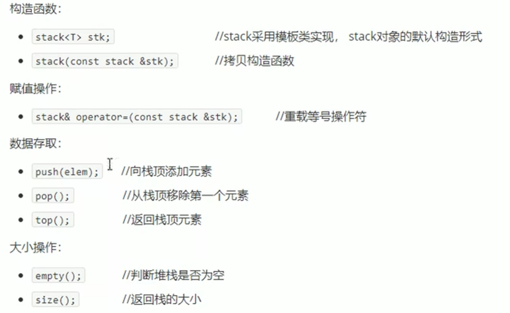
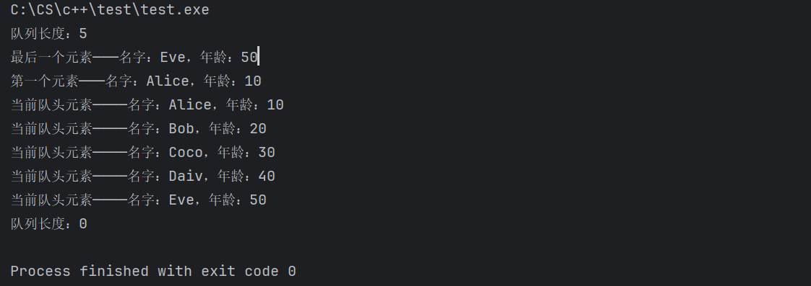
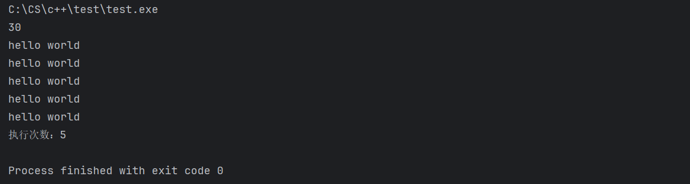
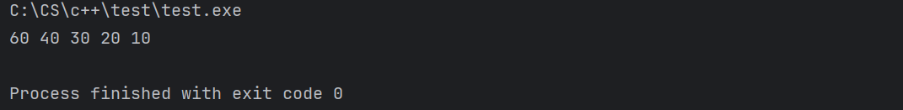
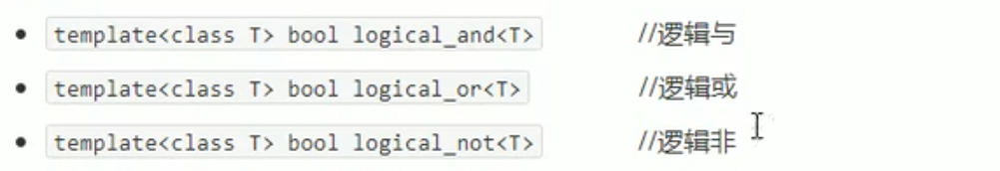

本阶段主要针对C++ **泛型编程** 和 **STL技术** 做详细讲解，探讨C++更深层的使用。

# 1 模板

模板的特点：

- 不可以直接使用，只是一个框架；
- 模板的通用并不是万能的；

C++另一种编程思想称为 **泛型编程**，主要利用的技术就是模板。C++提供两种模板机制：

- 函数模板
- 类模板

## 1.1 函数模板

### 1.1.1 基本使用

函数模板作用：建立一个通用函数，其函数返回值类型和形参类型可以不具体制定，用一个 **虚拟的类型** 来代表。

语法：

```c++
template<typename T>
函数声明或定义
```

解释：

- `template`：声明创建模板；
- `typename`：表明其后面的符号是一个通用的数据类型，可以用 `class` 代替；
- `T`：通用的数据类型，名称可以替换，通常为大写字母；

实例：

```c++
void swapInt(int & a, int & b){
    int tmp = a;
    a = b;
    b = tmp;
}

void swapDouble(double & a, double & b){
    double tmp = a;
    a = b;
    b = tmp;
}
```

上面是两个不同类型的交换函数，这两个函数除了函数名之后唯一的区别就是类型不同，因此 **如果可以不指定类型，后续根据需要传入** 就可以简化代码。

```c++
template<typename T>
void mySwap(T & a, T & b){
    T tmp = a;
    a = b;
    b = tmp;
}
int a = 10;
int b = 20;
double c = 1.1;
double d = 2.2;
mySwap(a, b);  // 自动类型推导
mySwap<double>(c, d);  // 显示指定类型
```

总结：

- 函数的模板使用有两种方式：自动类型推导、显示指定类型；
- 模板的目的是为了提高复用性，将类型参数化；
- `typename` 和 `class` 作用一样，没有区别，不过一般是函数模板用 `typename`，类模板用 `class`；

### 1.1.2 注意事项

注意事项1：自动类型推导必须推导出一致的数据类型 `T` 才可以使用。

```c++
int a = 10;
double c = 1.1;
mySwap(a, c);
```

报错：deduced conflicting types for parameter 'T' ('int' and 'double')。意思是 `T` 的推导发生了冲突，不知道是 `int` 还是 `double`。

注意事项2：模板必须要确定出 `T` 的数据类型才可以使用；

```c++
template<typename T>
void func(){
    cout << "hello world" << endl;
}

int main(){
    func();
}
```

报错：couldn't deduce template parameter 'T'。意思是推导不出 `T` 的数据类型。

注意事项3：`template` 和函数定义（声明）之间不能存在有效语句（注释可以存在）

```c++
// 可以
template<typename T>
bool isSame(T a, T b){
    if (a == b){
        cout << "函数模板";
        return true;
    }
    return false;
}

// 可以
template<typename T>
// void func();
bool isSame(T a, T b){
    if (a == b){
        cout << "函数模板";
        return true;
    }
    return false;
}

// 不可以
template<typename T>
void func();
bool isSame(T a, T b){
    if (a == b){
        cout << "函数模板";
        return true;
    }
    return false;
}
```

注意事项4：函数声明和定义如果分开，两个地方都要写 `template<typename T>`。


### 1.1.3 案例

案例描述：

- 利用函数模板封装一个排序的函数，可以对 **不同数据类型数据** 进行排序；
- 排序规则从大到小，排序算法为 **选择排序**；
- 分别利用 `char` 数据 和 `int` 数据进行测试；

```c++
#include <iostream>
using namespace std;

template<typename T>
void mySwap(T & a, T & b){
    T tmp = a;
    a = b;
    b = tmp;
}

template<typename T>
void mySort(T arr[], int len){
    for (int i = 0; i < len - 1; i++){
        int maxIdx = i;
        for (int j = i + 1; j < len; j++){
            if (arr[maxIdx] < arr [j]){
                maxIdx = j;
            }
        }
        if (maxIdx != i) {
            mySwap(arr[i], arr[maxIdx]);
        }
    }
}

template<typename T>
void printArr(T arr[], int len){
    for (int i = 0; i < len; i ++){
        cout << arr[i] << '\t';
    }
    cout << endl;
}


int main(){
    char charArr[] = "asdfhe";
    int intArr[] = {1, 4, 6, 8, 9, 2};
    int charArrLen = sizeof(charArr) / sizeof(charArr[0]);
    int intArrLen = sizeof(intArr) / sizeof(intArr[0]);
    mySort(charArr, charArrLen);
    mySort(intArr, intArrLen);
    printArr(charArr, charArrLen);
    printArr(intArr, intArrLen);
}

```


### 1.1.4 普通函数与函数模板的区别

两者的区别：

- 普通函数调用时可以发生自动类型转换（隐式类型转换）；
- 函数模板调用时，如果利用自动类型推导，则不会发生隐式类型转换；
- 如果利用显示指定类型的方式，可以发生隐式类型转换；

```c++
#include <iostream>
using namespace std;

int myAdd01(int a, int b){
    return a + b;
}

template<typename T>
int myAdd02(T a, T b){
    return a + b;
}

int main(){
    int a = 10;
    int b = 20;
    char c = 'a';
    cout << "普通函数调用，传入 int a 和 int b：" << myAdd01(a, b) << endl;
    cout << "普通函数调用，传入 int a 和 char c：" << myAdd01(a, c) << endl;
    cout << "函数模板调用（自动类型推导），传入 int a 和 int b：" << myAdd02(a ,b) << endl;
//    cout << "函数模板调用（自动类型推导），传入 int a 和 char c：" << myAdd02(a ,c) << endl;
    cout << "函数模板调用（显示指定类型），传入 int a 和 int b：" << myAdd02<int>(a ,b) << endl;
    cout << "函数模板调用（显示指定类型），传入 int a 和 char c：" << myAdd02<int>(a ,c) << endl;

    return 0;
}
```


解释：

- 这里 `c` 能够相加是因为被转为了 `int` 型，本质上其实 `char` 存入内存的就是 ASCII 码，`char` 只是显示的方式，所以只能 `int` 和 `char` 互相转换；
- 普通函数调用，会自动完成 `char` 到 `int` 的转变；
- 函数模板调用，不会自动完成 `char` 到 `int` 的转变，需要显示指定类型；

总结：

- 建议使用显示指定的方式调用模板函数；

### 1.1.5 普通函数与函数模板的调用规则

调用规则如下：

1. 如果函数模板和普通函数都可以实现，优先调用普通函数；
2. 可以通过 **空模板参数列表** 来强制调用函数模板；
3. 函数模板也可以发生重载；
4. 如果函数模板可以产生更好的匹配，优先调用函数模板；

```c++
void myPrint(int a){
    cout << "普通函数：" << a << endl;
}

template<typename T>
void myPrint(T a){
    cout << "函数模板：" << a << endl;
}
```

调用函数：

```c++
int a = 10;
myPrint(a);
```

结果是调用了普通函数，这就说明了调用规则的第一点。即使普通函数只有声明而没有实现，也会调用普通函数，从而导致报错。

如果希望调用函数模板，可以使用这样的方式：

```c++
int a = 10;
myPrint<>(a);
```

这就是 **空模板参数列表**。

如果是如下的调用方式：

```c++
char c = 'b';
myPrint(c);
```

也是调用的函数模板，因为普通函数要求传入 `int` ，这里传入 `char`，虽然可以互相转换，但函数模板更加匹配，它可以直接传入 `char`，所以调用函数模板。

最后，函数模板也可以发生重载：

```c++
template<typename T>
void myPrint(T a){
    cout << "函数模板：" << a << endl;
}

template<typename T>
void myPrint(T a, T b){
    cout << "函数模板：" << a << ", " << b <<endl;
}
```

### 1.1.6 模板的局限性

假设存在如下模板：

```c++
template<typename T>
bool isSame(T & a, T & b){
    if (a == b){
        return true;
    }
    return false;
}
```

如果传入的 `a` 和 `b` 是数组或者自定以的类则无法比较。

为了解决上述问题，C++提供模板的重载，可以为这些特定的类型提供具体化模板。

```c++
template<typename T>
bool isSame(T & a, T & b){
    if (a == b){
        return true;
    }
    return false;
}

// 具体化模板
template<> bool isSame(Person & a, Person & b){
    if (a.m_Name == b.m_Name && a.m_Age == b.m_Age){
        return true;
    }
    return false;
}
```

需要注意：

- 模板参数列表是什么样子，下面也得是什么样子，比如不能少了引用或者用其他的；
- 具体化模板与普通函数的区别，具体化模板就像是函数模板的一个实例，而普通函数和函数模板就是两个不一样的东西了；


总结：

- 利用具体化模板可以解决自定义类型的通用化；
- 学习模板并不是为了写模板，而是在 STL 能够运用系统提供的模板；


## 1.2 类模板

### 1.2.1 语法

类模板作用：建立一个通用类，类中的成员、数据类型可以不具体制定，用一个 **虚拟的类型** 来代表。

语法：

```c++
template<class T>
类的定义
```

例子：

```c++
#include <iostream>
using namespace std;

template<typename NameType, typename AgeType>
class Person{
public:
    Person(NameType name, AgeType age){
        m_Name = name;
        m_Age = age;
    }

    void showPerson(){
        cout << "姓名：" << this->m_Name << endl;
        cout << "年龄：" << this->m_Age << endl;
    }

    NameType m_Name;
    AgeType m_Age;
};


int main(){
    Person<string, int> p("Tom", 18); 
    // Person<string, int>p("Tom", 18); // 也可以
    p.showPerson();
    
    return 0;
}

```


### 1.2.2 类模板与函数模板的区别

区别：

- 类模板没有自动类型推导的使用方式；
- 类模板在模板参数列表中可以有默认参数；

```c++
Person p("Tom", 18);
```

理论上不行，但是 CLion 可以。但 **尽量不这么使用**。

```c++
template<typename NameType, typename AgeType = int>
class Person{
public:
    Person(NameType name, AgeType age){
        m_Name = name;
        m_Age = age;
    }

    void showPerson(){
        cout << "姓名：" << this->m_Name << endl;
        cout << "年龄：" << this->m_Age << endl;
    }

    NameType m_Name;
    AgeType m_Age;
};
```

需要注意和默认参数一样，如果 i 位置存在默认参数，那么 i+1 到最后一定都要有默认参数。

### 1.2.3 类模板中的成员函数创建时机

类模板中成员函数和普通类中成员函数创建时机有区别：

- 普通类中的成员函数一开始就可以创建；
- 类模板中的成员函数在调用时创建；

```c++
class Person1{
public:
    void showPerson1(){}
};

class Person2{
public:
    void showPerson2(){}
};

template<class T>
class MyClass{
public:
    void showInfo1(){
        obj.showPerson1();
    }

    void showInfo2(){
        obj.showPerson2();
    }


    T obj;
};
MyClass<Person1> mc;
mc.showInfo1();
```

上述代码直接编译可以通过，也可以运行，但下面就不行了，因为此时 `T = Person1`，而 `Person1` 中没有 `showPerson2()`，所以报错。

```c++
mc.showInfo2();
```

简单理解就是：

- 类创建时由于不确定 `T` 所以可以通过；
- 一旦传入具体类型，则可以调用相关的成员函数，但无法调用不相关的成员函数；
- 比如 `mc.shoInfo1()` 并不涉及 `showPerson2()` 所以可以调用；

### 1.2.4 类模板对象做函数参数

一共有3种方式：

1. 指定传入类型（最广泛使用）
2. 参数模板化
3. 整个类模板化

```c++
#include <iostream>
using namespace std;

template<class T1, class T2>
class Person{
public:
    Person(T1 name, T2 age){
        m_Name = name;
        m_Age = age;
    }

    void showPerson(){
        cout << "名字：" << this->m_Name << endl;
        cout << "年龄：" << this->m_Age << endl;
    }

    T1 m_Name;
    T2 m_Age;
};

// 1. 指定传入类型
void show1(Person<string, int> & p){
    p.showPerson();
}

// 2. 参数模板化
template<typename T1, typename T2>
void show2(Person<T1, T2> &p){
    p.showPerson();
    cout << "T1的数据类型是：" << typeid(T1).name() << endl;
    cout << "T2的数据类型是：" << typeid(T2).name() << endl;
}

// 3. 整个类模板化
template<typename T>
void show3(T & p){
    p.showPerson();
    cout << "T 的数据类型是：" << typeid(T).name() << endl;
}

int main(){
    Person<string, int> p("Tom", 10);
    show1(p);
    show2(p);
    show3(p);
    
    return 0;
}

```


后两种方式说白了就是利用函数模板的自动类型推导，所以这里使用的是 `typename`。（当然也可以用 `class`）

至于结果中类型为什么是这样，是因为 `g++` 的优化，不重要。

### 1.2.5 类模板与继承

当类模板碰到继承时，需要注意：

1. 当子类继承的父类是一个类模板时，子类在声明时需要指定出父类中的具体类型；
2. 如果不指定，编译器无法给子类分配内存；
3. 如果想灵活指定父类中的具体类型，那么子类也需要变为类模板；

```c++
template<class T>
class Base{
public:
    Base(){
        cout << "T的数据类型：" << typeid(T).name() << endl;
    }

    T m;
};

//  错误示范
//class Son1 : public Base {
//public:
//    Son1(){}
//};

// 正确示范，指定 T 的数据类型
class Son1 : public Base<int>{
public:
    int m1;
}
```

将子类变为类模板：

```c++
template<class T>
class Base{
public:
    Base(){
        cout << "T的数据类型：" << typeid(T).name() << endl;
    }

    T m;
};

template<class T1, class T2>
class Son2 : public Base<T2>{
public:
    Son2(){
        cout << "T1的数据类型：" << typeid(T1).name() << endl;
        cout << "T2的数据类型：" << typeid(T2).name() << endl;
    }
};

Son2<string, int> s;
```


`Son2<string, int> s;` 使  `T1 = string`、`T2 = int`，由于 `T2` 是指定的父类的 `T`，所以父类构造函数中显示的也是 `i`。

### 1.2.6 类模板成员函数类外实现

```c++
template<class T1, class T2>
class Person{
public:
    Person(T1 name, T2 age);
    void showPerson();

    T1 m_Name;
    T2 m_Age;
};

template<class T1, class T2>
Person<T1, T2>::Person(T1 name, T2 age){
    this->m_Name = name;
    this->m_Age = age;
}

template<class T1, class T2>
void Person<T1, T2>::showPerson(){
    cout << "姓名：" << this->m_Name << endl;
    cout << "年龄：" << this->m_Age << endl;
}
```

需要注意两点：

- 类外实现的时候也需要 `template<...>` 语句；
- 类外实现需要 `类名<参数列表>::函数名(形参列表)`

### 1.2.7 类模板份文件编写

问题：

- 类模板中的成员函数创建时机是在调用阶段，导致分文件编写时链接不到；

解决问题：

- 方式1：直接包含 `.cpp` 文件；
- 方式2：将声明和实现写到同一个文件中，并更改后缀名为 `.hpp`，这是约定俗成的后缀名，并非强制；

目录结构：

```cmd
person
│ main.cpp
│
├─include
│		person.hpp
│		person.h
│
└─src
        person.cpp
```

```c++
// main.cpp
#include "./include/person.h"
using namespace std;

int main(){
    Person<string ,int> p("Tom", 18);
    p.showPerson();
    return 0;
}

// person.h
#pragma once
#include <iostream>

template<class T1, class T2>
class Person{
public:
    Person(T1 name, T2 age);
    void showPerson();

    T1 m_Name;
    T2 m_Age;
};

// person.cpp
#include "../include/person.h"
using namespace std;

template<class T1, class T2>
Person<T1, T2>::Person(T1 name, T2 age){
    this->m_Name = name;
    this->m_Age = age;
}

template<class T1, class T2>
void Person<T1, T2>::showPerson(){
    cout << "姓名：" << this->m_Name << endl;
    cout << "年龄：" << this->m_Age << endl;
}
```

上述中，如果 `main.cpp` 中不调用 `Person` 类，则不会报错，成功编译，一旦调用则会报错。这就是因为 **类模板中的成员函数创建时机是在调用阶段，导致分文件编写时链接不到**。

解决方式1：

```c++
#include "./include/person.h"
#include "./src/person.cpp"  // 包含 .cpp 文件
using namespace std;

int main(){
    Person<string ,int> p("Tom", 18);
    p.showPerson();
    return 0;
}
```

解决方式2：

```c++
// person.hpp
#pragma once
#include <iostream>
using namespace std;

template<class T1, class T2>
class Person{
public:
    Person(T1 name, T2 age);
    void showPerson();

    T1 m_Name;
    T2 m_Age;
};

template<class T1, class T2>
Person<T1, T2>::Person(T1 name, T2 age){
    this->m_Name = name;
    this->m_Age = age;
}

template<class T1, class T2>
void Person<T1, T2>::showPerson(){
    cout << "姓名：" << this->m_Name << endl;
    cout << "年龄：" << this->m_Age << endl;
}

// main.cpp
#include "./include/person.hpp"
using namespace std;

int main(){
    Person<string ,int> p("Tom", 18);
    p.showPerson();
    return 0;
}
```

### 1.2.8 类模板与友元

全局函数类内实现（前面的友元没有内类实现）：直接在类内声明友元即可；

```c++
#include <iostream>
using namespace std;

template<class T1, class T2>
class Person{
    // 类内实现成员函数
    friend void showPerson(Person<T1, T2> & p){
        cout << "姓名：" << p.m_Name << endl;
        cout << "年龄：" << p.m_Age << endl;
    }

public:
    Person(T1 name, T2 age){
        this->m_Age = age;
        this->m_Name = name;
    }
private:
    T1 m_Name;
    T2 m_Age;
};

int main(){
    Person<string, int> p("Tom", 19);
    showPerson(p);
    
    return 0;
}

```


全局函数类外实现：需要提前让编译器知道全局函数的存在；

```c++
#include <iostream>
using namespace std;

template<class T1, class T2>
class Person;

template<class T1, class T2>
void showPerson(Person<T1, T2> & p){
    cout << "姓名：" << p.m_Name << endl;
    cout << "年龄：" << p.m_Age << endl;
}

template<class T1, class T2>
class Person{
    friend void showPerson<>(Person<T1, T2> & p);
public:
    Person(T1 name, T2 age){
        this->m_Age = age;
        this->m_Name = name;
    }
private:
    T1 m_Name;
    T2 m_Age;
};

int main(){
    Person<string, int> p("Tom", 19);
    showPerson(p);

    return 0;
}

```

注意：

- 全局函数的类外实现需要在 `class Person` 定义之前；
- 由于全局函数需要用到 `Person` 类，所以需要在全局函数前面声明 `Person` 类；
- 因为全局函数也是函数模板，所以 `showPerson<>`，让编译器知道这是一个函数模板；

### 1.2.9 案例

实现一个通用的数组类，要求如下：

1. 可以对内置数据类型以及自定义数据类型的数据进行存储；
2. 将数组中的数据存储到堆区；
3. 构造函数中可以传入数组的容量；
4. 提供对应的拷贝构造函数以及 `operato=` 防止浅拷贝问题；
5. 提供尾插法和尾删法对数组中的数据进行增加和删除；
6. 可以通过下标的方式访问数组中的元素；
7. 可以获取数组中当前元素个数（size）和数组容量（capacity）；


```c++
// myArr.hpp
#pragma once
#include <iostream>
using namespace std;

template<class T>
class MyArray{
private:
    T * m_pAddress;
    int m_Capacity;
    int m_Size;
public:
    MyArray(int capacity); // 构造函数
    MyArray(const MyArray & arr); // 拷贝构造函数
    MyArray & operator=(const MyArray & arr);  // 重载=，使其进行赋值操作
    void pushBack(const T & val); // 尾插法
    void popBack(); // 尾删法（逻辑删除）
    T & operator[](int index); // 重载[]，使其可以通过下标访问
    int getCapacity();  // 返回数组容量
    int getSize();  // 返回数组大小
    ~MyArray();
};

/**
 * 类外实现成员函数
 */

// 构造函数
template<class T>
MyArray<T>::MyArray(int capacity){
    this->m_Capacity = capacity;
    this->m_Size = 0;
    this->m_pAddress = new T[this->m_Capacity];
}

// 拷贝构造函数
template<class T>
MyArray<T>::MyArray(const MyArray & arr) {
     this->m_Capacity = arr.m_Capacity;
     this->m_Size = arr.m_Size;
     this->m_pAddress = new T[arr.m_Capacity];
     for (int i = 0; i < this->m_Size; i++){
         this->m_pAddress[i] = arr.m_pAddress[i];
     }

}

// 重载 =，注意类外实现的时候，返回值时 MyArray<T> &
template<class T>
MyArray<T> & MyArray<T>::operator=(const MyArray & arr) {
    if (this->m_pAddress != NULL) {
        delete[] this->m_pAddress;
        this->m_pAddress = NULL;
        this->m_Size = 0;
        this->m_Capacity = 0;
    }

    this->m_Capacity = arr.m_Capacity;
    this->m_Size = arr.m_Size;
    this->m_pAddress = new T[this->m_Capacity];
    for (int i = 0; i < this->m_Size; i++){
        this->m_pAddress[i] = arr.m_pAddress[i];
    }
    return * this;
}

// 尾插法
template<class T>
void MyArray<T>::pushBack(const T & val) {
    if (this->m_Size == this->m_Capacity) {
        cout << "数组已满，无法插入" << endl;
        return;
    }

    this->m_pAddress[this->m_Size++] = val;
}

// 尾删法
template<class T>
void MyArray<T>::popBack() {
    if (this->m_Size == 0) {
        cout << "数组为空，无法删除" << endl;
        return;
    }
    this->m_Size--;
}

// 重载 []
template<class T>
T & MyArray<T>::operator[](int index){
    return this->m_pAddress[index];
}

// 返回数组容量
template<class T>
int MyArray<T>::getCapacity() {
    return this->m_Capacity;
}

// 返回数组大小
template<class T>
int MyArray<T>::getSize() {
    return this->m_Size;
}

// 析构函数
template<class T>
MyArray<T>::~MyArray(){
    if(this->m_pAddress != NULL){
        delete[] this->m_pAddress;
        this->m_pAddress = NULL;
        this->m_Size = 0;
        this->m_Capacity = 0;
    }
}
```

```c++
#include "myArray.hpp"

class Person{
public:
    Person() {};
    Person(string name, int age){
        this->m_Name = name;
        this->m_Age = age;
    }
    void showPerson(){
        cout << "姓名：" << this->m_Name << "，年龄：" << this->m_Age << endl;
    }
private:
    string m_Name;
    int m_Age;
};

int main(){
    MyArray<Person> arr(5);
    Person p1("Alice", 18);
    Person p2("Bob", 20);
    Person p3("Coco", 22);
    arr.pushBack(p1);
    arr.pushBack(p2);
    arr.pushBack(p3);

    cout << "数组容量：" << arr.getCapacity() << "\t 数组大小："  << arr.getSize() << endl;
    for (int i = 0; i < arr.getSize(); i++){
        arr[i].showPerson();
    }

    arr.popBack();
    cout << "数组容量：" << arr.getCapacity() << "\t 数组大小："  << arr.getSize() << endl;
    for (int i = 0; i < arr.getSize(); i++){
        arr[i].showPerson();
    }

    return 0;
}
```


注意：

- 类模板成员函数类外实现时：声明时可以写 `MyArray & ...`，类外实现时必须写 `MyArray<T> & ....`；
- 为了实现下标访问，需要重载 `[]`；
- 尾删法，逻辑实现，不需要真的删除；
- `Person` 之中必须有无参构造函数，因为 `MyArray<Person> arr(5);` 会调用构造函数，而此时无法传入参数，所以必须有无参构造函数；

# 2 STL 初识

## 2.1 概念

STL 的诞生：

- 长久以来，软件界希望建立一种可重复利用的东西；
- C++ 面向对象和泛型编程的思想，目的就是 复用性提升；
- 大多情况下，数据结构和算法都未能有一套标准，导致被迫从事大量重复的工作；
- 为了建立数据结构和算法的一套标准，诞生了 STL；

STL 基本概念：

- STL （Standard Template Library，标准模板库）
- STL 从广义上分为：容器（container）、算法（algorithm）、迭代器（iterator）
- 容器和算法之间通过迭代器进行无缝衔接；
- STL 几乎所有的代码都采用了模板类或者模板函数；

STL 6大组件分别是：

1. 容器：各种数据结构，如：vector、list、deque、set、map等，用来存放数据；
2. 算法：各种常用的算法，如：sort、find、copy、for_each等；
3. 迭代器：扮演了容器与算法之间的胶合剂；
4. 仿函数：行为类似函数（重载 `()`），可作为算法的某种策略；
5. 适配器：一种用来修饰容器或者仿函数或者迭代器接口的东西；
6. 控制配置器：负责空间的配置与管理；


**容器**：置物之所也

STL 容器就是将运用最广泛的一些数据结构实现出来。

常用的数据结构：数据、链表、树、栈、队列、集合、映射表等；

这些容器分为 **序列式容器** 和 **关联式容器**：

- 序列式容器：强调值的排序，序列式容器中的每个元素均有固定的位置；
- 关联式容器：二叉树结构，各元素之间没有严格的物理上的顺序关系；

**算法**：问题之解法也

有限的步骤，解决逻辑或数学上的问题。算法分为：

- **质变算法**：运算过程中会更高区间内元素的内容。例如：拷贝、替换、删除等；
- **非质变算法**：运算过程中不会更改区间内的元素内容，例如：查找、计数、遍历、寻找等；

**迭代器**：容器和算法之间的粘合剂

提供一种方法，使之能够依序寻访某个容器所含的各个元素，而又无需暴露该容器的内部表示方式。每个容器都有自己专属的迭代器。

 迭代器种类：

| 种类           | 功能                                                     | 支持运算                                |
| -------------- | -------------------------------------------------------- | --------------------------------------- |
| 输入迭代器     | 对数据的只读访问                                         | 只读，支持 ++、==、!=                   |
| 输出迭代器     | 对数据的只写访问                                         | 只写，支持 ++                           |
| 前向迭代器     | 读写操作，并能向前推进迭代器                             | 读写，支持++、==、!=                    |
| 双向迭代器     | 读写操作，并能向前和向后操作                             | 读写，支持++、--                        |
| 随机访问迭代器 | 读写操作，可以以跳跃的方式访问任意数据，功能最强的迭代器 | 读写，支持++、--、[n]、-n、<、>、<=、>= |

常用的容器中的迭代器种类为双向迭代器和随机访问迭代器。

## 2.2 容器、算法、迭代器初识

 ### 2.2.1 vector 存放内置数据类型

容器：`vector`

算法：`for_each`

迭代器：`vector<数据类型>::iterator`

```c++
#include<iostream>
#include<vector>
#include<algorithm>
using namespace std;

void myPrint(int val){
    cout << val << endl;
}

int main(){
    vector<int> v;

    v.push_back(1);
    v.push_back(2);
    v.push_back(3);
    v.push_back(4);
    v.push_back(5);

    // 第一种遍历方式
    cout << "First" << endl;
    vector<int>::iterator pBegin = v.begin();
    vector<int>::iterator pEnd = v.end();

    while(pBegin != pEnd){
        cout << *pBegin << endl;
        pBegin++;
    }

    // 第二种遍历方式
    cout << "Second" << endl;
    for (vector<int>::iterator it = v.begin(); it != v.end(); it++){
        cout << *it << endl;
    }

    // 第三种遍历方式
    cout << "Thrid" << endl;
    for_each(v.begin(), v.end(), myPrint);

    return 0;
}
```

解释：

- `vector<int> v;` 创建一个 vector 容器对象，通过模板参数指定容器中存放的数据类型；
- `v.push_back(1);`向容器中放数据；
- `v.begin()` 返回容器中第一个数据的指针；
- `v.end()` 返回容器中最后一个数据后一个位置的指针；
- `for_each(v.begin(), v.end(), myPrint);` 需要包含 `algorithm` 最后一个参数是函数，叫做回调函数；

```c++
  template<typename _InputIterator, typename _Function>
    _GLIBCXX20_CONSTEXPR
    _Function
    for_each(_InputIterator __first, _InputIterator __last, _Function __f)
    {
      // concept requirements
      __glibcxx_function_requires(_InputIteratorConcept<_InputIterator>)
      __glibcxx_requires_valid_range(__first, __last);
      for (; __first != __last; ++__first)
	__f(*__first);
      return __f; // N.B. [alg.foreach] says std::move(f) but it's redundant.
    }
```

上面是 `for_each`的定义重点关注：

- `__glibcxx_requires_valid_range(__first, __last);`：确定范围是否有效；
- `for (; __first != __last; ++__first)  __f(*__first);`：for循环就是我们第二种遍历方式，然后执行我们传入的函数，可以看到参数是取值，所以我们写的函数的形参是 `int val`；

### 2.2.2 存放自定义数据类型

例子1：存放类

```c++
#include<iostream>
#include<vector>
#include<algorithm>
using namespace std;

class Person{
public:
    Person(string name, int age){
        this->m_Name = name;
        this->m_Age = age;
    }
    string m_Name;
    int m_Age;
};

void myPrint(Person p){
    cout << "姓名：" << p.m_Name << "\t年龄：" << p.m_Age << endl;
}

int main(){

    vector<Person> v;

    Person p1("Alice", 10);
    Person p2("Bob", 12);
    Person p3("Coco", 17);
    Person p4("Davi", 20);
    Person p5("Eve", 24);

    v.push_back(p1);
    v.push_back(p2);
    v.push_back(p3);
    v.push_back(p4);
    v.push_back(p5);

    for_each(v.begin(), v.end(), myPrint);
    
    return 0;
}
```


示例2：存放类的指针

```c++
#include<iostream>
#include<vector>
#include<algorithm>
using namespace std;

class Person{
public:
    Person(string name, int age){
        this->m_Name = name;
        this->m_Age = age;
    }
    string m_Name;
    int m_Age;
};

void myPrint(Person * p){
    cout << "姓名：" << p->m_Name << "\t年龄：" << p->m_Age << endl;
}

int main(){

    vector<Person *> v;

    Person p1("Alice", 10);
    Person p2("Bob", 12);
    Person p3("Coco", 17);
    Person p4("Davi", 20);
    Person p5("Eve", 24);

    v.push_back(&p1);
    v.push_back(&p2);
    v.push_back(&p3);
    v.push_back(&p4);
    v.push_back(&p5);

    for_each(v.begin(), v.end(), myPrint);

    return 0;
}
```


两者结果一样，不过需要注意，因为第一个例子中存放的是类对象，所以 `v.begin()` 是第一个元素的指针，因此 `*` 之后就是第一个元素本身，因此 `myPrint` 形参是 `Person p`。第二个例子中存放的是类对象的指针，所以 `v.begin()` 是第一个元素的指针的指针，因此 `*` 之后就是第一个元素的指针，因此 `myPrint` 的形参是 `Person * p`。

> vector<type> type是什么，那么 v.begin()、v.end() 取出来的就是什么类型。

### 2.2.3 vector 容器嵌套容器

> 二（多）维数组

```c++
#include<iostream>
#include<vector>
using namespace std;

int main(){

    vector<vector<int>> v;

    vector<int> v1;
    vector<int> v2;
    vector<int> v3;
    vector<int> v4;

    for (int i = 0; i < 4; i++){
        v1.push_back(i);
        v2.push_back(i + 4);
        v3.push_back(i + 8);
        v4.push_back(i + 12);
    }

    v.push_back(v1);
    v.push_back(v2);
    v.push_back(v3);
    v.push_back(v4);

    for (vector<vector<int>>::iterator it = v.begin(); it != v.end(); it++){
        for (vector<int>::iterator jt = it->begin(); jt != it->end(); jt++){
            cout << *jt << ' ';
        }
        cout << endl;
    }

    return 0;
}
```

注意：关键就是要弄清 `v.begin()` 返回的是什么！！！

遍历算法改为：

```c++
void myPrint(int val){
    cout << val << ' ';
}

for (vector<vector<int>>::iterator it = v.begin(); it != v.end(); it++){
    for_each((*it).begin(), (*it).end(), myPrint);
    cout << endl;
}
```

或者：

```c++
void myPrint2(int val){
    cout << val << ' ';
}

void myPrint1(vector<int> v){
    for_each(v.begin(), v.end(), myPrint2);
    cout << endl;
}

for_each(v.begin(), v.end(), myPrint1);
```


# 3 STL - 常用容器

## 3.1 string容器

### 3.1.1 基本概念

本质：string 是 C++ 风格的字符串，本质是一个类。

string 和 char * 的区别：

- char * 是一个指针
- string 是一个类，内部封装了 char *，管理这个字符串，是一个 char * 型的容器；

特点：

- string 类内部封装了很多成员方法，如：find、copy、delete、replace、insert等；
- string 管理 char * 所分配的内存，不用担心复制越界和取值越界等，由内部进行负责；

### 3.1.2 构造函数

构造函数原型：

- `string();`  // 创建一个空的字符串
- `string(const char * s);`  // 使用字符串 s 初始化
- `string(const string & str);`  // 使用一个 string 对象初始化另一个对象
- `string(int n, char c);`  // 使用 n 个字符 c 初始化

```c++
#include<iostream>
using namespace std;

int main(){
    string s1;  // 空字符串
    cout << s1 << endl;

    char * s = "hello world";
    string s2(s);
    cout << s2 << endl;

    string s3(s2);
    cout << s3 << endl;

    string s4(4, 'a');
    cout << s4 << endl;
    
    return 0;
}
```


### 3.1.3 赋值

功能描述：给 string 字符串进行赋值

赋值函数的原型：

- `string & operator=(const char * s);`  // char * 类型字符串 赋值给 当前的字符串
- `string & operator=(const string & s);`  // 把字符串 s 赋值给 当前字符串
- `string & operator=(char c);`  // 字符 赋值给 当前字符串
- `string & assign(const char * s);`  // 把字符串 s 赋值给 当前字符串
- `string & assign(const char * s, int n);`  // 把字符串 s 的前 n 个字符 赋值给 当前字符串
- `string & assign(const string & s);`  // 把字符串 s 赋值给 当前字符串
- `string & assign(int n, char c);`  // 用 n 个字符 c 赋值给当前字符串

```c++
#include<iostream>
using namespace std;

int main(){
    string str1;
    str1 = "hello C++";  // 可以写为 string str1 = "hello C++";，其他也类似

    string str2;
    str2 = str1;

    string str3;
    str3 = 'a'; 

    cout << "str1 = " << str1 << endl;
    cout << "str2 = " << str2 << endl;
    cout << "str3 = " << str3 << endl;

    string str4;
    str4.assign("hello world");

    string str5;
    str5.assign("hello world", 5);

    string str6;
    str6.assign(str1);

    string str7;
    str7.assign(4, 'b');

    cout << "str4 = " << str4 << endl;
    cout << "str5 = " << str5 << endl;
    cout << "str6 = " << str6 << endl;
    cout << "str7 = " << str7 << endl;

    return 0;
}
```


### 3.1.4 拼接

功能描述：实现在字符串末尾拼接字符串

函数原型：

- `string & operator+=(const char * s);`    // 在当前字符串后面拼接字符串 s
- `string & operator+=(const string & s);`  // 在当前字符串后面拼接字符串 s  
- `string & operator+=(const char c);`    // // 在当前字符串后面拼接字符 c
- `string & append(const char * s);`   // 在当前字符串后面拼接字符串 s
- `string & append(const char * s, int n);`   // 在当前字符串后面拼接字符串 s 的前 n 个字符
- `string & append(const string & s);`   // 在当前字符串后面拼接字符串 s
- `string & append(const string & s, int pos, int n);`  // 在当前字符串后面拼接字符串 s 从 pos 下标开始的n 个字符

### 3.1.5 查找和替换

功能描述：

- 查找：查找指定字符串是否存在；
- 替换：在指定的位置替换字符串；

函数原型：

- `int find(const string & str, int pos = 0) const;`  // 查找 str 第一次出现的位置，从 pos 开始查找
- `int find(const char * s, int pos = 0) const;`   // 查找 s 第一次出现的位置，从 pos 开始查找
- `int find(const char * s, int pos, int n) const;`  // 从 pos 开始查找 s 的前 n 个字符第一次出现的位置；
- `int find(const char c, int pos = 0) const;`  // 查找 c 第一次出现的位置
- `int rfind(const string & str, int pos = npos) const;`  // 查找 str 最后一次出现的位置，从 pos 开始查找
- `int rfind(const char * s, int pos = npos) const;`   // 查找 s 最后一次出现的位置，从 pos 开始查找
- `int rfind(const char * s, int pos, int n) const;`  // 从 pos 开始查找 s 的前 n 个字符最后一次出现的位置；
- `int rfind(const char c, int pos = 0) const;`  // 查找 c 最后一次出现的位置
- `string & replace(int pos, int n, const string & str);`  // 替换从 pos 开始的 n 个字符为字符串 str；
- `string & replace(int pos, int n, const char * s);`   // 替换从 pos 开始的 n 个字符为字符串 s；

### 3.1.6 比较

功能描述：字符串之间的比较。字符串比较是按照字符的ASCII码进行比较的，

- `=` 返回 0
- `>` 返回 1
- `<` 返回 -1

函数原型：

- `int compare(const string & s) const;`  // 与字符串 s 比较
- `int compare(const char * s) const;`  // 与字符串 s 比较

### 3.1.7 存取

string 中单个字符存取有两种方式：

- `char & operator[](int n);`  // 通过 [] 方式取字符；
- `char & at(int n);`  // 通过 at 方法获取字符

```c++
#include<iostream>
using namespace std;

int main(){
    string str1 = "hello world";
    for (int i = 0; i < str1.size(); i++){
        cout << str1[i] << ' ';
    }
    cout << endl;

    str1[5] = 'p';  // 修改单个字符
    str1.at(6) = 't';  // 修改单个字符

    for (int i = 0; i < str1.length(); i++){
        cout << str1.at(i) << ' ';
    }
    cout << endl;

    return 0;
}
```

注意：

- `str1.size()` 和 `str1.length()` 没有区别，两者源码相同。length是因为沿用C语言的习惯而保留下来的，string类最初只有length，引入STL之后，为了兼容又加入了size，它是作为STL容器的属性存在的，便于符合STL的接口规则，以便用于STL的算法

### 3.1.8 插入和删除

功能描述：对 string 字符串插入和删除字符操作

函数原型：

- `string & insert(int pos, const char * s);`  // 在指定位置插入字符串
- `string & insert(int pos, const string & str);`  // 在指定位置插入字符串
- `string & insert(int pos, int n, char c);`  // 在指定位置插入 n 个字符 c
- `string & erase(int pos, int n = npos);`  // 删除从 pos 开始的 n 个字符

### 3.1.9 子串

功能描述：从字符串中获取想要的子串

函数原型：

- `string substr(int pos = 0, int n = npos) const;`  // 返回由 pos 开始的  n 个字符组成的字符串

## 3.2 vector容器

### 3.2.1 基本概念

功能：vector 数据结构和数组非常类似，也称为 **单端数组**

与普通数组的区别：

- 数组是静态空间（无法扩展），而 vector 是动态扩展；

动态扩展：

- 并不是在原空间之后续接新空间，而是找更大的内存空间，然后将原数据拷贝到新空间，释放原空间
- vector 容器的迭代器是支持随机访问的迭代器


### 3.2.2 构造函数

功能描述：创建 vector 容器

函数原型：

- `vector<数据类型> v;`   默认构造  无参构造
- `vector<数据类型> v2(v.begin(), v.end());`  将 v.begin(), v.end() 区间中的元素拷贝给自身
- `vector<数据类型> v3(n, elem);`  将 n 个 elem 拷贝给自身
- `vector<数据类型> v4(const vector & vec);`   拷贝构造函数

### 3.2.3 赋值

功能描述：给 vector 容器赋值

函数原型：

- `vector & operator=(const vector & vec);`   重载等号操作符
- `assign(beg, end);`  将 [beg, end] 区间中的数据拷贝赋值给本身
- `assign(n, elem);`   将 n 个 elem 拷贝赋值给本身

### 3.2.4 容量和大小

功能描述：对 vector 容器的容量和大小进行操作

函数原型：

- `empty();`   判断容器是否为空
- `capacity()`  容器的容量
- `size()` 返回容器中的元素个数
- `resize(int num)`   重新指定容器的长度为 num，若容器变长，则以默认值填充新位置；若容器变短，则超出部分被删除；
- `resize(int num, elem)` 重新指定容器的长度为 num，若容器变长，则以 elem 填充新位置；若容器变短，则超出部分被删除；

## 3.3 deque容器

### 3.3.1 基本概念

功能：双端数组，可以对头端进行插入和删除操作

deque和vector的区别：

- vector对于头部插入、删除效率低，数据量越大，效率越低；
- deque相对而言对头部的插入、删除速度比vector快；
- vector访问内部元素的速度比deque快，这和两者的内部实现有关；


deque容器内部工作原理：

deque内部存在一个 **中控器**，维护每段缓冲区的内存，缓冲区中存放真实数据，中控器维护的是每个缓冲区的地址，使得deque像一片连续的内存空间。


- deque容器的迭代器支持随机访问

### 3.3.2 构造函数

功能描述：deque 容器构造

函数原型：

- `deque<Typename> deqT`  默认构造形式
- `deque<Typename> deqT(beg, end)`  构造函数将 [beg, end) 区间中的元素拷贝给本身
- `deque<Typename> deqT(n, elem)`  构造函数将 n 个 elem 拷贝给本身
- `deque<Typename> deqT(const deque & deq)`  拷贝构造函数

```c++
#include<iostream>
#include<deque>
using namespace std;

void printDeque(deque<int> & d){
    for (deque<int>::iterator it = d.begin(); it != d.end(); it++){
        cout << (*it) << " ";
    }
    cout << endl;
}

int main(){
    deque<int> d1;
    for (int i = 0; i < 10; i++){
        d1.push_back(i+1);
    }
    printDeque(d1);

    deque<int> d2(d1.begin(), d1.end());
    printDeque(d2);

    deque<int> d3(5, 100);
    printDeque(d3);

    deque<int> d4(d3);
    printDeque(d4);

    return 0;
}
```


需要注意，上述代码中的 `printDeque` 由于传入的是引用，所以可以在函数内部修改实参的值，如果不希望实参被修改，应该加 const 关键字，**遍历的时候也需要使用 const 迭代器**。下面是两者的对比：

```c++
void printDeque(deque<int> & d){
    for (deque<int>::iterator it = d.begin(); it != d.end(); it++){
        (*it) = 100;  // 不报错
        cout << (*it) << " ";
    }
    cout << endl;
}

void printDeque1(const deque<int> & d){
    for (deque<int>::const_iterator it = d.begin(); it != d.end(); it++){
//        (*it) = 100;  // 报错
        cout << (*it) << " ";
    }
    cout << endl;
}
```

总结：

- deque 容器和 vector 容器的构造方式几乎一致，灵活使用即可

### 3.3.3 赋值

功能描述：给deque容器赋值

函数原型：

- `deque & operator=(const deque & deq)`  重载赋值符号
- `assign(beg, end)`  将 [beg, end) 区间的数据拷贝给本身
- `assign(n, elem)`  将 n 个 elem 拷贝给本身

### 3.3.4 大小

功能描述：对的却容器进行大小操作

函数原型：

- `deque.empty()`  判断容器是否为空
- `deque.size()`  返回容器中元素个数
- `deque.resize(num)`   重新指定容器的长度为 num，若容器变长，则以默认值填充新位置；若容器变短，则超出部分被删除；
- `deque.resize(num, elem)`  重新指定容器的长度为 num，若容器变长，则以 elem 填充新位置；若容器变短，则超出部分被删除；

> deque没有容量的概念

### 3.3.5 插入和删除

功能描述：向 deque 容器中插入和删除数据

函数原型：


> 需要注意，容器中的pos指的是迭代器而不是下班，因此不是int，而是一个指针！！！

### 3.3.6 数据存取

功能描述：对deque容器中的数据进行存取操作

函数原型：

- `at(idx)`  返回索引 idx 所指位置的元素
- `operator[]`  重写 `[]`，可以通过方括号访问
- `front()`  返回容器中的第一个元素
- `back()`  返回容器中的最后一个元素

### 3.3.7 排序

功能描述：利用算法对deque容器进行排序

函数原型：

- `sort(iterator beg, iterator end)`  对 [beg, end) 区间内的元素进行排序，默认升序，后面会细讲

```c++
#include<iostream>
#include<deque>
#include<algorithm>
using namespace std;

void printDeque(const deque<int> & d){
    for (deque<int>::const_iterator it = d.begin(); it != d.end(); it++){
        cout << (*it) << " ";
    }
    cout << endl;
}

int main(){
    deque<int> d1;
    d1.push_back(100);
    d1.push_back(10);
    d1.push_back(20);
    d1.push_back(1);
    d1.push_back(1000);

    cout << "排序前：" << endl;
    printDeque(d1);
    sort(d1.begin(), d1.end());
    cout << "排序后：" << endl;
    printDeque(d1);

    
    return 0;
}
```


> vector容器也可以使用 sort 算法

## 3.4 案例——评委打分

案例描述：

5名选手 ABCDE，10个评委分别对每一名选手打分，去除最高分，去除最低分，求平均分。


实现步骤：

1. 创建5名选手，放在 vector 容器中；
2. 遍历 vector 容器，取每一名选手执行for循环，将评分存到deque容器中；
3. sort 算法对deque容器排序，去除最高、最低分；
4. 累加deque容器；
5. 求平均分

```c++
#include<iostream>
#include<vector>
#include<deque>
#include<algorithm>
#include<ctime>
using namespace std;

class Person{
public:
    Person(string name, double avgScore = 0.0){
        this->m_Name = name;
        this->m_AvgScore = avgScore;
    }

    string m_Name;  // 选手名字
    double m_AvgScore;  // 选手平均分
};

void createPlayers(vector<Person> & v){
    for (int i = 0; i < 5; i++){
        string name = "选手";
        name += ('A' + i);  // 这里需要用单引号而不是双引号，单引号是char，才可以转为ascii码，双引号是字符串不可以转为ascii码
        v.push_back(Person(name));
    }
}

void setScore(vector<Person> & v){
    for (vector<Person>::iterator it = v.begin(); it != v.end(); it++){
        deque<int> score;
        for (int i = 0; i < 10; i++){
            score.push_back(rand() % 41 + 60);  // 分数在60 ~ 100区间随机
        }

        sort(score.begin(), score.end());  // 排序

        score.pop_back();  // 去除最高分
        score.pop_front();  // 去除最低分

        int scoreSum = 0;
        for (int i = 0; i < score.size(); i++){
            scoreSum += score[i];
        }

        (*it).m_AvgScore = (double)scoreSum / score.size();
    }
}

void showPlayerInfo(const vector<Person> & v){
    for(vector<Person>::const_iterator it = v.begin(); it != v.end(); it++){
        cout << "名字：" << (*it).m_Name << "，平均分：" << (*it).m_AvgScore << endl;
    }
}

int main(){
    srand((unsigned int)time(NULL));

    vector<Person> playerVec;
    createPlayers(playerVec);
    setScore(playerVec);
    showPlayerInfo(playerVec);

    return 0;
}
```


`string name = “选手” + 'A'` 是不行的，而 `string name = string数据+ “xx” + "xx"` 是可行的，因为前两项中有一个 string 类型，所以可以。而第一种前两项没有string类型。

## 3.5 stack容器

### 3.5.1 基本概念

stack是一种先进后出（First In Last Out，FILO）的数据结构，它只有一个出口。


栈中只有栈顶元素可以被外界使用，因此栈没有遍历。

栈中进入数据称为入栈（push）

栈中弹出数据称为出栈（pop）

### 3.5.2 常用接口

功能描述：栈容器常用的对外接口



```c++
#include<iostream>
#include<stack>

using namespace std;

int main(){
    stack<int> s;
    for (int i = 0; i < 10; i++){
        s.push(i+1);
    }
    cout << "栈的大小：" << s.size() << endl;

    stack<int> s2 = s;
    stack<int> s3(s2);

    while (!s.empty()){
        cout << "当前栈顶元素为：" << s.top() << endl;
        s.pop();
    }

    cout << "s栈的大小：" << s.size() << endl;

    return 0;
}
```

总结：

- s2和s3和s一样；
- `pop` 只是出栈，并不会返回出栈元素；
- `top` 只是获取栈顶元素，并不会出栈；

## 3.6 queue容器

### 3.6.1 基本概念

queue是一种先进先出（First In First Out，FIFO）的数据结构，它有两个口，一个是入口，另一个是出口。


queue只允许在队尾新增元素，只允许在队头移出元素。

queue只有对头和队尾可以被外界使用，因此不存在遍历行为。

队列中进数据称为入队（push）

队列中出数据称为出队（pop）

### 3.6.2 常用接口

功能描述：队列容器常用的对外接口


```c++
#include<iostream>
#include<queue>

using namespace std;

class Person{
public:
    Person(string name, int age){
        this->m_Name = name;
        this->m_Age = age;
    }

    string m_Name;
    int m_Age;
};

int main(){
    queue<Person> q;

    q.push(Person("Alice", 10));
    q.push(Person("Bob", 20));
    q.push(Person("Coco", 30));
    q.push(Person("Daiv", 40));
    q.push(Person("Eve", 50));

    cout << "队列长度：" << q.size() << endl;

    cout << "最后一个元素———名字：" << q.back().m_Name << "，年龄：" << q.back().m_Age << endl;
    cout << "第一个元素———名字：" << q.front().m_Name << "，年龄：" << q.front().m_Age << endl;

    while (!q.empty()){
        cout << "当前队头元素————名字：" << q.front().m_Name << "，年龄：" << q.front().m_Age << endl;
        q.pop();
    }
    
    cout << "队列长度：" << q.size() << endl;

    return 0;
}
```



## 3.7 list容器

### 3.7.1 基本概念

功能：将数据进行链式存取

链表（list）是一种物理存储单元上非连续的存储空间，数据元素的逻辑顺序是通过链表中的指针实现的。

链表由一系列 **节点** 组成。

节点的组成：一个存储数据元素的 **数据域**，另一个是存储下一个节点信息的 **指针域**


STL中的链表是一个双向循环链表：


由于列表的存储方式不是连续的内存空间，因此链表中的迭代器只支持前移（++）和后移（--），属于双向迭代器。

优点：

- 采用动态存储分配，不会造成内存浪费和输出
- 链表执行插入和删除操作十分方便，修改指针即可，不需要移动大量元素；

缺点：

- 空间占用比数组多；

> list插入和删除操作不会造成原有list迭代器（指针）的失效（内存地址发生变化），这在vector中不成立。就是任意位置插入，并不会影响原来的迭代器指向的位置；任意位置删除也是同理。

### 3.7.2 构造函数

功能描述：创建list容器

函数原型：

- `list<Typename> lst`
- `list(beg, end)`
- `list(n, elem)`
- `list(const list & lst)`

```c++
#include<iostream>
#include<list>

using namespace std;

void printList(const list<int> & lst){
    for (list<int>::const_iterator it = lst.begin(); it != lst.end(); it++){
        cout << *it << " ";
    }
    cout << endl;
}

int main(){
    list<int> lst1;
    for (int i = 0; i < 5; i++){
        lst1.push_back(i + 1);
    }
    printList(lst1);

    list<int> lst2(++lst1.begin(), lst1.end());
    printList(lst2);

    list<int> lst3(10, -1);
    printList(lst3);

    list<int> lst4(lst2);
    printList(lst4);

    return 0;
}
```


### 3.7.2 赋值和交换

功能描述：给list容器赋值，以及交换list容器

函数原型：


### 3.7.3 大小操作

功能描述：对list容器进行大小操作

函数原型：


### 3.7.4 插入和删除

功能描述：对list容器进行数据的插入和删除


> 上图中的pos值得是迭代器，而不是下标

### 3.7.5 数据存取

功能描述：对list容器中的数据进行存取

函数原型：


### 3.7.6 反转和排序

功能描述：将容器中的元素反转，以及将容器中的数据进行排序

函数原型：


```c++
#include<iostream>
#include<list>

using namespace std;

void printList(const list<int> & lst){
    for (list<int>::const_iterator it = lst.begin(); it != lst.end(); it++){
        cout << *it << " ";
    }
    cout << endl;
}

bool myCompare(int v1, int v2){
    return v1 > v2;
}

int main(){
    list<int> lst;
    lst.push_back(100);
    lst.push_back(20);
    lst.push_back(10);
    lst.push_back(30);
    lst.push_back(0);

    cout << "默认状态：" << endl;
    printList(lst);

    lst.reverse();
    cout << "反转后：" << endl;
    printList(lst);

    lst.sort();
    cout << "升序排序后：" << endl;
    printList(lst);

    lst.sort(myCompare);
    cout << "降序排序后：" << endl;
    printList(lst);

    return 0;
}
```


注意：

- `sort` 支持传入自定义函数实现自定义排序，降序就让 `v1 > v2`；（个人理解，如果为真，则保持不变，如果为假，则换位置）

### 3.7.7 排序案例

案例描述：将 Person 自定义数据类型进行排序，Person中有姓名、年龄、身高。

排序规则：按照年龄进行 **升序**，如果年龄相同按照身高进行 **降序**。

```c++
#include<iostream>
#include<list>
using namespace std;

class Person{
public:
    Person(string name, int age, int height){
        this->m_Name = name;
        this->m_Age = age;
        this->m_Height = height;
    }

    string m_Name;
    int m_Age;
    int m_Height;
};

void printList(const list<Person> & lst){
    for (list<Person>::const_iterator it = lst.begin(); it != lst.end(); it++){
        cout << "姓名：" << (*it).m_Name << "，年龄：" << (*it).m_Age << "，身高：" << (*it).m_Height << endl;
    }
}

bool myCompare(const Person & p1, const Person & p2){
    if (p1.m_Age < p2.m_Age){
        return true;
    }else if(p1.m_Age == p2.m_Age){
        if (p1.m_Height >= p2.m_Height){
            return true;
        }else{
            return false;
        }
    }else{
        return false;
    }
}

int main(){
    list<Person> personLst;
    personLst.push_back(Person("Alice", 20, 160));
    personLst.push_back(Person("Bob", 12, 150));
    personLst.push_back(Person("Coco", 30, 180));
    personLst.push_back(Person("Deai", 19, 170));
    personLst.push_back(Person("Ele", 20, 175));

    cout << "排序前：" << endl;
    printList(personLst);

    personLst.sort(myCompare);
    cout << "排序后：" << endl;
    printList(personLst);

    return 0;
}
```


总结：

- 自定义数据类型必须使用自定义排序规则。

## 3.8 set/multiset容器

### 3.8.1 基本概念

简介：所有元素在插入时都会被自动排序。

本质：set/multiset属于 **关联式容器**，底层结构是用 **二叉树** 实现。

set和multiset的区别：

1. set容器不允许有重复元素；
2. multiset允许有重复元素；

### 3.8.2 构造和赋值

功能描述：创建set容器，以及赋值

函数原型：


> 插入数据只有insert

```c++
#include<iostream>
#include<set>
using namespace std;

void printSet(const set<int> & s){
    for (set<int>::const_iterator it = s.begin(); it != s.end(); it ++){
        cout << (*it) << " ";
    }
    cout << endl;
}

int main(){
    set<int> s1;
    s1.insert(10);
    s1.insert(30);
    s1.insert(20);
    s1.insert(40);
    s1.insert(30);

    printSet(s1);

    set<int> s2 = s1;
    printSet(s2);

    set<int> s3(s2);
    printSet(s3);

    return 0;
}
```


可以看出 set 容器的自动排序和不允许重复元素的特点。

```c++
#include<iostream>
#include<set>
using namespace std;

void printMultiset(const multiset<int> & s){
    for (multiset<int>::const_iterator it = s.begin(); it != s.end(); it ++){
        cout << (*it) << " ";
    }
    cout << endl;
}

int main(){
    multiset<int> s1;
    s1.insert(10);
    s1.insert(30);
    s1.insert(20);
    s1.insert(40);
    s1.insert(30);

    printMultiset(s1);

    multiset<int> s2 = s1;
    printMultiset(s2);

    multiset<int> s3(s2);
    printMultiset(s3);

    return 0;
}
```


可以看出 multiset 容器的自动排序和允许重复元素的特点。

### 3.8.3 大小和交换

功能描述：统计set容器大小及交换set容器

函数原型：


### 3.8.4 插入和删除

功能描述：set容器进行插入数据和删除数据

函数原型：


> 上面的pos、beg、end都是指迭代器

### 3.8.5 查找和统计

功能描述：对set容器进行查找数据以及统计数据

函数原型：

- `find(key)`  查找key是否存在，若存在，返回该key的迭代器，若不存在返回 `set.end()`；
- `count(key)`  统计key元素的个数，对于set容器结果是1或0

### 3.8.6 set和multiset的区别

区别：

- set不可以插入重复元素，multiset可以
- set插入数据的同时返回插入结果，表示插入成功；
- multiset不会检测数据，因此可以插入重复数据；

```c++
#include<iostream>
#include<set>
using namespace std;

int main(){
    set<int> s1;
    pair<set<int>::iterator, bool> ret = s1.insert(10);
    if (ret.second){
        cout << "第一次插入" << (*ret.first)<< "成功" << endl;
    }else{
        cout << "第一次插入失败" << endl;
    }

    pair<set<int>::iterator, bool> ret2 = s1.insert(10);
    if (ret2.second){
        cout << "第二次插入" << (*ret2.first)<< "成功" << endl;
    }else{
        cout << "第二次插入失败" << endl;
    }

    return 0;
}
```

解释：

- `insert`插入成功会返回两个值，第一个是插入元素的迭代器，第二个是是否插入成功；
- `pair`可以接收这样的两个值


multiset 是可以插入重复的值，之前也看过了，所以multiset的插入不会返回两个值，会报错。

### 3.8.7 pair对组

功能描述：成对出现的数据，利用对组可以返回两个数据。

两种创建方式：


```c++
#include<iostream>
#include<set>
using namespace std;

int main(){
    pair<string, int> p1("tom", 19);
    cout << "姓名：" << p1.first << "，年龄：" << p1.second << endl;

    pair<string, int> p2 = make_pair("Jerry", 30);
    cout << "姓名：" << p1.first << "，年龄：" << p1.second << endl;

    return 0;
}
```


### 3.8.8 排序

set容器默认排序规则是从小到大，可以利用仿函数改变排序规则。

示例1：内置数据类型

```c++
#include<iostream>
#include<set>
using namespace std;

class MyCompare{
public:
    bool operator()(int v1, int v2) const {
        return v1 > v2;
    }
};

int main(){
    set<int, MyCompare> s1;
    s1.insert(10);
    s1.insert(30);
    s1.insert(40);
    s1.insert(20);
    s1.insert(50);

    for (set<int>::iterator it = s1.begin(); it != s1.end(); it++){
        cout << *it << " ";
    }

    return 0;
}
```


解释：

- 利用仿函数实现set的倒序排序；
- 使用仿函数是因为 `template<class _Key, class _Compare, class _Alloc> class std::set `要求第二个参数是class；
- 仿函数中的v1,v2的类型根据set的类型而定；
- 倒叙就是让前一个数大于后一个数为真；
- 成员函数声明或定义后面加上`const`关键字表示该函数是一个常量成员函数。这意味着它不会修改对象的状态，即不会改变任何成员变量的值（除了被声明为`mutable`的变量）。


示例2：自定义数据类型

> 自定义数据类型必须指定排序规则，否则set不知道如何排序

```c++
#include<iostream>
#include<set>
using namespace std;

class Person{
public:
    Person(string name, int age){
        this->m_Name = name;
        this->m_Age = age;
    }

    string m_Name;
    int m_Age;
};

class MyCompare{
public:
    bool operator()(const Person & v1, const Person & v2) const {
        return v1.m_Age < v2.m_Age;
    }
};


int main(){
    set<Person, MyCompare> s;
    s.insert(Person("Tom", 10));
    s.insert(Person("Alice", 19));
    s.insert(Person("Coco", 6));

    for (set<Person, MyCompare>::iterator it = s.begin(); it != s.end(); it++){
        cout << (*it).m_Name << ' ' << (*it).m_Age << endl;
    }

    return 0;
}
```


解释：

- 这里按照年龄升序，所以是 v1.m_Age < v2.m_Age；
- `set<Person, MyCompare>::iterator it = s.begin()` 可以不写 MyCompare，`set<Person>::iterator it = s.begin()`

## 3.9 map/multimap容器

### 3.9.1 基本概念

简介：

- map中所有元素都是pair

- pair中第一个元素为key，起到索引作用，第二个元素为value
- 所有元素都会根据元素的key自动排序

本质：map/multimap属于 **关联式容器**，底层结构是用二叉树实现。

优点：可以根据key值快速找到value

map/multimap区别：

- map不允许容器中有重复key的元素；
- multimap允许容器中有重复key的元素；

### 3.9.2 构造和赋值

功能描述：对map容器进行构造和赋值操作。

函数原型：


```c++
#include<iostream>
#include<map>
using namespace std;

void printMap(const map<int, int> & mp){
    for (map<int, int>::const_iterator it = mp.begin(); it != mp.end(); it++){
        cout << "key: " << it->first << ", value: " << it->second << endl;
    }
}

int main(){
    map<int, int> mp1;
    mp1.insert(pair<int, int> (1, 20));
    mp1.insert(pair<int, int> (3, 10));
    mp1.insert(pair<int, int> (2, 5));
    mp1.insert(pair<int, int> (4, 30));
    cout << "mp1:" << endl;
    printMap(mp1);

    map<int, int> mp2(mp1);
    cout << "mp2:" << endl;
    printMap(mp2);

    map<int, int> mp3 = mp1;
    cout << "mp3:" << endl;
    printMap(mp3);

    return 0;
}
```


从结果可以看出，map会将元素根据key进行自动升序排序。

### 3.9.3 大小和交换

功能描述：统计map容器大小以及交换map容器

函数原型：


### 3.9.4 插入和删除

功能描述：map容器进行数据插入和删除

函数原型：


插入的形式有4种：

- `mp.insert(pair<t1, t2> (k, v))`
- `mp.insert(make_pair(k, v))`
- `mp.insert(map<t1, t2>::value_type(k, v))`
- `mp[k] = v`

其中，第四种方式不建议使用，因为 `[]` 没有检测机制，如果输入的k不存在，返回的value为0，而不是报错。

### 3.9.5 查找和统计

功能描述：对map容器进行数据查找以及统计。

函数原型：


### 3.9.6 排序

功能描述：map容器默认排序规则是从小到大，可以利用仿函数改变排序规则。

> 与map容器内容基本一样

示例1：内置数据类型

```c++
#include<iostream>
#include<map>
using namespace std;

class MyCompare{
public:
    bool operator()(int v1, int v2) const {
        return v1 > v2;
    }
};
void printMap(const map<int, int, MyCompare> & mp){
    for (map<int, int>::const_iterator it = mp.begin(); it != mp.end(); it++){
        cout << "key: " << it->first << ", value: " << it->second << endl;
    }
}

int main(){
    map<int, int, MyCompare> mp1;
    mp1.insert(pair<int, int> (1, 20));
    mp1.insert(pair<int, int> (3, 10));
    mp1.insert(pair<int, int> (2, 5));
    mp1.insert(pair<int, int> (4, 30));
    printMap(mp1);

    return 0;
}
```


`void printMap(const map<int, int, MyCompare> & mp)` 一定要写 `MyCompare` 。

示例2：自定义数据类型

```c++
#include<iostream>
#include<map>
using namespace std;

class Person{
public:
    Person(string name, int age){
        this->m_Name = name;
        this->m_Age = age;
    }

    string m_Name;
    int m_Age;
};

class MyCompare{
public:
    bool operator()(const Person & v1, const Person & v2) const {
        return v1.m_Age < v2.m_Age;
    }
};


int main(){
    map<Person, int, MyCompare> mp1;
    mp1.insert(pair<Person, int>(Person("Alice", 50), 3));
    mp1.insert(pair<Person, int>(Person("Bob", 40), 1));
    mp1.insert(pair<Person, int>(Person("Coco", 30), 2));

    for (map<Person, int, MyCompare>::iterator it = mp1.begin(); it != mp1.end(); it++){
        cout << "key: " << it->second << ", 姓名: " << (it->first).m_Name << ", 年龄: " << (it->first).m_Age << endl;
    }

    return 0;
}
```


注意：

- map容器只对key进行排序，所以需要将排序的对象写在前面，这里 Person 在 int 前面；
- 此时 Person 类型称为key，不允许重复；而 int 成为 value，可以重复。

## 3.10 案例——员工分组

案例描述：

公司新招聘10个员工（ABCDEFGHIJ），员工信息有姓名、工资；部门分为：策划、美术、研发。随机给10名员工分配部门和工资，通过multimap进行信息的插入，其中（key：部门编号，value：员工）。分部门显示员工信息。

实现步骤：

1. 创建10名员工，放到vector中；
2. 遍历vector容器，取出每一个员工，进行随机分组；
3. 分组后，将员工部门编号作为key，具体员工作为value，放入到multimap容器中；
4. 分部门显示员工信息；

```c++
#include <iostream>
#include <map>
#include <vector>
#include <ctime>
using namespace std;

class Staff{
public:
    Staff(string name, int salary){
        this->m_Name = name;
        this->m_Salary = salary;
    }

    string m_Name;
    int m_Salary;
};

void createStaff(vector<Staff> & vec){
    string nameSeed = "ABCDEFGHIJ";
    for (int i = 0; i < 10; i++){
        string name = "Staff_";
        name += nameSeed[i];
        int salary = rand() % 3001 + 3000;
        vec.push_back(Staff(name, salary));
    }
}

void setDepartment(multimap<int, Staff> & mmap, const vector<Staff> & vec){
    for (vector<Staff>::const_iterator it = vec.begin(); it != vec.end(); it++){
        int departmentNo = rand() % 3;  // 0：策划，1：美术，2：研发
        mmap.insert(pair<int, Staff>(departmentNo, (*it)));
    }
}

void showInfo(const multimap<int, Staff> & mmap){
    string department[3] = {"策划", "美术", "研发"};
    multimap<int, Staff>::const_iterator it = mmap.begin();
    for (int i = 0; i < 3; i++){
        cout << department[i] << "人员如下：" << endl;
        int count = mmap.count(i);
        for (int j = 0; j < count; j++){
            cout << "姓名: " << (*it).second.m_Name << "，年龄：" << (*it).second.m_Salary  << endl;
            it++;
        }
    }
}

int main(){
    srand((unsigned int)time(NULL));
    vector<Staff> staffVec;
    multimap<int, Staff> department;
    createStaff(staffVec);
    setDepartment(department,staffVec);
    showInfo(department);

    return 0;
}

```


# 4 STL - 函数对象

## 4.1 函数对象

概念：

- 重载 **函数调用操作符** 的类，其对象常称为 **函数对象**；
- **函数对象** 使用重载的 `()` 时，行为类似函数调用，也叫 **仿函数**；

本质：

- 函数对象是一个类，不是一个函数；


```C++
#include<iostream>
using namespace std;

class MyAdd{
public:
    int operator()(int v1, int v2) {
        return v1 + v2;
    }
};

class MyPrint{
public:
    MyPrint(){
        this->m_Count = 0;
    }
    void operator()(string str){
        cout << str << endl;
        this->m_Count++;
    }
    int m_Count;
};

void doPrint(MyPrint & mp, string str){
    mp(str);
}

int main(){
    MyAdd myAdd;
    cout << myAdd(10, 20) << endl;

    MyPrint myPrint;
    myPrint("hello world");
    myPrint("hello world");
    myPrint("hello world");
    myPrint("hello world");

    doPrint(myPrint, "hello world");

    cout << "执行次数：" << myPrint.m_Count << endl;

    return 0;
}
```



从结果可以看出：

- 函数对象在使用时，可以像普通函数那样调用，可以有参数，可以有返回值；
- 函数对象超出普通函数的概念，函数对象可以有自己的状态；
- 函数对象可以作为参数传递；

## 4.2 谓词

概念：

- 返回bool类型的反函数称为 **谓词**
- 如果operator() 接受一个参数，那么叫做 **一元谓词**
- 如果operator() 接受两个参数，那么叫做 **二元谓词**

**示例1：一元谓词**

```c++
#include<iostream>
#include<vector>
#include<algorithm>
using namespace std;

class GreaterFive{
public:
    bool operator()(int val){
        return val > 5;
    }
};

int main(){
    vector<int> vec;
    for (int i = 0; i < 10; i++){
        vec.push_back(i + 1);
    }

    vector<int>::iterator val = find_if(vec.begin(), vec.end(), GreaterFive());
    cout << *val << endl;

    return 0;
}
```


```c++
  /**
   *  @brief Find the first element in a sequence for which a
   *         predicate is true.
   *  @ingroup non_mutating_algorithms
   *  @param  __first  An input iterator.
   *  @param  __last   An input iterator.
   *  @param  __pred   A predicate.
   *  @return   The first iterator @c i in the range @p [__first,__last)
   *  such that @p __pred(*i) is true, or @p __last if no such iterator exists.
  */
  template<typename _InputIterator, typename _Predicate>
    _GLIBCXX_NODISCARD _GLIBCXX20_CONSTEXPR
    inline _InputIterator
    find_if(_InputIterator __first, _InputIterator __last,
	    _Predicate __pred)
    {
      // concept requirements
      __glibcxx_function_requires(_InputIteratorConcept<_InputIterator>)
      __glibcxx_function_requires(_UnaryPredicateConcept<_Predicate,
	      typename iterator_traits<_InputIterator>::value_type>)
      __glibcxx_requires_valid_range(__first, __last);

      return std::__find_if(__first, __last,
			    __gnu_cxx::__ops::__pred_iter(__pred));
    }
```

可以看到 `find_if` 函数的作用是寻找序列中第一个满足条件的元素，并返回其迭代器。

**示例2：二元谓词**

```c++
#include<iostream>
#include<vector>
#include<algorithm>
using namespace std;

class MyCompare{
public:
    bool operator()(int v1, int v2){
        return v1 > v2;
    }
};

int main(){
    vector<int> v;
    v.push_back(20);
    v.push_back(10);
    v.push_back(30);
    v.push_back(60);
    v.push_back(40);

    sort(v.begin(), v.end(), MyCompare());
    for (vector<int>::iterator it = v.begin(); it != v.end(); it++){
        cout << (*it) << ' ';
    }
    cout << endl;
    
    return 0;
}
```


## 4.3 内建函数对象

概念：STL内建了一些函数对象。

分类：

1. 算术仿函数
2. 关系仿函数
3. 逻辑仿函数

用法：

- 这些仿函数所产生的对象，用法和一般函数完全相同；
- 使用内建函数对象，需要引入头文件 `functional`

**示例1：算术仿函数**

功能描述：实现四则运算，其中negate是一元运算，其他都是二元运算

仿函数原型：


```c++
#include<iostream>
#include<functional>
using namespace std;

int main(){
    negate<int> n;
    cout << n(4) << endl;

    plus<int> p;
    cout << p(10, 20) << endl;

    minus<int> m;
    cout << m(20, 10) << endl;

    multiplies<int> mul;
    cout << mul(2, 5) << endl;

    divides<int> d;
    cout << d(10, 2) << endl;

    modulus<int> mod;
    cout << mod(20, 3) << endl;

    return 0;
}
```


**示例2：关系仿函数**

功能描述：实现关系对比

仿函数原型：


比较常用的就是自定义排序规则可以使用 `greater` ，比如：

```c++
#include<iostream>
#include<functional>
#include<algorithm>
using namespace std;

int main(){
    vector<int> v;
    v.push_back(20);
    v.push_back(10);
    v.push_back(30);
    v.push_back(60);
    v.push_back(40);

    sort(v.begin(), v.end(), greater<int>());
    for (vector<int>::iterator it = v.begin(); it != v.end(); it++){
        cout << (*it) << ' ';
    }
    cout << endl;

    return 0;
}
```



**示例3：逻辑仿函数**

功能描述：实现逻辑运算

仿函数原型：



# 5 STL - 常用算法

概述：

- 算法主要由头文件 `algorithm, functional, numeric` 组成；
- `algorithm` 是所有STL头文件中最大的一个，范围涉及到比较、交换、查找、遍历、复制、修改等；
- `numeric` 体积很小，直播啊看几个在序列上面进行简单数学运算的模板函数；
- `functional` 定义了一些模板类，用以声明函数对象；

## 5.1 常用遍历算法

`for_each(iterator beg, iterator end, _func)` 

- 遍历算法，遍历容器元素
- beg 开始迭代器
- end 结束迭代器
- _func 函数或者函数对象

```c++
#include<iostream>
#include<functional>
#include<algorithm>
using namespace std;

void print01(int val){
    cout << val << endl;
}

class print02{
public:
    void operator()(int val){
        cout << val << endl;
    }
};

int main(){
    vector<int> v;
    v.push_back(20);
    v.push_back(10);
    v.push_back(30);
    v.push_back(60);
    v.push_back(40);
	
    // for_each(v.begin(), v.end(), print01);
    for_each(v.begin(), v.end(), print02());

    return 0;
}
```

注意： `for_each` 只是遍历，至于是否输出取决于第三个参数。


`transform(iterator beg1, iterator end1, iterator beg2, _func)`

- 搬运容器到另一个容器
- beg1 源容器开始迭代器
- end1 源容器结束迭代器
- beg2 目标容器开始迭代器
- _func 函数或者函数对象

```c++
#include<iostream>
#include<functional>
#include<algorithm>
using namespace std;

int myFunc(int val){
    return val + 1;
}

class print02{
public:
    void operator()(int val){
        cout << val << endl;
    }
};

int main(){
    vector<int> v;
    v.push_back(20);
    v.push_back(10);
    v.push_back(30);
    v.push_back(60);
    v.push_back(40);

    vector<int> vTarget;
    vTarget.resize(v.size());

    transform(v.begin(), v.end(), vTarget.begin(), myFunc);
    for_each(vTarget.begin(), vTarget.end(), print02());
    
    return 0;
}
```


_func 的作用：搬运过程中对元素进行操作。

## 5.2 常用查找算法


`find(iterator beg, iterator end, value)`

- 按值查找元素，找到返回元素的迭代器，找不到返回结束迭代器；
- beg 开始迭代器
- end 结束迭代器
- value 查找的元素

```c++
#include<iostream>
#include<functional>
#include<algorithm>
using namespace std;

class Person{
public:
    Person(string name, int age){
        this->m_Name = name;
        this->m_Age = age;
    }

    bool operator==(const Person & p){
        if (this->m_Name == p.m_Name && this->m_Age == p.m_Age){
            return true;
        }else{
            return false;
        }
    }

    string m_Name;
    int m_Age;
};

int main(){
    vector<Person> vec;
    Person p1("alice", 19);
    Person p2("bob", 20);
    Person p3("coco", 21);
    vec.push_back(p1);
    vec.push_back(p2);
    vec.push_back(p3);

    vector<Person>::iterator it = find(vec.begin(), vec.end(), p1);
    if (it == vec.end()){
        cout << "没有找到" << endl;
    }else{
        cout << "姓名：" << it->m_Name << "，年龄：" << it->m_Age << endl;
    }

    return 0;
}
```

需要注意，如果是自定义数据类型，需要重载 `==` ，这是因为在 `find` 函数中，也是通过 `== `比较判断是否相同，而自定义数据类型情况下`find`不知道如何比较，所以需要重载 `==`。


`find_if(iterator beg, iterator end, _Pred)`

- 按值查找元素，找到返回元素的迭代器，找不到返回结束迭代器；
- beg 开始迭代器
- end 结束迭代器
- _Pred 函数或者谓词

```c++
#include<iostream>
#include<functional>
#include<algorithm>
using namespace std;

class Person{
public:
    Person(string name, int age){
        this->m_Name = name;
        this->m_Age = age;
    }

    string m_Name;
    int m_Age;
};

bool MyCompare(const Person & p){
    return p.m_Age > 20;
}

int main(){
    vector<Person> vec;
    Person p1("alice", 19);
    Person p2("bob", 20);
    Person p3("coco", 21);
    vec.push_back(p1);
    vec.push_back(p2);
    vec.push_back(p3);

    vector<Person>::iterator it = find_if(vec.begin(), vec.end(), MyCompare);
    if (it == vec.end()){
        cout << "没有找到" << endl;
    }else{
        cout << "姓名：" << it->m_Name << "，年龄：" << it->m_Age << endl;
    }

    return 0;
}
```

`adjacent_find(iterator beg, iterator end)`

- 查找相邻重复元素，返回相邻元素的第一个位置的迭代器
- beg 开始迭代器
- end 结束迭代器

```c++
#include<iostream>
#include<vector>
#include<algorithm>
using namespace std;

class Person{
public:
    Person(string name, int age){
        this->m_Name = name;
        this->m_Age = age;
    }

    bool operator==(const Person & p){
        if (this->m_Name == p.m_Name && this->m_Age == p.m_Age){
            return true;
        }
        return false;
    }

    string m_Name;
    int m_Age;
};

int main(){
    vector<Person> vec;
    Person p1("alice", 200);
    Person p2("alice", 10);
    Person p3("bob", 20);
    Person p4("bob", 20);
    Person p5("alice", 10);
    vec.push_back(p1);
    vec.push_back(p2);
    vec.push_back(p3);
    vec.push_back(p4);
    vec.push_back(p5);

    vector<Person>::iterator it = adjacent_find(vec.begin(), vec.end());
    if (it != vec.end()){
        cout << "找到了  " << endl;
    }else{
        cout << "没找到" << endl;
    }

    return 0;
}

```

> 调整 p4, p5的插入顺序就可以看到效果。

 `binary_search(iterator beg, iterator end, value, compare)`

- 按值查找元素，找到返回true，找不到返回false；
- beg 开始迭代器
- end 结束迭代器
- value 要查找的值
- compare 用于比较的函数

注意：容器元素必须是有序的序列！！！这个有序指的是容器的序列要和binary_search的规则一样，容器升序则函数升序（默认情况），容器降序则函数降序，容器自定义规则则函数自定义规则。

```c++
#include<iostream>
#include<vector>
#include<algorithm>
using namespace std;

class Person{
public:
    Person(string name, int age){
        this->m_Name = name;
        this->m_Age = age;
    }

    bool operator<(const Person & p){
        return this->m_Age < p.m_Age;
    }

    string m_Name;
    int m_Age;
};

bool myCompare(const Person & p1, const Person & p2){
    return p1.m_Age < p2.m_Age;
}

int main(){
    vector<Person> vec;
    Person p1("alice", 10);
    Person p2("bob", 16);
    Person p3("coco", 30);
    Person p4("dddd", 19);
    Person p5("eeee", 26);

    vec.push_back(p1);
    vec.push_back(p2);
    vec.push_back(p3);
    vec.push_back(p4);
    vec.push_back(p5);

    sort(vec.begin(), vec.end(), myCompare);
//    for (vector<Person>::iterator it = vec.begin(); it != vec.end(); it++){
//        cout << it->m_Name << ' ' << it->m_Age << endl;
//    }

    if (binary_search(vec.begin(), vec.end(), p2, myCompare)){
        cout << "找到了" << endl;
    }else{
        cout << "没找到" << endl;
    }

    return 0;
}
```

`cout(iterator beg, iterator end, value)`

- 返回元素出现次数
- beg 开始迭代器
- end 结束迭代器
- value 统计的元素

> 这种需要比较的需要重载 `==` 

`cout_if(iterator beg, iterator end, _Pred)`

- 按条件返回元素出现次数
- beg 开始迭代器
- end 结束迭代器
- _Pred 谓词

> 这种需要比较的需要重载 `==` 

## 5.3 常用排序算法


`sort(iterator beg, iterator end, _Pred)`

- 对容器内的元素进行排序
- beg 开始迭代器
- end 结束迭代器
- _Pred 谓词

```c++
#include<iostream>
#include<vector>
#include<algorithm>
using namespace std;

int main(){
    vector<int> vec;
    vec.push_back(10);
    vec.push_back(30);
    vec.push_back(40);
    vec.push_back(20);

    sort(vec.begin(), vec.end());
    for (vector<int>::iterator it = vec.begin(); it != vec.end(); it++){
        cout << *it << ' ';
    }
    cout << endl;

    sort(vec.begin(), vec.end(), greater<int>());
    for (vector<int>::iterator it = vec.begin(); it != vec.end(); it++){
        cout << *it << ' ';
    }
    cout << endl;
    
    return 0;
}
```


~~`random_shuffle(iterator beg, iterator end)`~~

- ~~指定范围内的元素随机调整次序~~
- ~~beg 开始迭代器~~
- ~~end 结束迭代器~~

`shuffle(iterator beg, iterator end, rng)`

- 指定范围内元素随机调整次序
- beg 开始迭代器
- end 结束迭代器
- rng 随机生成器

```c++
#include<iostream>
#include<vector>
#include<algorithm>
#include<random>
using namespace std;

void myPrint(int val){
    cout << val << ' ';
}

int main(){
    vector<int> vec;
    for (int i = 0 ; i < 100; i++){
        vec.push_back(i);
    }

    random_device rd;
    mt19937 rnd(rd());
    shuffle(vec.begin(), vec.end(), rnd);
    for_each(vec.begin(), vec.end(), myPrint);

    return 0;
}
```

`merge(iterator beg1, iterator end1, iterator beg2, iterator end2, iterator dest)`

- 容器元素合并，并存储到另一个容器
- beg1 容器1开始迭代器
- end1 容器1结束迭代器
- beg2 容器2开始迭代器
- end2 容器2结束迭代器
- dest 目标容器开始迭代器

```c++
#include<iostream>
#include<vector>
#include<algorithm>
using namespace std;

void myPrint(int val){
    cout << val << ' ';
}

int main(){
    vector<int> v1;
    vector<int> v2;

    for (int i = 0; i < 10; i++){
        v1.push_back(i);
    }
    v2.push_back(5);
    v2.push_back(7);
    v2.push_back(9);
    v2.push_back(11);

    vector<int> vTarget;
    vTarget.resize(v1.size() + v2.size());  // 需要给 vTarget 分配内存空间

    merge(v1.begin(), v1.end(), v2.begin(), v2.end(), vTarget.begin());
    for_each(vTarget.begin(), vTarget.end(), myPrint);

    return 0;
}
```

注意：

1. 如果两个容器都有序，且排序规则一样，则目标容器排序规则一样；
2. 如果两个容器无序、或者排序规则不一样，那么就是简单的将两个容器合并到目标容器，并不排序；


`reverse(iterator beg iterator end)`

- 反转指定范围内的元素
- beg 开始迭代器
- end 结束迭代器

```c++
#include<iostream>
#include<vector>
#include<algorithm>
using namespace std;

void myPrint(int val){
    cout << val << ' ';
}

int main(){
    vector<int> v;
    for (int i = 0; i < 10; i++){
        v.push_back(i);
    }

    cout << "反转前：" << endl;
    for_each(v.begin(), v.end(), myPrint);
    cout << endl;
    reverse(v.begin(), v.end());
    cout << "反转后：" << endl;
    for_each(v.begin(), v.end(), myPrint);

    return 0;
}
```

## 5.4 常用拷贝和替换算法


`copy(iterator beg, iterator end, iterator dest)`

- 容器内指定范围的元素拷贝到另一个容器
- beg 源容器开始迭代器
- end 源容器结束迭代器
- dest 目标容器开始迭代器

`replace(iterator beg, iterator, end, oldValue, newValue)`

- 将区间内的 **所有** 旧元素改为新元素
- beg 开始迭代器
- end 结束迭代器
- oldValue 旧元素
- newValue 新元素

`replace_if(iterator beg, iterator end, _Pred, newValue)`

- 将区间内满足条件的替换为新元素
- beg 开始迭代器
- end 结束迭代器
- _Pred 谓词
- newValue 新元素

`swap(container c1, container c2)`

- 互换两个**同种类型**容器的元素
- c1 容器1
- c2 容器2

## 5.5 常用算术生成算法


`accumulate(iterator beg, iterator end, value)`

- 计算容器元素累计之和
- beg 开始迭代器
- end 结束迭代器
- value 起始值（就是容器累加值实在value基础上开始，一般设置为0）

`fill(iterator beg, iterator end, value)`

- 向容器区间内填充元素
- beg 开始迭代器
- end 结束迭代器
- value 填充的值

## 5.6 常用集合算法


`set_intersection(iterator beg1, iterator end1, iterator beg2, iterator end2, iterator dest)`

- beg1/2 容器1/2开始迭代器
- end1/2 容器1/2结束迭代器
- dest 目标容器开始迭代器
- 返回值是一个迭代器，是目标容器中最后一个交集元素的位置

```c++
#include<iostream>
#include<vector>
#include<algorithm>
using namespace std;

void myPrint(int val){
    cout << val << ' ';
}

bool myCompare(int v1, int v2){
    return v1 > v2;
}

int main(){
    vector<int> v1;
    vector<int> v2;
    vector<int> vTarget;
    for (int i = 0; i < 10; i++){
        v1.push_back(i);
        v2.push_back(15 - i);
    }
//    sort(v1.begin(), v1.end(), myCompare);
//    sort(v2.begin(), v2.end(), myCompare);
//    sort(v1.begin(), v1.end(), myCompare);
    sort(v1.begin(), v1.end());
    sort(v2.begin(), v2.end());
    vTarget.resize(min(v1.size(), v2.size()));
    vector<int>::iterator itEnd = set_intersection(v1.begin(), v1.end(), v2.begin(), v2.end(), vTarget.begin());
//    vector<int>::iterator itEnd = set_intersection(v1.begin(), v1.end(), v2.begin(), v2.end(), vTarget.begin(), myCompare);
    for_each(vTarget.begin(), itEnd, myPrint);

    return 0;
}
```

注意：

- 两个容器必须有序，默认为升序，如果是降序或者其他，则需要在`set_intersection`中也添加自定义规则；
- `itEnd`指向交集中最有一个元素，因为 vTarget 容量会比交集元素多，所以需要用 `itEnd`；
- 交集需要注意容量问题！分配容量的时候需要分配一个容量**，这个容量大小可以小于实际需要，但有时候会报错，不建议这么做**；

`set_union(iterator beg1, iterator end1, iterator beg2, iterator end2, iterator dest)`

同上

`set_difference(iterator beg1, iterator end1, iterator beg2, iterator end2, iterator dest)`

同上

# 6 演讲比赛流程管理系统

比赛规则：


程序功能：


```
D:\C_PLUS_PLUS\SPEECHMANAGEMENT
│  main.cpp
│
├─include
│      speaker.h
│      speechManager.h
└─src
        speaker.cpp
        speechManager.cpp
```


## 6.1 头文件

speechManager.h

```c++
#pragma once
#include <iostream>
#include <vector>
#include <map>
#include <algorithm>
#include <random>
#include <deque>
#include <fstream>
#include "speaker.h"
#define FILE2SAVE "speech.csv"
using namespace std;


class SpeechManager{
public:
    SpeechManager();
    void showMenu();  // 展示菜单
    void exitSystem();  // 退出系统
    void initSpeech();  // 初始化
    void createSpeaker();  // 创建选手
    void startSpeech();  // 开始比赛
    void speechDraw();  // 抽签
    void speechContest();  // 比赛
    void showScore();  // 显示比赛结果
    void saveRecord();  // 记录结果
    void loadRecord();  // 读取记录
    void clearRecor();  // 清空记录
    ~SpeechManager();

    vector<int> v1;  // 第一轮比赛选手编号
    vector<int> v2;  // 第一轮晋级选手编号
    vector<int> vVictory;  // 胜出的前3名选手编号
    map<int, Speaker> m_Speaker;  // 编号及其对应的选手

    int m_Idx;  // 比赛轮数
};
```

speaker.h

```c++
#pragma once
#include <iostream>
using namespace std;

class Speaker{
public:
    Speaker(string name);
    string getName();
    void setScore(int idx, double score);
    double * getScore();
private:
    string m_Name;
    double m_Score[2];  // 可能有两轮成绩
};
```

## 6.2 源文件

speechManager.cpp

```c++
#include "../include/speechManager.h"

SpeechManager::SpeechManager() {
    this->initSpeech();
    this->createSpeaker();
}

void SpeechManager::showMenu() {
    cout << "欢迎参加演讲比赛" << endl;
    cout << "1、开始演讲比赛" << endl;
    cout << "2、查看往届记录" << endl;
    cout << "3、清空比赛记录" << endl;
    cout << "4、退出比赛程序" << endl;
}

void SpeechManager::exitSystem() {
    cout << "欢迎下次使用" << endl;
    system("pause");
    exit(0);
}

void SpeechManager::initSpeech() {
    this->v1.clear();
    this->v2.clear();
    this->vVictory.clear();
    this->m_Speaker.clear();

    this->m_Idx = 1;
}

void SpeechManager::createSpeaker() {
    string nameSeed = "ABCDEFGHIJKL";
    for (int i = 0; i < nameSeed.size(); i++){
        string name = "选手";
        name += nameSeed[i];
        Speaker s(name);
        this->v1.push_back(i + 10001);
        this->m_Speaker.insert(make_pair(i + 10001, s));  // 将选手与编号关联
    }
}

void SpeechManager::startSpeech(){
    // 第一轮比赛
    // 抽签
    this->speechDraw();

    // 比赛
    this->speechContest();

    //显示晋级结果
    this->showScore();

    // 第二轮比赛
    this->m_Idx++;
    // 抽取
    this->speechDraw();

    // 比赛
    this->speechContest();

    // 显示最终结果
    this->showScore();

    // 保存结果，并清空所有容器为下一场比赛做准备
    this->saveRecord();
    this->initSpeech();
    this->createSpeaker();
}

void SpeechManager::speechDraw() {
    cout << "第 <<" << this->m_Idx << ">>轮比赛选手正在抽签" << endl;
    cout << "----------------------------------------------------------------" << endl;
    random_device rd;
    mt19937 rnd(rd());
    cout << "抽签后演讲顺序如下：" << endl;
    if (this->m_Idx == 1){
        shuffle(this->v1.begin(), this->v1.end(), rnd);
        for (vector<int>::iterator it = v1.begin(); it != v1.end(); it++){
            cout << *it << ' ';
        }
    }else{
        shuffle(this->v2.begin(), this->v2.end(), rnd);
        for (vector<int>::iterator it = v2.begin(); it != v2.end(); it++){
            cout << *it << ' ';
        }
    }
    cout << endl;
    cout << "----------------------------------------------------------------" << endl;
}

void SpeechManager::speechContest() {
    cout << "---------------------第" << this->m_Idx << "轮正式比赛开始---------------------" << endl;
    multimap<double, int, greater<double>> groupScore;  // 临时容器，保存key分数、value和选手编号
    int num = 0;  // 记录人员数，6人一组
    vector<int> v_Src;  // 比赛的人员容器
    if (this->m_Idx == 1){
        v_Src = this->v1;
    }else{
        v_Src = this->v2;
    }

    for (vector<int>::iterator it = v_Src.begin(); it != v_Src.end(); it++){
        num++;

        // 评委打分
        deque<double> deq;
        for (int i = 0; i < 10; i++){
            double score = (rand() % 401 + 600)  / 10.f;
            deq.push_back(score);
        }
        sort(deq.begin(), deq.end());
        deq.pop_back();
        deq.pop_front();

        double sum = accumulate(deq.begin(), deq.end(), 0);
        double avg = sum / (double)deq.size();
//        cout << "编号：" << *it << "，选手：" << this->m_Speaker.find(*it)->second.getName() << "，平均分：" << avg << endl;
        this->m_Speaker.find(*it)->second.setScore(this->m_Idx - 1, avg);

        groupScore.insert(make_pair(avg, *it));  // 将成绩和编号绑定

        if (num % 6 == 0){
            // 如果满足条件，则说明已有6或者12人的成绩已给定，也就是第一组或者两组的成绩都给定
            cout << "第" << num / 6 << "轮小组比赛名次" << endl;
            for (multimap<double, int, greater<double>>::iterator it = groupScore.begin(); it != groupScore.end(); it++){
                cout << "编号：" << it->second << "，姓名：" << this->m_Speaker.find(it->second)->second.getName() << "，成绩：" << this->m_Speaker.find(it->second)->second.getScore()[this->m_Idx - 1] << endl;
            }
            int cnt = 0;  //  取前三
            for (multimap<double, int, greater<double>>::iterator it = groupScore.begin(); it != groupScore.end() && cnt < 3; it++, cnt++){
                if (this->m_Idx == 1){
                    this->v2.push_back(it->second);  // 如果当前是第一轮，则放入第二轮
                }else{
                    this->vVictory.push_back(it->second);  // 如果当前是第二轮，则放入最终数组
                }
            }
            groupScore.clear();
            cout << endl;
        }


    }

}

void SpeechManager::showScore(){
    cout << "---------------------第" << this->m_Idx << "轮晋级选手信息如下：---------------------" << endl;
    vector<int> v;
    if (this->m_Idx == 1){
        v = v2;
    }else{
       v = vVictory;
    }
    for (vector<int>::iterator it = v.begin(); it != v.end(); it++){
        cout << "编号：" << *it << "，姓名：" << this->m_Speaker.find(*it)->second.getName() << "，成绩：" << this->m_Speaker.find(*it)->second.getScore()[this->m_Idx - 1] << endl;
    }
    cout << "---------------------------------------------------------------" << endl;

}

void SpeechManager::saveRecord() {
    ofstream file(FILE2SAVE, ios::out | ios::app);  // 如果已存在则追加，否则创建
    for (vector<int>::iterator it = vVictory.begin(); it != vVictory.end(); it++){
        file << *it << ','
            << this->m_Speaker.find(*it)->second.getName() << ','
            << this->m_Speaker.find(*it)->second.getScore()[this->m_Idx - 1] << ',';
    }
    file << endl;
    file.close();
    cout << "记录已保存" << endl;
    cout << "本届比赛结束" << endl;
}

void SpeechManager::loadRecord() {
    ifstream file(FILE2SAVE, ios::in);
    if(!file.is_open()){
        cout << "文件打开失败" << endl;
        return;
    }
    string buff;
    int cnt = 1; // 届数
    while (getline(file, buff)){
        cout << "第" << cnt << "届比赛结果：";
        int pos = -1;
        int start = 0;
        vector<string> record;  // 记录每一届的结果
        while (true) {
            pos = buff.find(",", start);
            if (pos == -1) {
                // 没找到
                break;
            }
            record.push_back(buff.substr(start, pos - start));
            start = pos + 1;
        }

        // 显示
        string title1[] = {"冠军", "亚军", "季军"};
        string title2[] = {"编号", "姓名", "成绩"};
        for (int i = 0; i < record.size(); i++){
            if (i % 3 == 0){
                cout << endl;
                cout << title1[i / 3] << "：";
            }
            cout << title2[i % 3] << "：" << record[i] << "；";
        }

        cnt++;
        cout << endl;
    }
}

void SpeechManager::clearRecor() {
    int select = 0;
    cout << "确认清空？" << endl;
    cout << "1、确认" << endl;
    cout << "2、取消" << endl;
    cin >> select;
    if (select == 1){
        ofstream ofs(FILE2SAVE, ios::trunc);
        ofs.close();

        this->initSpeech();
        this->createSpeaker();
        cout << "清空成功";
    }
}

SpeechManager::~SpeechManager(){

}
```

speaker.cpp

```c++
#include "../include/speaker.h"
using namespace std;

Speaker::Speaker(string name){
    this->m_Name = name;
    for (int i = 0; i < 2; i++){
        this->m_Score[i] = 0;
    }
}

string Speaker::getName(){
    return this->m_Name;
}

double * Speaker::getScore(){
    return this->m_Score;
}

void Speaker::setScore(int idx, double score) {
    this->m_Score[idx] = score;
}
```

main.cpp

```c++
#include <iostream>
#include "include/speechManager.h"

int main() {
    SpeechManager sm;
    int choice = 0;
    while (true){
        sm.showMenu();
        cout << "请输入你的选择：";
        cin >> choice;
        switch(choice){
            case 1:
                sm.startSpeech();
                break;
            case 2:
                sm.loadRecord();
                break;
            case 3:
                sm.clearRecor();
                break;
            case 4:
                sm.exitSystem();
                break;
            default:
                system("cls");
                break;
        }
    }
}
```


