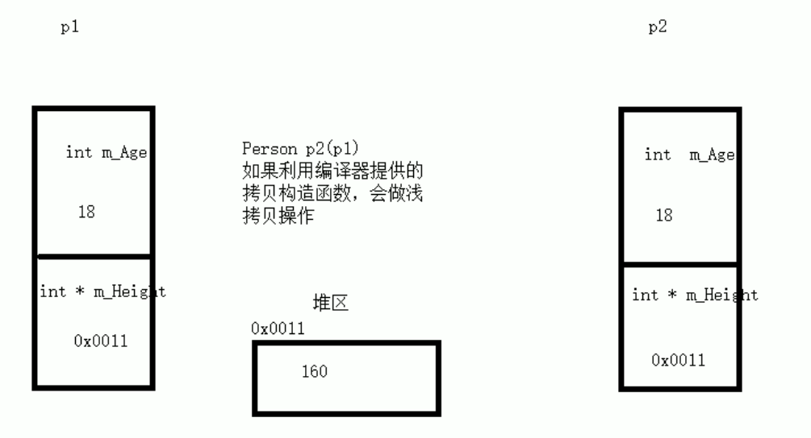
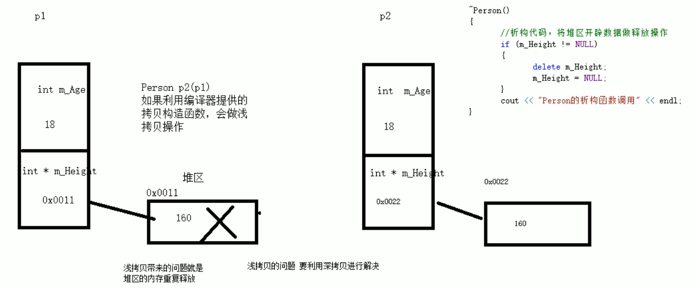
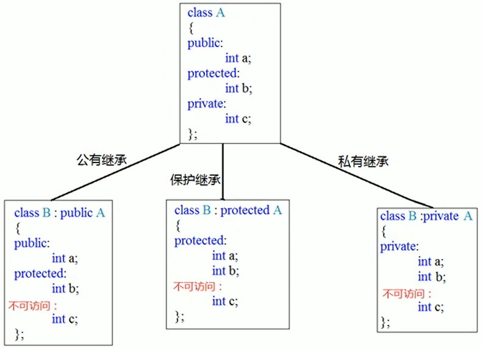

本阶段主要针对C++面向对象编程技术做详细讲解，探讨C++的核心和精髓

# 1 内存分区模型

C++程序在执行时，将内存大方向划分为4个区域：

- 代码区：存放函数体的二进制代码，由操作系统进行管理；
- 全局区：存放全局变量、静态变量以及常量
- 栈区：由编译器自动分配释放，**函数结束时** 地址回收，存放函数的参数值、局部变量等；
- 堆区：由程序员分配和释放，若程序员不释放，**程序结束时** 由操作系统回收；

内存四区的意义：不同区域存放的数据，赋予不同的生命周期，更大的灵活编程。

## 1.1 程序运行前

在程序编译后，生成了exe可执行文件，**未执行该程序前** 分为两个区域：

- **代码区**：
  - 存放CPU执行的机器指令；
  - 代码区是 **共享** 的，共享的目的是对于频繁执行的程序，只需要在内存中存储一份代码即可；
  - 代码区是 **只读** 的，原因是防止程序意外地修改了它的指令；
- **全局区**：
  - 全局变量和静态变量存放在此；
  - 全局区还包含了常量区，字符串常量和其他常量存放于此；
  - **该区域的数据在程序结束后由操作系统释放**；

```c++
#include <iostream>
using namespace std;

// 全局变量
int g_a = 10;
int g_b = 20;

// const 修饰的全局常量
const int c_g_a = 10;
const int c_g_b = 20;

int main(){
    // 局部变量
    int a = 10;
    int b = 20;

    //静态常量
    static int s_a = 10;
    static int s_b = 20;

    // const修饰的局部变量（局部常量）
    const int c_l_a = 10;
    const int c_l_b = 20;

    cout << "局部变量a的地址：" << &a << endl;
    cout << "局部变量b的地址：" << &b << endl;
    cout << "全局变量g_a的地址：" << &g_a << endl;
    cout << "全局变量g_b的地址：" << &g_b << endl;

    cout << "字符串常量的地址：" << &"hello" << endl;

    cout << "静态常量s_a的地址：" << &s_a << endl;
    cout << "静态常量s_b的地址：" << &s_b << endl;
    cout << "const修饰的局部常量c_l_a的地址：" << &c_l_a << endl;
    cout << "const修饰的局部常量c_l_b的地址：" << &c_l_b << endl;
    cout << "const修饰的全局常量c_l_a的地址：" << &c_g_a << endl;
    cout << "const修饰的全局常量c_l_b的地址：" << &c_g_b << endl;

    return 0;
}
```


可以看出，带有 “局部” 的在一块，不带 “局部” 的在一块（全局区）。

总结：

1. C++中在程序运行前分为全局区和代码区；
2. 代码区特点是 **共享** 和 **只读**；
3. 全局区中存放全局变量、静态变量、常量；
4. 常量区中存放 const 修饰的全局常量和字符串常量；

## 1.2 程序运行后

**栈区**：由编译器自动分配、释放，存放函数的参数值（形参）、局部变量等；

> 注意：不要返回局部变量的地址，栈区开辟的数据由编译器自动释放，**函数结束时** 局部变量地址就被回收了。

```c++
#include <iostream>
using namespace std;

int * func(int num){
    int a = 10;
    num = 100;
    return &a;
}

int main(){
    int * p = func(20);
    cout << *p << endl;

    return 0;
}
```


直接报错了。。。

**堆区**：由程序员分配、释放，若程序员不释放，程序结束时由操作系统回收。在C++中主要利用 `new` 开辟内存。

```c++
#include <iostream>
using namespace std;

int * func(){
    int * p = new int(10);
    cout << "func中p的地址：" << &p << endl;
    cout << "func中p指向的地址：" << p << endl;
    return p;
}

int main(){
    int * p = func();
    cout << *p << endl;
    cout << "main中p的地址：" << &p << endl;
    cout << "main中p指向的地址：" << p << endl;

    return 0;
}
```


可以看到：

- `main` 和 `func` 中的 p 指针地址不同，`func` 中的 p 存放在栈区，函数结束回收；`main` 中的 p 也存放在栈区，只不过不是同一个函数的栈区， `main` 函数结束时才会被回收；
- `main` 和 `func` 中的 p 指针指向的地址相同，这块地址存放在 **堆区** 中；

## 1.3 new运算符

C++中利用 `new` 在堆区开辟内存，堆区的内存由程序员手动开辟、手动释放，释放运算符 `delete`。

语法：`new 数据类型`

利用 `new` 创建的数据，会返回该数据对应的类型的指针。

```c++
#include <iostream>
using namespace std;

int * func1(){
    int * p = new int(10);
    return p;
}

int main(){
    int * p = func1();
    cout << *p+1 << endl;
    delete p;
    cout << *p+1 << endl;

    return 0;
}
```


可以看到，同样是输出 `*p`，但是 `delete` 后的内容就不同，这是因为内存被释放了，那块内存被操作系统用来干其他的，可能有垃圾数据，此时的 p 就是野指针。

`new` 还可以用来开辟数组：

```c++
#include <iostream>
using namespace std;

int * func2(){
    int * p = new int[10];
    return p;
}

int main(){
    int * p = func2();
    for (int i = 0; i < 10; i++){
        p[i] = 10 + i;
    }
    for (int i = 0; i < 10; i++){
        cout << p[i] << '\t';
    }
    delete[] p;
    for (int i = 0; i < 10; i++){
        cout << p[i] << '\t';
    }

    return 0;
}
```


`new`开辟数组使用的是 `new int[10]`，也就是方括号，此时里面的数表示数组长度。同样的，释放也是 `delete[] 指针`。

# 2 引用

## 2.1 引用基本使用

作用：给变量起别名

语法：`数据类型 &别名 = 原名`

```c++
#include <iostream>
using namespace std;

int main(){
    int a = 10;
    int &b = a;

    cout << "a = " << a << endl;
    cout << "b = " << b << endl;

    b = 100;
    
    cout << "a = " << a << endl;
    cout << "b = " << b << endl;

    return 0;
}
```


解释：

- 变量 a 即某个地址的名字，该地址存放数据 10；
- 为变量 a 起别名 b，即这个地址多了一个名字 b；
- 变量 a 和 b 都表示同一块地址，因此修改 b 也修改了 a；


注意事项：

1. 引用必须初始化，`int &b;` 这句话是错的；
2. 引用在初始化后，不可以改变，假设 c 是一个变量，那么 `b = c;` 是可以的，这是将变量c的值赋值给引用b；

```c++
int a = 10;
int &b = a;
int c = 100;
int &b = c;  // 错误
```


## 2.2 引用做函数参数

作用：函数传参时，引用的技术让形参修饰（修改）实参

优点：可以简化指针修改实参

```c++
// 1. 值传递
void mySwap1(int x, int y){
    int tmp = x;
    x = y;
    y = tmp;
}

// 2. 地址传递
void mySwap2(int * x, int * y){
    int tmp = *x;
    *x = *y;
    *y = tmp;
}

// 3. 引用传递
void mySwap3(int & x, int & y){
    int tmp = x;
    x = y;
    y = tmp;
}
```

其中，值传递无法修改实参，而地址传递和引用传递可以，这是引用传递中，`&x` 和 `&y` 是实参的别名，实际地址一样，所以可以直接修改。

## 2.3 引用做函数返回值

作用：引用时可以作为函数的返回值的

注意：不要返回局部变量引用

```c++
// 错误示范，返回局部变量
int & test1(){
    int a = 10;
    return a;
}

// 正确示范
int & test2(){
    static int a = 10;
    return a;
}
```

```c++
int main(){
    int & res = test2();
    cout << "res = " << res << endl;
    cout << "res = " << res << endl;

    test2() = 1000;
    cout << "res = " << res << endl;
    cout << "res = " << res << endl;

    return 0;
}
```


解释：

- `int & res = test2()` 给 `test2()` 返回的地址起别名 `res`；
- `test2()`可以作为左值，因此可以给 `test2()`赋值，等同于给 `res` 赋值，所以后面两句输出为 1000；

## 2.4 引用的本质

本质：引用的本质在 C++ 内部实现是一个指针常量

```c++
#include <iostream>
using namespace std;

// 发现是引用，转换为 int * const x = &a;
void func(int & x){
    x = 1000;  // x 是引用，转换为 *x = 1000;
}

int main(){
    int a = 10;
    int & ref = a;  // 自动转换为 int * const ref = &a;
    ref = 20;  // 自动转换为 *ref = 20;
    cout << "a = " << a << endl;
    cout << "ref = " << ref << endl;

    func(a);
    cout << "a = " << a << endl;
    cout << "ref = " << ref << endl;

    return 0;
}
```


结论：C++ 推荐使用引用技术，因为语法方便，引用本质是指针常量，但是所有的指针操作编译器都帮我们做了。

## 2.5 常量引用

作用：常量引用主要用来修饰形参，防止误操作

使用场景：在函数形参列表中，可以加const修饰，防止形参改变实参

```c++
int & ref = 10;  // 错误，引用本身需要一个合法的内存空间
const int & ref = 10;  // 正确，编译器自动优化为：int tmp = 10; const int & ref = tmp;
```

但此时 `ref = 1000` 会报错。

函数形参的使用：

```c++
// 不会报错
void showValue(int & ref){
    ref = 1000;
    cout << "ref = " << ref << endl;
}

// 会报错
void showValue(const int & ref){
    ref = 1000;
    cout << "ref = " << ref << endl;
}
```

第一个函数中，因为形参是引用，所以可以在函数内部修改，而第二个函数中，形参带有 const，所以 `ref = 1000` 报错。

# 3 函数提高

## 3.1 函数默认参数

在C++中，函数的形参列表中的形参可以有默认值的。

语法：`返回值类型 函数名(参数 = 默认值){}`

```c++
int func1(int a, int b = 1, int c = 2){
    return a + b + c;
}
```

调用：

```c++
func1(10, 20, 30);  // 结果是60
func1(10);			// 结果是13
func1(10, 20);		// 结果是32
```

解释：

- 如果函数调用时候传入参数，则使用传入的值，否则使用默认值；
- 如果存在多个默认参数，那么用户传入也必须按照顺序，比如 `func1(10, 1, 20);` 这里想传入 `c = 20` 但不能跳过 b，所以我们也得传入 `b = 1`；


注意事项：

1. 如果形参列表中，一个位置有默认参数，那么这个位置后面都必须有默认参数；
   1. 错误：`func(int a, int b = 10, int c)`，c 也必须有默认参数；
   2. 正确 `func(int a, int b = 10, int c = 20);`
2. 函数声明与实现两个地方，默认参数只能写在一个地方；
   1. 要么在声明中写 `int func(int a, int b = 10, int c = 20);`，实现写 `int func(int a, int b, int c){...}；`
   2. 要么声明中不写 `int func(int a, int b, int c);`，在实现中写 `int func(int a, int b = 10, int c = 20){...}`

## 3.2 函数占位参数

C++中函数的参数列表里可以存在占位参数，**调用函数时必须填补该位置**

语法：`返回值类型 函数名(数据类型){}`

```c++
void func1(int){
    cout << "this is a func." << endl;
}

func1(); // 错误调用
func1(10);  // 正确调用
```

这里 `func1(int)` 就是占位参数，调用时必须传入 `int` 型参数。

除此之外，占位参数也可以有默认值：

```c++
void func1(int = 10){
    cout << "this is a func." << endl;
}

func1(); // 正确调用
```

## 3.3 函数重载

作用：函数名可以相同，提高复用性

函数重载满足条件：

- 同一个作用域下；
- 函数名称相同；
- 函数参数 **类型不同**，或者 **个数不同** 或者 **顺序不同**；

```c++
#include <iostream>
using namespace std;

void func(){
    cout << "func() 的调用" << endl;
}

// 个数不同
void func(int a){
    cout << "func(int a) 的调用" << endl;
}

// 类型不同
void func(double a){
    cout << "func(double a) 的调用" << endl;
}

// 个数不同
void func(int a, double b){
    cout << "func(int a, double b) 的调用" << endl;
}

// 顺序不同
void func(double b, int a){
    cout << "func(double b, int a) 的调用" << endl;
}

int main(){
    func();
    func(10);
    func(3.14);
    func(10, 3.14);
    func(3.14, 10);

    return 0;
}
```


需要注意**顺序不同** 不是变量名字的顺序不同，而是变量类型的顺序不同：

```c++
// 1
void func(int a, double b){
    cout << "func(int a, double b) 的调用" << endl;
}
// 2 与 1 顺序不同
void func(double b, int a){
    cout << "func(double b, int a) 的调用" << endl;
}
// 3 与  1 顺序相同，所以不能重载
void func(int a, double b){
    cout << "func(double b, int a) 的调用" << endl;
}
```


函数的返回值不同不可以作为函数重载的条件。

```c++
void func(){
    cout << "func() 的调用" << endl;
}

int func(){
    cout << "int func() 的调用" << endl;
    returun 0;
}
```

下面那个函数返回类型是 `int`，但是会报错。本质是因为有没有返回类型都不影响函数的调用，比如说 `func()` 该调用哪一个？这里两个函数产生了二义性，所以无法重载。


注意事项：

- 引用作为重载条件；
- 函数重载碰到函数默认参数；

```c++
// 引用作为重载条件；
void func(int & a){
    cout << "func(int & a) 的调用" << endl;
}

void func(const int & a){
    cout << "func(const int & a) 的调用" << endl;
}

int a = 10;
const int b = 20;
func(a);  // 调用func(int & a)
func(b);  // 调用func(const int & a)
func(10);  // 调用func(const int & a)
```

注意 `func(10)`：

- 第一个函数出现 `int & a = 10` 这是不合法的；
- 第二个函数出现 `const int & a = 10` 这是合法的；

```c++
// 函数重载碰到函数默认参数；
void func(int a, int b = 10){
    cout << "func(int a, int b = 10)" << endl;
}

void func(int a){
    cout << "func(int a)" << endl;
}

func(10);  // 不合法
func(10, 30);  // 合法
```

`func(10)` 不合法因为两个函数都可以指向，存在二义性；而 `func(10, 30)` 只能够执行 `func(int a, int b = 10)`。

虽然调用不合法，但是实际上满足函数重载条件，因为个数不同，所以要尽可能避免。

# 4 类和对象

C++面向对象的三特特性：

- 封装
- 多态
- 继承

C++认为万事万物皆为对象，对象上有其属性和行为。


## 4.1 封装

### 4.1.1 封装的基本使用

意义：

- 将属性和行为作为一个整体，表现生活中的事物；
- 将属性和行为加以权限控制；

语法：

```c++
class 类名{
    访问权限: 
    	属性 / 行为
};
```

示例1：

```c++
#include <iostream>
using namespace std;

const double PI = 3.14;

class Circle{  // 类
    public:   // 访问权限
        int m_r;  // 属性
        double calculateCircumference(){  // 行为（一般是函数）
            return 2 * PI * m_r;
        }
};

int main(){
    Circle c1;  // 实例化一个类对象
    c1.m_r = 10;  // 赋值
    cout << "圆的周长是：" << c1.calculateCircumference() << endl;  // 调用类行为
    return 0;
}
```

示例2：

```c++
class Student{
    public:
        string name;
        string id;
        void setName(string tmpName){
            name = tmpName;
        }
        void setID(string tmpID){
            id = tmpID;
        }
        void showInfo(){
            cout << "姓名："  << name << "，学号：" << id << endl;
        }
};
```

示例2说明，可以通过行为给属性赋值。

注意：类中的属性和行为都称为成员；

- 成员属性、成员变量；

- 成员函数、成员行为；

类中访问权限有3种：

1. 公共权限 `public`：类内可以访问，类外可以访问；
2. 保护权限 `protected`：类内可以访问，类外不可以访问；子类可以访问父类的保护内容；
3. 私有权限 `private`：类内可以访问，类外不可以访问；子类不可以访问父类的私有内容；

```c++
#include <iostream>
using namespace std;

class Person{
    public:
        string name;
        void initInfo(string tmpName, string tmpCar, string tmpPasswd){
            name = tmpName;
            car = tmpCar;
            passwd = tmpPasswd;
        }
        string showCar(){
            return car;
        }
        string showPasswd(){
            return passwd;
        }
    protected:
        string car;
    private:
        string passwd;
};

int main(){
    Person p1;
    p1.initInfo("张三", "byd", "1115");
    cout << p1.name << endl;
    // cout << p1.car << endl;  // 报错
    // cout << p1.passwd << endl;  // 报错
    cout << p1.showCar() << endl;
    cout << p1.showPasswd() << endl;
    return 0;
}
```


### 4.1.2 struct和class的区别

在C++中，struct和class唯一的区别是 **默认的访问权限不同**：

- struct 中默认权限为公共
- class 中默认权限为私有

```c++
class C1{
    int m_a;
};

struct C2{
    int m_a;
};

C1 c1;
C2 c2;
c1.m_a = 100;  // 报错
c2.m_a = 100;
```


### 4.1.2 成员属性设置为私有

优点：

1. 将所有成员属性设置为私有，可以自己控制读写权限；
2. 对于写权限，我们可以检测数据的有效性；

```c++
class Person{
public:
    void setName(string tmpName){
        name = tmpName;
    }
    string getName(){
        return name;
    }
    void setAddr(string tmpAddr){
        addr = tmpAddr;
    }
    string getIdol(){
        return idol;
    }
    void setAge(int tmpAge){
        if (tmpAge < 0 || tmpAge > 120){
            cout << "超出年龄范围，设置年龄失败！" << endl;
        }else{
            age = tmpAge;
        }
    }
private:
    string name;  // 可读可写
    string idol = "许嵩";  // 只读
    string addr;  // 只写
    int age; // 只写，但是范围需要在 0 ~ 120
};
```

解释：

- 所有的属性都是私有；
- `name`需要可读可写，因此可以设置两个函数 `setName` 和 `getName` 分别读、写名字；
- `idol` 只读，因此只需要 `getIdol`；
- `addr`只写，因此只需要 `addr`;
- `age` 只写，但是需要设置范围，即检测数据有效性；

### 4.1.3 案例

案例1：设计立方体类 `Cube`，求出立方体的面积和体积，分别用全局函数和成员函数判读两个立方体是否相等。

```c++
#include <iostream>
using namespace std;

class Cube{
private:
    double m_l;
    double m_w;
    double m_h;
public:
    void setLength(double tmpLen){
        m_l = tmpLen;
    }
    void setWidth(double tmpWid){
        m_w = tmpWid;
    }
    void setHigh(double tmpHigh){
        m_h = tmpHigh;
    }
    double getLength(){
        return m_l;
    }
    double getWidth(){
        return m_w;
    }
    double getHigh(){
        return m_h;
    }
    double getArea(){
        return 2 * (m_l * m_w + m_l * m_h + m_w * m_h);
    }
    double getVolume(){
        return m_l * m_w * m_h;
    }
    bool isSame(Cube & c){
        if(m_l == c.getLength() && m_w == c.getWidth() && m_h == c.getHigh()){
            return true;
        }else{
            return false;
        }
    }

};

bool isSame(Cube & c1, Cube & c2){
    if (c1.getLength() == c2.getLength() && c1.getWidth() == c2.getWidth() && c1.getHigh() == c2.getHigh()){
        return true;
    }else{
        return false;
    }
}

int main(){
    Cube c1;
    Cube c2;
    c1.setLength(10);
    c1.setWidth(9);
    c1.setHigh(8);
    c2.setLength(10);
    c2.setWidth(10);
    c2.setHigh(10);
    cout << "c1的长：" << c1.getLength() << ",宽：" << c1.getWidth() << "，高：" << c1.getHigh() << endl;
    cout << "c1的面积：" << c1.getArea() << endl;
    cout << "c1的体积：" << c1.getVolume() << endl;
    if (isSame(c1, c2)){
        cout << "全局函数，c1和c2相等"  <<  endl;
    }else{
        cout << "全局函数，c1和c2不相等"  << endl;
    }
    if (c1.isSame(c2)){
        cout << "成员函数，c1和c2相等" << endl;
    }else{ 
        cout << "成员函数，c1和c2不相等" << endl;
    }
    return 0;
}
```

案例2：点和圆的关系，设计一个圆形类，和一个点类，计算点和圆的关系

- 一个类中可以包含另一个类；
- 规范化写法；

项目结构：

```
Circle&Point
    |include
        |circle.h
        |point.h
    |src
        |circle.cpp
        |point.cpp
    |main.cpp
```

```c++
// circle.h: 定义Circle类，并声明属性和行为
#pragma once
#include <iostream>
#include "point.h"
using namespace std;

class Circle{
private:
    int m_Radius;
    Point m_Center;
public:
    void setRadius(int tmpRadius);
    void setCenter(Point tmpCenter);
    int getRadius();
    Point getCenter();
};

// circle.cpp: 定义circle.h中的行为
#include "circle.h"

void Circle::setRadius(int tmpRadius){
    m_Radius = tmpRadius;
}

void Circle::setCenter(Point tmpCenter) {
    m_Center = tmpCenter;
}

int Circle::getRadius() {
    return m_Radius;
}

Point Circle::getCenter() {
    return m_Center;
}

// point.h
#pragma once  // 保证该头文件只会被编译一次
#include <iostream>

class Point{
private:
    int m_X;
    int m_Y;
public:
    void setX(int x);
    void setY(int y);
    int getX();
    int getY();
};

// point.cpp
#pragma once  // 保证该头文件只会被编译一次
#include "point.h"

void Point::setX(int x){
    m_X = x;
}
void Point::setY(int y){
    m_Y = y;
}

int Point::getX() {
    return m_X;
}

int Point::getY() {
    return m_Y;
}

// main.cpp
#include <iostream>
#include "circle.h"
#include "point.h"
using namespace std;

void judge(Point & p, Circle & c){
    int radius_2power = c.getRadius() * c.getRadius();
    int dis_2power = (c.getCenter().getX() - p.getX()) * (c.getCenter().getX() - p.getX()) + ((c.getCenter().getY() - p.getY()) * (c.getCenter().getY() - p.getY()));
    if (radius_2power == dis_2power){
        cout << "点在圆上" << endl;
    }else if(radius_2power < dis_2power){
        cout << "点在圆外" << endl;
    }else{
        cout << "点在圆内" << endl;
    }

}

int main(){
    Circle c;
    Point p;
    Point center;
    p.setX(5);
    p.setY(11);
    center.setX(0);
    center.setY(0);
    c.setRadius(10);
    c.setCenter(center);
    judge(p, c);

    return 0;
}
```

## 4.2 对象的初始化和清理

### 4.2.1 构造函数和析构函数

对象的 **初始化和清理** 是两个非常重要的安全问题：

- 一个对象或者变量没有出事状态，对其使用后果是未知的；
- 同样的使用完一个对象或变量，没有及时清理，也会造成一定的安全问题；

C++利用了 **构造函数** 和 **析构函数** 解决上述问题，这两个函数将会被编译器自动调用，完成对象初始化和清理工作，**对象的初始化和清理工作是编译器强制要求的事情**，如果我们不提供构造和析构，则编译器会提供 **空实现** 的构造函数和析构函数。

**构造函数语法：**`类名(){}`

1. 没有返回值也不写 void；
2. 函数名称与类名相同；
3. 可以有参数，因此可以发生重载；
4. 程序在调用对象时会自动调用构造函数，无需手动调用，而且只会调用一次；
5. 构造函数需要放在 `public` 下；

**析构函数语法：**`~类名(){}`

1. 没有返回值也不写 void；
2. 函数名称与类名相同，在名称前面加上 ~；
3. 不可以有参数，因此不可以发生重载；
4. 程序在对象销毁前会自动调用析构函数，无需手动调用，而且只会调用一次；
5. 析构函数需要放在 `public` 下；

```c++
#include <iostream>
using namespace std;

class Person{
public:
    Person(){
        cout << "Person 构造函数调用。" << endl;
    }
    ~Person(){
        cout << "Person 析构函数调用。" << endl;
    }
};

int main(){
    Person();
    return 0;
}
```


如果是 `main` 函数中，那么整个程序执行完毕，才会调用析构函数；如果是在普通函数内，那么该函数执行完就会销毁，调用析构函数。

### 4.2.2 构造函数的分类及调用

两种分类方式：

- 按参数分：有参构造和无参构造（默认构造）；
- 按类型分：普通构造和拷贝构造；

```c++
class Person{
public:
    // 无参构造
    Person(){
        cout << "Person 无参构造函数调用。" << endl;
    }
    // 有参构造
    Person(int tmpAge){
        age = tmpAge;
        cout << "Person 有参构造函数调用。" << endl;
    }
    // 拷贝构造
    Person(const Person & p){
        age = p.age;
        cout << "Person 拷贝构造函数调用。" << endl;
    }
    ~Person(){
        cout << "Person 析构函数调用。" << endl;
    }
    int age;
};
```

三种调用方式：

- 括号法
- 显示法
- 隐式转换法

```c++
// 1. 括号法
Person p1;
Person p2(10);
Person p3(p2);

cout << "p2.age = " << p2.age << endl;
cout << "p3.age = " << p3.age << endl;

// 2. 显示法
Person p1 = Person();
Person p2 = Person(10);
Person p3 = Person(p2);

cout << "p2.age = " << p2.age << endl;
cout << "p3.age = " << p3.age << endl;

// 3. 隐式转换法
Person p2 = 10;
Person p3 = p2;
cout << "p2.age = " << p2.age << endl;
cout << "p3.age = " << p3.age << endl;
```


注意：

- 拷贝构造函数形参 `const Person & p`，是为了防止 `p` 在函数中被修改，不加 `const` 也可以；
  - 拷贝函数不能传入值，因为若拷贝构造函数参数为值传递，当实参赋值给形参时，又发生了一次拷贝函数的调用，无限递归下去，导致爆栈；

- 括号法：调用无参构造函数时不可以加括号，否则会被编译器认为是一个函数声明。`Person p4();` 不会报错，但也不会调用构造函数和析构函数；
- 显示法：
  - 等号右边单独拿出来 `Person(10)` 不会报错，但这是创造一个匿名对象，匿名对象特点：当前行结束后，系统立即回收匿名对象；
  - 拷贝构造不能创造匿名对象 `Person(p2)`，这会被认为等价于 `Person p2`，在这个例子也就是 `p2` 被重定义；

### 4.2.3 拷贝构造函数调用时机

C++中拷贝构造函数调用时机通常有3种情况：

- 使用一个已经创建完毕的对象来初始化一个新对象；
- 值传递的方式给函数参数传值；
- 以值方式返回局部对象；

```c++
// 1. 第一个使用方法
Person p1(10);
Person p2(p1);  // 这里会调用拷贝构造函数

// 2. 第二个使用方法
void doWork(Person p){  // 实参赋值给形参时调用拷贝构造函数，这里的p和传入的p1不是一个对象，类似于 Person p1 = Person(p)
    cout << "doWork" << endl;
}

void test2(){
    Person p1(10);
    doWork(p1);  
}

// 3. 第三个使用方法
Person doWork(){
    Person p(10);  // 调用有参构造函数
    cout << &p << endl;  // 输出地址 a
    return p;  // 拷贝构造函数调用（创建对象）
}  // 析构函数调用（把 p 释放）

void test2(){
    Person p1 = doWork();  // 获取 doWork 返回值
    cout << &p1 << endl; // 输出地址 b， b != a
} // 析构函数调用
```

上面描述的第三个使用方法在 C++ 11 之后已被优化，现在两个地址相同，不会调用拷贝构造函数，只会调用一个析构函数，始终只有一个对象。

### 4.2.4 构造函数调用规则

默认情况下，C++编译器至少给一个类添加3个函数：

1. 默认构造函数（无参，函数体为空）
2. 默认析构函数（无参，函数体为空）
3. 默认拷贝构造函数，对属性进行值拷贝；

构造函数调用规则如下：

1. 如果用户定义有参构造函数，则不存在默认无参构造，但存在默认拷贝构造；
2. 如果用户定义拷贝构造函数，则不存在任何默认构造函数

示例1：不定义构造函数

```c++
#include <iostream>
using namespace std;

class Person{
public:
    int age;
};

int main(){
    Person p1;
    p1.age = 20;
    Person p2(p1);
    cout << "p1.age = " << p1.age << endl;
    cout << "p2.age = " << p2.age << endl;
    return 0;
}
```


可以返现 `Person p2(p1)` 还是进行了拷贝。

示例2：定义有参构造函数

```c++
#include <iostream>
using namespace std;

class Person{
public:
    Person(int tmpAge){
        age = tmpAge;
        cout << "Person 有参构造函数调用。" << endl;
    }

    int age;
};

int main(){
    Person p1(20);  // 此时 Person p1 会报错
    Person p2(p1);
    cout << "p1.age = " << p1.age << endl;
    cout << "p2.age = " << p2.age << endl;
    return 0;
}
```


示例3：定义拷贝函数

```c++
class Person{
public:
    Person(Person &p){
        age = p.age;
        cout << "Person 拷贝构造函数调用。" << endl;
    }
    int age;
};
```

那么 `Person p1` 和 `Person p1(10)` 都报错。

### 4.2.5 深拷贝和浅拷贝

浅拷贝：简单的赋值拷贝操作

深拷贝：在堆区重新申请空间，进行拷贝操作

```c++
#include <iostream>
using namespace std;

class Person{
public:
    Person(int age, int height){
        m_Age = age;
        m_Height = new int(height);  // 在堆区开辟内存
        cout << "Person 有参构造函数调用" << endl;
    }

    ~Person(){
        if (m_Height != NULL){
            delete m_Height;
            m_Height = NULL;
        }
        cout << "Person 析构函数调用" <<endl;
    }
    int m_Age;
    int * m_Height;
};

int main(){
    Person p1(18, 180);
    Person p2(p1);
    cout << "p1.age = " << p1.m_Age << endl;
    cout << "p2.age = " << p2.m_Age << endl;
    return 0;
}
```

上述代码会报错，具体是因为默认的拷贝函数是浅拷贝，如下图所示，`p1` 中 `m_Height` 存放的内容是 `0x0011`，而 `p2` 经过浅拷贝 `p2.m_Height = 0x0011`。但是函数结束后，假设先释放 `p2`，那么必定会执行析构函数，从而将 `p2.m_Height` 所指向的内存  `0x0011` 释放，然后将 `p2.m_Height` 指向空；接着释放 `p1` 时候也是相同的步骤，但此时的 `0x0011` 已经被释放，再去访问就是非法操作，所以报错。



浅拷贝带来的问题就是：堆区内存的重复释放。该问题可以使用深拷贝来解决。如下图，深拷贝就是 `p2` 也开辟一块堆区空间。



```c++
// 下面就是深拷贝构造函数
Person(const Person & p){
    m_Age = p.m_Age;
    m_Height = new int(*p.m_Height);
}
```

注意：

- 析构函数的作用：释放堆区内存。

### 4.2.6 初始化列表

作用：C++提供初始化列表语法，用来初始化属性。

语法：`构造函数(): 属性1(值1), 属性2(值2)...{}`

```c++
class Person{
public:
    // 传统方式
    Person(int a, int b, int c){
        m_A = a;
        m_B = b;
        m_C = c;
        cout << "构造函数调用" << endl;
    }
	// 初始化列表，但初始值固定
    Person(): m_A(10), m_B(20), m_C(30){
        cout << "构造函数调用" << endl;
    }
	// 初始化列表，类似于将传统方式的赋值语句放在冒号后面进行，性能更好
    Person(int a, int b, int c): m_A(a), m_B(b), m_C(c){
        cout << "构造函数调用" << endl;
    }
    int m_A;
    int m_B;
    int m_C;
};
```

### 4.2.7 类对象作为类成员

C++类中的成员可以是另一个类的对象，称该成员为对象成员。

比如：

```c++
class A{};
class B{
	A a;
	...
}
```

B类中有对象A作为成员，A为对象成员。那么当创建B对象时，A与B的构造和析构函数顺序是什么样的呢？

```c++
#include <iostream>
using namespace std;

class Phone{
public:
    Phone(string pname){
        cout << "Phone 构造函数调用" << endl;
        m_PName = pname;
    }
    ~Phone(){
        cout << "Phone 析构函数调用" << endl;
    }
    string m_PName;
};

class Person{
public:
    Person(string name, string pname): m_Name(name), m_Phone(pname){
        cout << "Person 构造函数调用" << endl;
    }
    ~Person(){
        cout << "Person 析构函数调用" << endl;
    }

    string m_Name;
    Phone m_Phone;
};

int main(){
    Person p("张三", "iPhone 16 pro max");
    cout << p.m_Name << "使用" << p.m_Phone.m_PName << endl;
    return 0;
}
```


可以看到是先调用对象成员的构造函数，然后调用自身的构造函数；销毁时先调用自身的析构函数，然后调用对象成员的析构函数。

注意：

- `m_Phone(pname)` 等价于 `Phone m_Phone = pname`，这是隐式转换法

### 4.2.8 静态成员

静态成员就是在成员变量和成员函数前加上关键字 `static` ，称为静态成员，分为：

- 静态成员变量：
  - 所有对象共享同一份数据
  - 在编译阶段分配内存
  - 类内声明，类外初始化（必须要的操作）
- 静态成员函数
  - 所有对象共享同一个函数
  - 静态成员函数只能访问静态成员变量

```c++
#include <iostream>
using namespace std;

class Person{
public:
    static int m_A;  // 类内声明
private:
    static int m_B;  // 类内声明
};

int Person::m_A = 100;  // 类外初始化
int Person::m_B = 200;  // 类外初始化

int main(){
    Person p1;
    Person p2;
    // 两种访问方式
    cout << p1.m_A << endl;
    cout << Person::m_A << endl;
    p2.m_A = 1000;
    cout << p1.m_A << endl;
    cout << Person::m_A << endl;

    return 0;
}
```


- 类外初始化必须是全局变量；
- 可以使用 `对象名.属性名` 的方式访问，也可以使用 `类名::属性名` 的方式访问；
- 所有对象共享同一数据，静态成员对象不属于任何一个对象；
- 静态成员属性也有访问权限，类外无法访问私有；


```c++
class Person{
public:
    static int m_A;
    int m_C;
    static void func1(){
        m_A = 900;
        // m_C = 10; // 报错
        cout << "statuc void func1() 调用" << endl;
    }
    
private:
    static int m_B;
    static void func2(){
        cout << "statuc void func2() 调用" << endl;
    }
};
```

- 静态成员函数只能访问静态成员变量，访问其他变量会报错。这是因为静态成员函数无法分辨 `m_C` 是哪一个对象的属性，因此无法访问；
- 静态成员函数的访问方式也是两种 `对象名.函数名()` 和 `类名::函数名()`；
- 静态成员函数也有访问权限，类外无法访问私有；

## 4.3 C++对象模型和this指针

### 4.3.1 成员变量和成员函数分开存储

在C++中，类内的 成员变量 和 成员函数 分开存储，只有非静态成员变量才属于类的对象。

C++编译器会给每个空对象也分配1个字节空间，为了区分空对象占内存位置。每个空对象也有唯一的内存地址。

```c++
#include <iostream>
using namespace std;

class Person1{};

class Person2{
    int m_A;
};

class Person3{
    int m_A;
    static int m_B;
};

class Person4{
    int m_A;
    void func1(){
        cout << "Person4" << endl;
    }
};

class Person5{
    int m_A;
    void func1(){
        cout << "Person4" << endl;
    }
    static void func2(){
        cout << "Person5" << endl;
    }
};

int m_B = 0;

int main(){
    Person1 p1;
    Person2 p2;
    Person3 p3;
    Person4 p4;
    Person5 p5;
    cout << "空对象：" << sizeof(p1) << endl;
    cout << "有一个成员变量对象：" << sizeof(p2) << endl;
    cout << "有一个成员变量对象和一个静态成员变量：" << sizeof(p3) << endl;
    cout << "有一个成员变量对象和一个成员函数：" << sizeof(p4) << endl;
    cout << "有一个成员变量对象、一个成员函数和一个静态成员函数：" << sizeof(p5) << endl;
    return 0;
}
```


可以看出：

- 非静态成员变量属于类的对象；
- 静态成员变量、静态成员函数和非静态成员函数不属于类的对象；

### 4.3.2 this指针概念

每个非静态成员函数只会诞生一份函数实例，因此多个同类型的对象会共用一块代码，那么这一块代码如何区分调用自己的对象呢？

C++通过提供特殊的对象指针——this指针，解决上述问题。**this 指针指向被调用的成员函数所属的对象**。

this指针式隐含每一个非静态成员函数内的一种指针。

his指针不需要定义，直接使用即可，其用途有：

1. 当形参和成员变量同名时，用this指针区分；
2. 在类的非静态成员函数中返回对象本身，可使用 `return *this`；

```c++
class Person{
public:
    Person(int age){
        this->age = age;
    }
    int age;
};
```

如上代码，如果不小心成员变量和形参名字相同，那就可以使用 `this` 指针进行区分。

```c++
#include <iostream>
using namespace std;

class Person{
public:
    Person(int age){
        this->age = age; 
    }
    Person & addAge(const Person & p){
        this->age += p.age;
        return *this;
    }
    int age;
};

int main(){
    Person p(10);
    Person p2(100);
    p2.addAge(p).addAge(p).addAge(p);  // 链式编程
    cout << "年龄：" << p2.age << endl;

    return 0;
}
```

想要实现 `p2.addAge(p).addAge(p).addAge(p)` 链式编程，那就必须让每次 `addAge(p)` 返回的是 `p2` 这个对象，此时可以使用 `return *this` ，因为 `this` 指针使用是 `->` ，所以 `*this` 就是 `p2` 对象地址。注意，成员函数返回类型必须使用引用，否则第一个 `addAge(p)` 返回的是浅拷贝过的对象，即 `p2'` 后续每一个 `addAge(p)` 返回的都是一个浅拷贝过的对象，这样 `p2.age == 110` 。

> 平常的 `m_Age = age` 也使用了 this 指针 `this->m_Age = age`。
>
> `this` 指针的本质是 `class * const this`，即 `this` 指针的指向不可以修改；

### 4.3.3 空指针访问成员函数

C++中空指针也是可以调用成员函数，但也要注意有没有用到this指针。如果用到this指针，需要加以判断保证代码的健壮性。

```c++
#include <iostream>
using namespace std;

class Person{
public:
    void showClassName(){
        cout << "Person class" << endl;
    }
    void showAge(){
        cout << "Age = " << m_Age << endl;
    }
    int m_Age;
};

int main(){
    Person * p = NULL;
    p->showClassName();  // 可以运行
    p->showAge();  // 报错

    return 0;
}
```

这是因为 `cout << "Age = " << m_Age << endl;` 实际是 `cout << "Age = " << this->m_Age << endl;`，而该案例中 `this = NULL` 所以报错。

为了增加代码健壮性，可以将 `showAge()` 做如下修改：

```c++
void showAge(){
    if (this == NULL){
        return;
    }
    cout << "Age = " << m_Age << endl;
}
```

### 4.3.4 const修饰成员函数

**常函数**：

- **成员函数后** 加 const 成为常函数；
- 常函数内不可以修改成员属性；
- 成员属性声明时加关键字 `mutable`，在常函数中可以修改；

**常对象**：

- **创建对象前** 加 const 为常对象；
- 常对象只能调用常函数；

```c++
class Person{
public:
    int m_A;
    mutable int m_B;
    void showPerson() const{
        // m_A = 100;  // 报错
        m_B = 200;  // 合法
    }
    void func(){
        cout << "调用 func()" << endl;
    }

};
```

解释：

- `m_A` 是普通变量，`m_B` 前面加了 `mutable`，所以后者可以在常函数中被修改，而前者不可以；
- `void showPerson() const{}` 的本质是令 `const` 修饰 `this` 指针，让指针指向的值不可以修改，因此变成 `const Person * const this`，`this`指针的指向和值都不可以修改；

```c++
#include <iostream>
using namespace std;

class Person{
public:
    Person(){};
    void showPerson() const{
        m_B = 200;  // 合法
    }
    void func(){
        cout << "调用 func()" << endl;
    }
    int m_A;
    mutable int m_B;
};

int main(){
    const Person p;
    p.m_B = 200;  // 合法
    p.showPerson(); // 合法
    // p.func();  // 不合法

    return 0;
}
```

解释：

- `Person(){};`常对象需要用户自定义构造函数，否则报错；
- `mutable` 修饰的变量也可以被常对象修改；
- 常对象只能调用常函数，而不能调用普通成员函数；

## 4.4 友元

程序中，有些私有属性需要让类外特殊的一些函数或者类进行访问，此时就需要 **友元** 技术。友元的目的就是让一个函数或者类访问另一个类中私有成员。友元的关键字为 `friend`。友元的3种实现：

- 全局函数做友元；
- 类做友元；
- 成员函数做友元；

示例1：全局函数做友元

```c++
#include <iostream>
using namespace std;

class Building{
    friend void goodFriend(Building * p);  // 全局函数做友元
public:
    Building(){
        m_SettingRoom = "客厅";
        m_BedRoom = "卧室";
    }
    string m_SettingRoom;
private:
    string m_BedRoom;

};

void normalFriend(Building * b){
    cout << "普通朋友正在访问：" << b->m_SettingRoom << endl;
}

void goodFriend(Building * b){
    cout << "好朋友正在访问：" << b->m_BedRoom << endl;
}

int main(){
    Building b;
    normalFriend(&b);
    goodFriend(&b);

    return 0;
}
```


从结果可以看到，类外全局函数 `goodFriend` 成功访问到私有属性 `b->m_BedRoom`。

示例2：类做友元（额外：类外实现成员函数）

```c++
#include <iostream>
using namespace std;

class Building{
    friend class GoodGay;  // 类做友元
public:
    Building();
    string m_SettingRoom;
private:
    string m_BedRoom;
};

class GoodGay{
public:
    GoodGay();
    void visit();
    Building * build;
};

Building::Building() {
    m_SettingRoom = "客厅";
    m_BedRoom = "卧室";
}

GoodGay::GoodGay(){
    build = new Building;
}

void GoodGay::visit() {
    cout << "好基友正在访问：" << build->m_SettingRoom << endl;
    cout << "好基友正在访问：" << build->m_BedRoom << endl;
}

int main(){
    GoodGay gg;
    gg.visit();
    return 0;
}
```

示例3：成员函数做友元

与前面类似，即 `friend void GoodGay::visit();`

```c++
#include <iostream>
using namespace std;

class Building;  // 提前声明

class GoodGay{
public:
    GoodGay();
    void visit();
    Building * build;
};

class Building{
    friend void GoodGay::visit();  // 成员函数做友元
public:
    Building();
    string m_SettingRoom;
private:
    string m_BedRoom;
};

Building::Building() {
    m_SettingRoom = "客厅";
    m_BedRoom = "卧室";
}

GoodGay::GoodGay(){
    build = new Building;
}

void GoodGay::visit() {
    cout << "好基友正在访问：" << build->m_SettingRoom << endl;
    cout << "好基友正在访问：" << build->m_BedRoom << endl;
}

int main(){
    GoodGay gg;
    gg.visit();
    return 0;
}
```

有一点需要注意，要先定义 `GoodGay`，这样成员函数做友元才不会报错，由于 `GoodGay` 中使用了 `Building` ，所以需要提前声明一下。

## 4.5 运算符重载

运算符重载：对已有运算符重新进行定义，赋予其另一种功能，以适应不同的数据类型。

### 4.5.1 加号

作用：实现两个自定义数据类型相加的运算。

示例1：成员函数实现

```c++
#include <iostream>
using namespace std;

class Person{
public:
    int m_A;
    Person operator+(Person &p){
        Person tmp;
        tmp.m_A = m_A + p.m_A;
        return tmp;
    }
};

int main(){
    Person p1;
    Person p2;
    p1.m_A = 100;
    p2.m_A = 200;
    Person p3 = p1 + p2;
    cout << "p3.m_A = " << p3.m_A << endl;
    return 0;
}
```

其中 `Person operator+(Person &p)` 就是重载加号，`Person p3 = p1 + p2` 的本质是 `Person p3 = p1.operator+(p2)` 。

示例2：成员函数实现

```c++
Person operator+(Person &p1, Person &p2){
    Person tmp;
    tmp.m_A = p1.m_A + p2.m_A;
    return tmp;
}
```

使用方式也是 `Person p3 = p1 + p2` 的本质是 `Person p3 = operator+(p1, p2)` 。

示例3：运算符重载实现函数重载

```c++
Person operator+(Person &p1, Person &p2){
    Person tmp;
    tmp.m_A = p1.m_A + p2.m_A;
    return tmp;
}

Person operator+(Person &p1, int num){
    Person tmp;
    tmp.m_A = p1.m_A + num;
    return tmp;
}
```

总结：

1. 运算符重载也可以函数重载
2. 对于内置的数据类型的表达式的运算符不能发生重载；
3. 不要滥用运算符重载；

### 4.5.2 左移运算符

作用：可以输出自定义的数据类型。

```c++
#include <iostream>
using namespace std;

class Person{
public:
    int m_A;
    // 简化之后是 p << cout
    void operator<<(ostream &out){
        out << m_A;
    }

};

// 简化 cout << p，为了实现链式编程，所以返回 oustrem类 的引用
Person & operator<<(ostream &out, Person & p){
    out << p.m_A;
    return p;
}

int main(){
    Person p1;
    Person p2;
    p1.m_A = 100;
    p2.m_A = 200;
    p1 << cout;
    cout << endl;
    cout << p1.m_A << '\t' << p2.m_A << endl;

    return 0;
}
```

总结：

1. 不会利用成员函数实现左移重载，因为无法实现 cout 在左侧；
2. 全局函数实现时为了实现链式编程，可以返回 oustrem类 的引用；
3. 如果成员属性是私有，可以使用友元；

### 4.5.3 递增和递减运算符

作用：通过重载递增运算符，实现自己的整型数据。

示例1：递增

```c++
#include <iostream>
using namespace std;

class MyInteger{
    friend ostream & operator<<(ostream & out, MyInteger p);
public:
    MyInteger(int num){
        m_Num = num;
    }
    // 前置递增
    MyInteger & operator++(){
        // 先增加，后返回。在原来对象上增加，返回原来对象，使用引用
        m_Num++;
        return *this;
    }
    // 后置递增
    MyInteger operator++(int){
        // 先返回，再增加。
        // 难点：函数一旦 return 就结束了，所以需要有一个临时对象保存，然后在原来对象的基础上++，最后返回临时对象的值
        MyInteger tmp = *this;
        m_Num++;
        return tmp;
    }
private:
    int m_Num;
};

ostream & operator<<(ostream & out, MyInteger p){
    out << p.m_Num;
    return out;
}
```

解释：

- 前置递增：先增加，后返回。在原来对象上增加，返回原来对象，使用引用；
- 后置递增：先返回，再增加。难点：函数一旦 return 就结束了，所以需要有一个临时对象保存，然后在原来对象的基础上++，最后返回临时对象的值
- 左移重载函数，由于后置递增返回的是值，所以重载函数中也要用值，而非引用；

示例2：递减：

```c++
// 前置递减
MyInteger & operator--(){
    m_Num--;
    return *this;
}

// 后置递减
MyInteger operator--(int){
    MyInteger tmp = *this;
    m_Num--;
    return tmp;
}
```

解释：

- 递增和递减中占位参数只是用来区分前置和后置，没有实际作用；

### 4.5.4 赋值运算符

C++编译器至少给一个类添加4个函数：

- 默认构造函数
- 默认析构函数
- 默认拷贝构造函数
- 赋值运算符 `operator=`，对属性进行值拷贝

如果类中有属性指向堆区，做赋值操作时也会出现浅拷贝问题。

浅拷贝问题：

```c++
#include <iostream>
using namespace std;

class Person {
public:
    Person(int age) {
        m_Age = new int(age);  // 创建堆
    }
    ~Person() {
        if (m_Age != NULL) {
            delete m_Age;
            m_Age = NULL;
        }
    }
    int * m_Age;
};

int main() {
    Person p1(18);
    Person p2(20);
    // p2 = p1;  // 这句代码报错
    cout << "p1.age = " << *p1.m_Age << endl;
    cout << "p2.age = " << *p2.m_Age << endl;
    return 0;
}

```

`p2 = p1` 报错的根本原因是浅拷贝，假设 `p1.m_Age = 0x11`，那么 `p2 = p1` 会使 `p2.m_Age = 0x11`。程序结束后，假设先析构 `p2`，那么 `0x11` 这块地址就会被收回，后续析构 `p1` 的时候就会非法访问，导致报错。

解决方法：成员函数重载赋值运算符，实现深拷贝

```c++
Person & operator=(Person & p) {
    m_Age = new int(*p.m_Age);  // 自己创建堆区，实现深拷贝
    return *this;
}
```

这里返回了自身的引用是因为 C++ 中允许 `a = b = c` 这样的操作，这表达式是把c的值赋值给b，然后把b的值赋值给a。为了实现这样的链式操作，所以需要返回自身的引用。

### 4.5.5 关系运算符

作用：重载关系运算符，可以让两个自定义类型对象进行比较

```c++
class Person {
public:
    Person(string name, int age) {
        m_Name = name;
        m_Age = age;
    }
    bool operator==(Person & p) {
        if (m_Name == p.m_Name && m_Age == p.m_Age) {
            return true;
        }else {
            return false;
        }
    }
    bool operator!=(Person & p) {
        if (m_Name != p.m_Name || m_Age != p.m_Age) {
            return true;
        }else {
            return false;
        }
    }
    string m_Name;
    int m_Age;
};
```

### 4.5.6 函数调用运算符

函数调用运算符 `()` 也可以重载，由于重载后使用的方式非常像函数的调用，因此称为 **仿函数**。仿函数没有固定写法，非常灵活。

```c++
#include <iostream>
using namespace std;

class MyPrint {
public:
    void operator()(string text) {
        cout << text << endl;
    }

};

int main() {
    MyPrint myPrint;
    myPrint.operator()("hello");  // 比较易懂的写法
    myPrint("hello");  // 简写
    return 0;
}
```

还可以配合 **匿名函数对象** 来使用：

```c++
#include <iostream>
using namespace std;

class MyAdd {
public:
    int operator()(int v1, int v2) {
        return v1 + v2;
    }

};

int main() {
    MyAdd myAdd;
    cout << myAdd.operator()(1, 2) << endl;  // // 比较易懂的写法
    cout << myAdd(3, 4) << endl;  // 简写
    cout << MyAdd()(5, 6) << endl;  // 匿名函数对象
    return 0;
}
```

`MyAdd()(5, 6)` 等价于 `MyAdd myAdd; myAdd(5, 6)`，只不过这里创建的是匿名对象，用完就销毁。

## 4.6 继承

**继承是面向对象三大特性之一**

有些类与类之间存在特殊的关系，如下图：


发现，定义这些类时，下级的成员除了拥有上一级的共性，还拥有自身的特性，这个时候就可以考虑利用继承减少重复代码。

### 4.6.1 基本语法与方式

语法：`class 子类(派生类) : 继承方式 父类(基类)`

子类中的成员包含两个部分：

- 从父类继承过来的；
- 自己新增的成员；

```c++
#include <iostream>
using namespace std;

class Animal {
public:
    string m_Name;
    int m_Age;
};

class Dog : public Animal {
public:
    void sayHello() {
        cout << "汪 汪 汪~" << endl;
    }
};

class Cat : public Animal {
public:
    void sayHello() {
        cout << "喵 喵 喵~" << endl;
    }
};

int main() {
    Dog d;
    Cat c;
    d.m_Name = "Dog";
    d.m_Age = 3;
    c.m_Name = "Cat";
    c.m_Age = 5;
    d.sayHello();
    c.sayHello();
    return 0;
}
```


可以看到，`Cat` 和 `Dog` 都继承了 `Animal` 中的 `m_Age` 和 `m_Name`，并且拥有各自的 `sayHello()`。


继承方式有3种：

1. 公共继承
2. 保护继承
3. 私有继承



简单总结：

- 父类中私有成员：**子类中无法访问，但是继承了**；
- 父类中公共成员：在子类中的权限等于子类继承的方式；
- 父类中保护成员：除非是私有继承，否则保持其原来的权限；

父类：

```c++
#include <iostream>
using namespace std;

class Base {
public:
    int m_A;
    void func() {  // 所有成员，类内都能访问
        m_A = 10;
        m_B = 20;
        m_C = 30;
    }
protected:
    int m_B;
private:
    int m_C;
};

int main() {
    Base ac;
    ac.m_A = 10;
    // ac.m_B = 20;  // 保护成员，类外无法访问
    // ac.m_C = 30;  // 私有成员，类外无法访问
    return 0;
}
```

子类1：

```c++
class Son1 : public Base {
    void func() {
        m_A = 10;
        m_B = 20;  // 保护成员，类内可以访问
        // m_C = 30;  // 父类私有成员，子类无法访问
    }
};

Son1 s1;
s1.m_A = 1;
// s1.m_B = 20;  // 保护成员，类外无法访问
// s1.m_C = 30;  // 父类私有成员，子类无法访问
```

子类2：

```c++
class Son2 : protected Base {
    void func() {
        m_A = 10;
        m_B = 20;
        // m_C = 30;
    }
};

Son2 s2;
// s2.m_A = 1;
// s2.m_B = 20;
// s2.m_C = 30;
```

子类3：

```c++
class Son3 : private Base {
    void func() {
        m_A = 10;
        m_B = 20;
        // m_C = 30;
    }
};


Son3 s3;
// s3.m_A = 1;
// s3.m_B = 20;
// s3.m_C = 30;
```

### 4.6.2 对象模型

问题：从父类继承过来的成员，哪些属于子类对象中？

上一节说了，子类会继承父类的所有成员，比如：

```c++
#include <iostream>
using namespace std;

class Base {
public:
    int m_A;
protected:
    int m_B;
private:
    int m_C;
};

class Son : public Base {
public:
    int m_D;
};

int main() {
    Son s;

    return 0;
}
```


可以看到， `s` 中存在  `m_C` 这个成员。

### 4.6.3 构造和析构顺序

子类继承父类后，当创建子类对象，也会调用父类的构造函数；类似的，子类销毁时也会调用父类的析构函数，本节探讨顺序问题。

```c++
#include <iostream>
using namespace std;

class Base {
public:
    Base() {
        cout << "Base::Base()" << endl;
    }
    ~Base() {
        cout << "Base::~Base()" << endl;
    }
};

class Son : public Base {
public:
    Son() {
        cout << "Son()" << endl;
    }
    ~Son() {
        cout << "~Son()" << endl;
    }
};

int main() {
    Son s;

    return 0;
}
```


结论：

- 构造：先父类，后子类；
- 析构：先子类，后父类；

> 这里也可以看出：子类不继承父类的构造、析构函数

### 4.6.4 同名成员处理方式

当父类与子类出现同名成员，如何通过 **子类对象** 访问子类或父类中同名的数据呢？

- 访问子类同名成员：直接访问；
- 访问父类同名成员：需要加作用域；

当子类与父类拥有同名的成员函数时，子类会隐藏父类中的同名成员函数（函数名相同，即使参数不同也算同名），加作用域才可以访问到。

```c++
class Base {
public:
    int m_A;
    Base() {
        m_A = 0;
    }
    void func() {
        cout << "Base::func" << endl;
    }
};

class Son : public Base {
public:
    int m_A;
    Son() {
        m_A = 10;
    }
    void func() {
        cout << "Son::func" << endl;
    }
};

Son s;
cout << "s.m_A = " << s.m_A << endl;
cout << "s.Base::m_A = " << s.Base::m_A << endl;
s.func();
s.Base::func();
```


同名的静态成员的访问方式：

- 同非静态成员；
- 使用类名访问，也是加作用域；

```c++
class Base {
public:
    static int m_A;
    static void func() {
        cout << "Base::func" << endl;
    }
};

class Son : public Base {
public:
    static int m_A;
    static void func() {
        cout << "Son::func" << endl;
    }
};

int Base::m_A = 10;
int Son::m_A = 20;
```

两种访问方式：

```c++
    Son s;
    // 通过对象访问
    cout << "通过对象访问" << endl;
    cout << "s.m_A = " << s.m_A << endl;
    cout << "Base::m_A = " << Base::m_A << endl;  // 传统静态成员访问方式
    cout << "s.Base::m_A = " << s.Base::m_A << endl;
    s.func();
    s.Base::func();

    // 通过类名访问
    cout << "通过类名访问" << endl;
    cout << "s.m_A = " << Son::m_A << endl;
    cout << "Base::m_A = " << Base::m_A << endl;  // 传统静态成员访问方式
    cout << "Son::Base::m_A = " << Son::Base::m_A << endl;
    Son::func();
    Base::func();
    Son::Base::func();
```

注意：`Son::Base::m_A` 中，第一个 `::` 表示 **使用类名的方式访问**，第二个 `::` 表示 **访问父类作用域下**。

### 4.6.5 多继承语法

C++允许 **一个类继承多个类**。

语法：`class 子类 : 继承方式 父类1, 继承方式 父类2, ....`

多继承可能会引发父类中有同名成员出翔，需要加作用域区分。所以实际开发中 **不建议用多继承**。

```c++
class Base1 {
public:
    int m_A;
    Base1() {
        m_A = 1900;
    }
};

class Base2 {
public:
    int m_A;
    Base2() {
        m_A = 100;
    }
};

class Son : public Base1, public Base2 {
public:
    int m_B;
    int m_C;
    Son() {
        m_B = 200;
        m_C = 300;
    }
};

Son s;
cout << "s.Base1::m_A = " << s.Base1::m_A << endl;
cout << "s.Base2::m_A = " << s.Base2::m_A << endl;
```

### 4.6.6 菱形继承

概念：两个子类（B，C）继承同一个父类（A），又有一个类（D）同时继承了B和C，这样的继承方式称为菱形继承，或者钻石继承。


问题：

1. 羊继承了动物的数据（age），驼也是，当羊驼使用数据（age）时，产生二义性——可以用 **作用域** 加以区分；
2. 羊驼继承了动物的数据（age）两份，但实际只需要一份即可——**虚继承** 解决；

```c++
#include <iostream>
using namespace std;

class Animal {
public:
    int m_Age;
};

class Sheep : public Animal{};

class Camel : public Animal{};

class Alpaca : public Sheep, public Camel{};

int main() {
    Alpaca al;
    al.Sheep::m_Age = 10;
    al.Camel::m_Age = 20;

    cout << "al.Sheep::m_Age = " << al.Sheep::m_Age << endl;
    cout << "al.Camel::m_Age = " << al.Camel::m_Age << endl;

    return 0;
}
```


> 图片来自视频课，Tuo 就是 Camel，SheepTuo 就是 Alpaca。

可以看到，Alpaca 中存在两个 `m_Age` 导致资源浪费。接下来看一下虚继承是如何实现：

```c++
#include <iostream>
using namespace std;

class Animal {
public:
    int m_Age;
};

class Sheep : virtual public Animal{};  // 虚继承

class Camel : virtual public Animal{};  // 虚继承

class Alpaca : public Sheep, public Camel{};

int main() {
    Alpaca al;
    al.Sheep::m_Age = 10;
    al.Camel::m_Age = 20;
    al.m_Age = 30;

    cout << "&al.Sheep::m_Age = " << &al.Sheep::m_Age << endl;
    cout << "&al.Camel::m_Age = " << &al.Camel::m_Age << endl;
    cout << "&al.m_Age = " << &al.m_Age << endl;

    return 0;
}
```


可以看到，这三个 `m_Age` 都是同一块地址，`Alpaca` 的对象模型如下：


底层实现：虚继承利用指针，vbptr 是一个指向 vbtable 的指针， vbtable 中存放的是偏移量。以 `Sheep` 为例，它在 vbtable 中的偏移量是 8，它本身地址是 0，0 + 8 = 8 正好是 `Animal::m_Age` 的地址。`Camel` 同理。

总结：使用虚继承时，不是真正继承成员，而是创建了一个指向 vbtable 的 vbptr，vbtable 中存放着偏移量，自身地址加上偏移量就可以得到父类成员的地址。

 ## 4.7 多态

**多态是C++面向对象三大特性之一**。多态分为两类：

- 静态多态：函数重载 和 运算符重载 属于静态多态，复用函数名；
- 动态多态：子类和虚函数 属于动态多态

两者的区别是：

- 静态多态的函数地址早绑定 - 编译阶段确定函数地址；
- 动态多态的函数地址玩绑定 - 运行阶段确定函数地址；

```c++
#include <iostream>
using namespace std;

class Animal{
public:
    void speak(){
        cout << "动物在说话" << endl;
    }
};

class Cat : public Animal{
public:
    void speak(){
        cout << "小猫在说话" << endl;
    }
};

void doSpeak(Animal & animal){
    animal.speak();
}

int main(){
    Cat c;
    doSpeak(c);

    return 0;
}
```


> 注意：这里虽然 `doSpeak` 函数的参数类型是 `Animal` ，但 C++ 支持其子类作为参数传入，即 `Animal & animal = c`。

`doSpeak(c)` 本意是让小猫说话，但结果是动物说话。想要实现原来的效果，需要利用虚函数，即：

```c++
class Animal{
public:
    virtual void speak(){
        cout << "动物在说话" << endl;
    }
};

class Cat : public Animal{
public:
    virtual void speak(){
        cout << "小猫在说话" << endl;
    }
};
```


总结：

- 动态多态满足条件：
  - 有继承关系；
  - 子类重写父类的虚函数。注意：重写和重载不同，**重写是函数名、参数、返回值类型完全相同**；
- 动态多态使用：
  - 父类的 指针或引用 指向子类对象；
