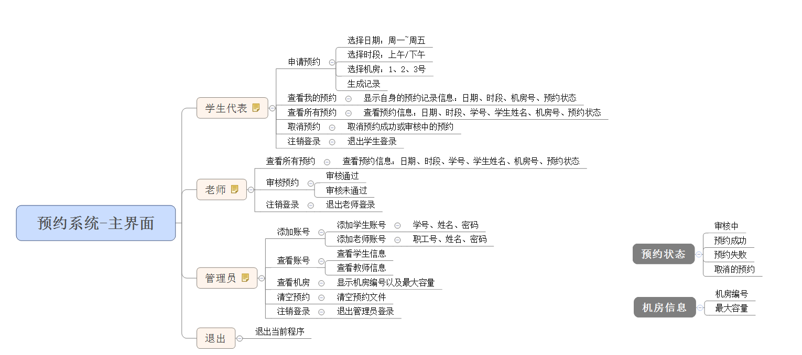
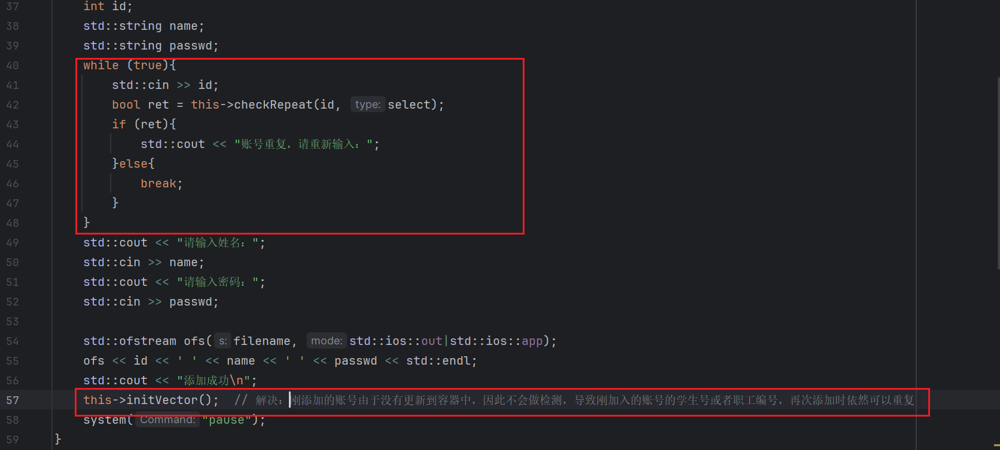

# 1 需求与框架

学校有几个规格不同的机房， 由于使用时经常出现“撞车”现象，现开发一套机房预约系统，解决这一问题。

身份信息：

1. 学生代表：申请使用机房
2. 教师：审核学生的预约申请
3. 管理员：给学生、教师创建账号

机房简介：

1. 1号机房：最大容量20人；
2. 2号机房：最大容量50人；
3. 3号机房：最大容量100人；

申请简介：

- 申请的订单每周由管理员负责清空
- 学生可以预约未来一周内的机房使用，预约的日期为周一到周五，预约需要选择预约时段（上午、下午）
- 教师来审核预约，依据实际情况审核预约通过或者不通过

系统具体需求：

- 首先进入登录界面，可选登录身份有：
  - 学生代表
  - 教师
  - 管理员
  - 退出
- 每个身份都需要进行验证后才可以进入子菜单：
  - 学生需要输入：学号、姓名、登录密码
  - 老师需要输入：职工号、姓名、登录密码
  - 管理员需要输入：管理员姓名、登录密码
- 学生具体功能：
  - 申请预约
  - 查看自身的预约（日期、时段、机房号、预约状态）
  - 查看所有预约（日期、时段、机房号、预约状态、学号、学生姓名）
  - 取消预约
  - 注销登录
- 教师具体功能：
  - 查看所有预约
  - 审核预约
  - 注销登录
- 管理员具体功能
  - 添加账号（需要检测学号、职工号是否重复）
  - 查看账号
  - 查看机房


预约信息包括：日期、时段、学号、学生姓名、机房号、预约状态

预装状态包括：审核中、预约成功、预约失败、取消预约

机房信息包括：机房编号、最大容量



框架：

```c++
#include <iostream>
#include <fstream>
#include "include/identity.h"
#include "include/student.h"
#include "include/teacher.h"
#include "include/manager.h"
#include "include/globalFile.h"
using namespace std;

void mainMenu(){
    system("cls");
    cout << "欢迎使用机房预约系统\n";
    cout << "1、学生\n";
    cout << "2、老师\n";
    cout << "3、管理员\n";
    cout << "0、退出\n";
}

int main() {
    int select = -1;
    while (true){
        mainMenu();
        cout << "输入您的选择：";
        cin >> select;
        switch(select){
            case 0:
                cout << "欢迎下次使用\n";
                system("pause");
                exit(0);
            case 1:
                // loginIn(STUDENT_FILE, 1);
                break;
            case 2:
                // loginIn(TEACHER_FILE, 2);
                break;
            case 3:
                // loginIn(ADMIN_FILE, 3);
                break;
            default:
                cout << "选择有误\n";
                system("pause");
                break;
        }
    }
}

```

# 2 身份

## 2.1 身份的基类

由于三个身份有共性（名字、密码），也有各自的特点（学生是学号，老师是职工号），所以可以将共性提取出来作为基类 `Identity`

identity.h

```c++
#pragma once
#include<iostream>

class Identity{
public:
    virtual void openMenu() = 0;  // 纯虚函数

    std::string m_Name;
    std::string m_Passwd;
};
```

## 2.2 学生类

student.h

```c++
#pragma once
#include "identity.h"

class Student : public Identity{
public:
    Student();
    Student(int id, std::string name, std::string passwd);
    virtual void openMenu();
    void showMyOrder();
    void showAllOrder();
    void cancelOrder();

    int m_Id;
};
```

student.cpp

```c++
#include "../include/student.h"

Student::Student(){}
Student::Student(int id, std::string name, std::string passwd){}
void Student::openMenu(){}
void Student::showMyOrder(){}
void Student::showAllOrder(){}
void Student::cancelOrder(){}
```

## 2.3 教师类

teacher.h

```c++
#pragma once
#include "identity.h"

class Teacher : public Identity{
public:
    Teacher();
    Teacher(int id, std::string name, std::string passwd);
    virtual void openMenu();
    void showAllOrder();
    void validOrder();

    int m_EmId;
};
```


teacher.cpp

```c++
#include "../include/teacher.h"

Teacher::Teacher(){}
Teacher::Teacher(int id, std::string name, std::string passwd){}
void Teacher::openMenu(){}
void Teacher::showAllOrder(){}
void Teacher::validOrder(){}
```

## 2.4 管理员类

manager.h

```c++
#pragma once
#include "identity.h"

class Manager : public Identity{
public:
    Manager();
    Manager(std::string name, std::string passwd);
    virtual void openMenu();
    void addPerson();
    void showPerson();
    void showComputer();
    void cleanFile();
};
```

manager.cpp

```c++
#include "../include/manager.h"

Manager::Manager(){}
Manager::Manager(std::string name, std::string passwd){}
void Manager::openMenu(){}
void Manager::addPerson(){}
void Manager::showPerson(){}
void Manager::showComputer(){}
void Manager::cleanFile(){}
```


# 3 登录模块

## 3.1 全局文件

功能描述：

- 不同的身份需要用到不同的文件操作，可以将所有的文件名定义在一个全局的文件中；
- 在头文件中添加 `globalFile.h` 文件；
- 添加如下代码：

```c++
#pragma once

#define ADMIN_FILE "admin.txt"
#define STUDENT_FILE "student.txt"
#define TEACHER_FILE "teacher.txt"
#define COMPUTER_FILE "computerRoom.txt"
#define ORDER_FILE "order.txt"
```

## 3.2 登录函数封装

功能描述：根据用户的选择，进入不同的身份登录

在`main.cpp`中添加全局函数 `void loginIn(string fileName, int type)`：

- filename：需要操作的文件名；
- type：登录身份

```c++
void loginIn(string filename, int type){
    Identity * person = NULL;

    ifstream ifs(filename, ios::in);
    if (!ifs.is_open()){
        cout << "打开文件失败！" << endl;
        ifs.close();
        system("pause");
        return;
    }

    int id = 0;
    string name;
    string passwd;
    if (type == 1){
        // 学生
        cout << "请输入学号：";
        cin >> id;
    }else if(type == 2){
        // 教师
        cout << "请输入职工号：";
        cin >> id;
    }

    cout << "请输入名字：";
    cin >> name;
    cout << "请输入密码：";
    cin >> passwd;

    if (type == 1){
        // 学生身份验证
    }else if(type == 2){
        // 老师身份验证
    }else if(type == 3){
        // 管理员身份验证
    }else{
        cout << "身份错误" << endl;
        return;
    }

    cout << "验证登录失败！" << endl;
    system("pause");
}
```

## 3.3 学生登录实现

在 `loginIn` 函数的 学生身份验证处添加如下代码：

```c++
// 学生身份验证
int fid;
string fname;
string fpasswd;
while(ifs >> fid && ifs >> fname && ifs >> fpasswd){
    if (id == fid && name == fname && passwd == fpasswd){
        cout << "学生身份验证成功！" << endl;
        system("pause");
        system("cls");
        person = new Student(id, name, passwd);
        // 进入学生菜单
        
        return;
    }
}
```

实现学生身份验证的功能。

## 3.4 教师登录实现

```c++
// 老师身份验证
int fid;
string fname;
string fpasswd;
while(ifs >> fid && ifs >> fname && ifs >> fpasswd){
    if (id == fid && name == fname && passwd == fpasswd){
        cout << "教师身份验证成功！" << endl;
        system("pause");
        system("cls");
        person = new Teacher(id, name, passwd);
        // 进入教师菜单

        return;
    }
}
```


## 3.5 管理员登录实现

```c++
// 管理员身份验证
string fname;
string fpasswd;
while(ifs >> fname && ifs >> fpasswd){
    if (name == fname && passwd == fpasswd){
        cout << "管理员身份验证成功！" << endl;
        system("pause");
        system("cls");
        person = new Manager(name, passwd);
        // 进入管理员菜单

        return;
    }
}
```

# 4 管理员模块

## 4.1 管理员登录和注销

### 4.1.1 构造函数

初始化管理员信息。

```c++
Manager::Manager(std::string name, std::string passwd){
    this->m_Name = name;
    this->m_Passwd = passwd;
}
```

### 4.1.2 管理员子菜单

在 `main.cpp` 中，当用户登录的是管理员，添加管理员菜单接口 `void managerMenu(Identity & manager)`。将不同的分支提供：

- 添加账号
- 查看账号
- 查看机房
- 清空预约
- 注销登录

```c++
void managerMenu(Identity* & manager){
    // 1. 因为loginIn中创建的是Identity指针，所以形参中有Identity*
    // 2. 又因为我们需要在当前函数中删除指针，需要能够直接修改本身，所以使用引用&
    while (true){
        manager->openMenu();
        Manager * man = (Manager *)manager;  // 将父类指针转为子类指针，条用子类接口
        int select = -1;
        cout << "请输入您的选择：";
        cin >> select;
        if (select == 1){
            cout << "添加账号" << endl;
            man->addPerson();
        }else if(select == 2){
            cout << "查看账号" << endl;
            man->showPerson();
        }else if(select == 3){
            cout << "查看机房" << endl;
            man->showComputer();
        }else if(select == 4){
            cout << "清空预约" << endl;
            man->cleanFile();
        }else if(select == 0){
            delete manager;  // 销毁堆区对象
            cout << "注销成功" << endl;
            system("pause");
            return;
        }else{
            cout << "输入有误！" << endl;
            system("pause");
            system("cls");
        }

    }
}
```

在 `manager.cpp` 的 `openMenu()` 中增加如下代码：

```c++
void Manager::openMenu(){
    system("cls");
    std::cout << "欢迎管理员："<<this->m_Name << "登录！\n";
    std::cout << "1.添加账号\n";
    std::cout << "2.查看账号\n";
    std::cout << "3.查看机房\n";
    std::cout << "4.清空预约\n";
    std::cout << "0.注销登录\n";
    std::cout << "请选择您的操作： ";
}
```

最后，在 `loginIn` 函数的 **进入管理员菜单** 处加入 `managerMenu(person)`

```c++
// 管理员身份验证
		......
        // 进入管理员菜单
        managerMenu(person);
        return;
    }
}
```

## 4.2 添加账号

功能描述：给学生或教师添加新的账号

功能要求：添加时学生学号不能重复，教师职工号不能重复。

### 4.2.1 添加功能

```c++
void Manager::addPerson(){
    int select = 0;
    std::string filename;
    std::cout << "请输入添加账号的类型：\n";
    std::cout << "1、学生\n";
    std::cout << "2、老师\n";
    std::cin >> select;
    if(select == 1){
        std::cout << "请输入学号：";
        filename = STUDENT_FILE;
    }else if(select == 2){
        std::cout << "请输入职工号：";
        filename = TEACHER_FILE;
    }else{
        std::cout << "输入有误\n";
        system("pause");
        return;
    }
    int id;
    std::string name;
    std::string passwd;
    std::cin >> id;
    std::cout << "请输入姓名：";
    std::cin >> name;
    std::cout << "请输入密码：";
    std::cin >> passwd;

    std::ofstream ofs(filename, std::ios::out|std::ios::app);
    ofs << id << ' ' << name << ' ' << passwd << std::endl;
    std::cout << "添加成功\n";
    system("pause");
}
```

上述代码实现了添加功能，但是没有去重。

### 4.2.1 去重操作

功能描述：添加账号时，如果时重复的学生学号或者时教师职工号，提示有误。

第一步：需要将文件中的学生和老师账号读取到程序中。

Manager类需要两个容器，vStu和vTea，分别用来存储现有学生和老师账号；一个函数`initVector`初始化这两个容器。

```c++
class Manager : public Identity{
public:
	......
    void initVector();
    std::vector<Student> vStu;
    std::vector<Teacher> vTea;
};
```

```c++
void Manager::initVector() {
    // 读取学生文件信息
    std::ifstream ifs(STUDENT_FILE, std::ios::in);
    if (!ifs.is_open()){
        std::cout << "文件读取失败\n";
        return;
    }

    Student tmpStu;
    while(ifs >> tmpStu.m_Id && ifs >> tmpStu.m_Name && ifs >> tmpStu.m_Passwd){
        vStu.push_back(tmpStu);
    }
    std::cout << "当前学生数量为：" << vStu.size() << std::endl;
    ifs.close();

    // 读取老师文件信息
    ifs.open(TEACHER_FILE, std::ios::in);
    if (!ifs.is_open()){
        std::cout << "文件读取失败\n";
        return;
    }

    Teacher tmpTea;
    while(ifs >> tmpTea.m_EmId && ifs >> tmpTea.m_Name && ifs >> tmpTea.m_Passwd){
        vTea.push_back(tmpTea);
    }
    std::cout << "当前老师数量为：" << vTea.size() << std::endl;
    ifs.close();
}
```

然后在manager有参构造函数中调用初始化容器函数

```c++
Manager::Manager(std::string name, std::string passwd){
	......
    this->initVector();
}
```

第二步：在manager类中添加成员函数 `bool checkRepeat(int id, int type)`，参数:(传入id，传入类型) 返回值：(true 代表有重复，false代表没有重复)

```c++
bool Manager::checkRepeat(int id, int type) {
    if (type == 1){
        for (std::vector<Student>::iterator it = vStu.begin(); it != vStu.end(); it++){
            if (id == it->m_Id){
                return true;
            }
        }
    }else{
        for (std::vector<Teacher>::iterator it = vTea.begin(); it != vTea.end(); it++){
            if (id == it->m_EmId){
                return true;
            }
        }
    }
    return false;
}
```

最后，在添加账号时，检测是否重复：



## 4.3 显示账号

功能描述：显示学生信息或教师信息

在Manager类中的showPerson函数中实现，代码如下：

```c++
void printStudent(const Student & s){
    std::cout << "学号：" << s.m_Id << "，姓名：" << s.m_Name << "，密码：" << s.m_Passwd << std::endl;
}

void printTeacher(const Teacher & t){
    std::cout << "学号：" << t.m_EmId << "，姓名：" << t.m_Name << "，密码：" << t.m_Passwd << std::endl;
}

void Manager::showPerson(){
    int select = 0;
    std::cout << "请选择查看内容：\n";
    std::cout << "1、学生\n";
    std::cout << "2、老师\n";
    std::cin >> select;
    if (select == 1){
        std::cout << "所有学生的信息如下：\n";
        std::for_each(vStu.begin(), vStu.end(), printStudent);
    }else if (select == 2){
        std::cout << "所有老师的信息如下：\n";
        std::for_each(vTea.begin(), vTea.end(), printTeacher);
    }else{
        std::cout << "选择有误！\n";
    }
    system("pause");
}
```

因为打印需要，所以添加两个函数：`printStudent`和`printTeacher`。

## 4.4 查看机房

添加 computerRoom.h 文件，创建ComputerRoom类

```c++
#pragma once
#include <iostream>

class ComputerRoom{
public:
    int m_ComId;  // 机房id
    int m_MaxNum;  // 机房最大容量
};
```

在Manager类下添加机房容器 `std::vector<ComputerRoom> vCom`，用于保存机房信息，并在有参构造中初始化机房信息

```c++
Manager::Manager(std::string name, std::string passwd){
    ......
    std::ifstream ifs(COMPUTER_FILE, std::ios::in);
    ComputerRoom c;
    while (ifs >> c.m_ComId && ifs >> c.m_MaxNum){
        vCom.push_back(c);
    }
    std::cout << "当前机房数量为：" << vCom.size() << std::endl;
    ifs.close();
}
```

最后，完成 showComputer 函数：

```c++
void Manager::showComputer(){
    std::cout << "机房数量为：" << vCom.size() << std::endl;
    for (std::vector<ComputerRoom>::iterator it = vCom.begin(); it != vCom.end(); it++){
        std::cout << "机房编号：" << it->m_ComId << "，最大容量：" << it->m_MaxNum << std::endl;
    }
    system("pause");
}
```

## 4.5 清空预约

功能描述：清空生成的 order.txt 预约文件。

完成 cleanFile 函数：

```c++
void Manager::cleanFile(){
    std::ofstream ofs(ORDER_FILE, std::ios::trunc);
    ofs.close();
    std::cout << "清空成功！\n";
    system("pause");
}
```

# 5 学生模块

## 5.1 学生登录和注销

### 5.1.1 构造函数

在有参构造函数中初始化学生信息：

```c++
Student::Student(int id, std::string name, std::string passwd){
    this->m_Id = id;
    this->m_Name = name;
    this->m_Passwd = passwd;
}
```

### 5.1.2 学生子菜单

在main.cpp中，当用户登录的是学生，添加学生菜单接口，将不同的分支提供出来

- 申请预约
- 查看我的预约
- 查看所有预约
- 取消预约
- 注销登录

添加全局函数 `void studentMenu(Identity* &manager)`，代码如下：

```c++
```


# 6 教师模块

